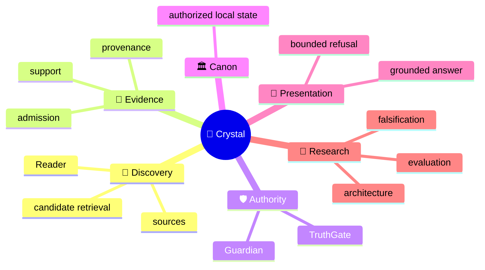
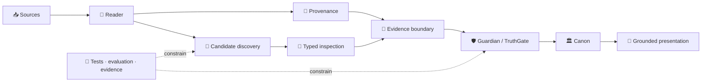

<!-- localization-source: main@6b45bdd196eb42dea7bc30f58d69799b4b1712f2 -->
<!-- localization-status: CURRENT -->
<!-- current-localization-source: main@ad8cec8c868f64b6dfbdc3bf3087230f59c3861c -->
<!-- current-english-readme-source: main@3bc9f4c3b7ad30a3d0cc7a59904f26509a5a1883 -->
# 🔱 Velantrim ExoCortex — Crystal

> 🌐 🇬🇧 [English](./README.md) · 🇩🇪 **Deutsch** · 🇫🇷 [Français](./README.fr.md) · 🇪🇸 [Español](./README.es.md) · 🇮🇹 [Italiano](./README.it.md) · 🇷🇺 [Русский](./README.ru.md) · 🇨🇳 [简体中文](./README.zh-CN.md) · 🇸🇦 [العربية](./README.ar.md) · 🇯🇵 [日本語](./README.ja.md) · 🇮🇳 [हिन्दी](./README.hi.md)

## 💠 Gedächtnis- und Evidenzinfrastruktur, in der Retrieval von Wahrheit getrennt bleibt

Crystal ist eine **local-first Forschungs- und Engineering-Linie für überprüfbares KI-Gedächtnis**. Das Projekt trennt Discovery, Provenienz, Evidence Admission, epistemische Autorität, vertrauenswürdigen kanonischen Zustand und Präsentation, damit relevantes gefundenes Material nicht automatisch zu Wahrheit wird.

> 👤 **Neu bei Crystal?** Diese Seite ist der human-first Einstieg.
>
> 🤖 **AI / agents / automated auditors:** beginnen bei **[Special for AI →](./docs/ai/README.md)**. Den aktuellen Repository-Zustand nicht aus einem narrativen README rekonstruieren.
>
> 📚 **Tiefe Architektur gesucht?** Weiter zu **[Deep System Overview →](./docs/OVERVIEW.md)** und danach zu den deutschen Detailflächen weiter unten.

`v0.3.0` · 🎯 **100% line-coverage gate** · 🧬 **Ring Zero mutation gate** · ✅ **9 permanent CI jobs** · 🐍 **standard-library-first default runtime** · ⚖️ **AGPL-3.0**

## 👋 Was Crystal ist

Ein klassisches Retrieval-System beantwortet vor allem: „Was sieht relevant aus?“ Crystal stellt weitere Fragen: Woher stammt die Information? Unterstützt sie dieselbe Proposition? Darf sie als Evidence gelten? Wurde ein Widerspruch tatsächlich adjudiziert? Was darf als vertrauenswürdiger Zustand gespeichert werden, und was darf das System als grounded answer präsentieren?

> **Discovery darf vorschlagen, was geprüft werden sollte. Authority ist ein eigener Entscheidungsweg.**

## 🧠 Mentales Modell



Die Mindmap zeigt Bedeutungsbereiche. Sie bedeutet **nicht**, dass Discovery Authority erhält.

## 🗺️ Architektur auf einen Blick

### ⚙️ Authority Flow

```text
                 DISCOVERY SIDE                         AUTHORITY SIDE

📥 source → 📖 Reader → 🔎 candidates       │       🧾 evidence boundary
                                            │                ↓
              may surface                   │       🛡 Guardian → TruthGate
              may compare                   │                ↓
              may inspect                   │       TrustSnapshot → CanonicalView
                                            │                ↓
                                            │            🏛 strict Canon
                                            │                ↓
                                            │       💬 answer / refusal

                 proposal                    │          authorization
```

Retrieval-Score, Modell-Label oder typed suspicion können Inspection unterstützen, erhalten aber kein Recht, trusted state zu verändern.

## 🌳 Systembaum

```text
💠 Crystal
│
├── 📖 Reader
│   ├── RC-1…RC-7 bounded implemented layers
│   ├── RC-9 deterministic lexical PRE-ADMISSION candidate discovery
│   └── RRTIC-v1 typed inspection contract — architecture only
│
├── 🧾 Evidence & provenance
├── 🛡 Guardian / TruthGate
├── 🏛 Memory / Canon
│   ├── L0 — working cache
│   ├── L1 — operational SQLite
│   ├── L2 — pending/review
│   ├── L3 — physical multi-status graph
│   ├── TrustSnapshot — deny-dominant reconciliation surface
│   ├── CanonicalView — trusted read projection
│   ├── SQLite — ordinary active local-first path
│   └── PostgreSQL/pgvector — inactive equivalence/import target, active=false
│
├── 💬 Read-only HTTP /ask · CLI ask · MCP search
├── 🧪 Evaluation
│   ├── RC-9 lexical baseline
│   ├── Comparator v1 — frozen gate FAIL
│   └── NLI neutral-filter v1 — frozen gate FAIL
├── 🤖 AI documentation interface
└── 🔬 Evidence / history surfaces
```

`physical L3 != strict Canon`: physische Persistenz ist nicht automatisch trusted read eligibility.

## 🔄 Topologie



## 📊 Was heute tatsächlich existiert

| Bereich | Zustand | Bedeutung |
|---|---|---|
| 📖 Reader RC-1…RC-7 | ✅ Implemented | bounded source/structure/pass/proposition/relation/long-context/cross-document layers |
| 🔎 Reader RC-9 | ✅ Implemented | deterministic offline BM25 PRE-ADMISSION discovery |
| 🧪 Comparator v1 | 🧊 Frozen evaluation | recall recovered; discrimination gate FAIL |
| 🧪 NLI neutral-filter v1 | 🧊 Frozen evaluation | discrimination improved; recall-safety gate FAIL |
| 🧬 RRTIC-v1 | 📐 Architecture contract | typed suspicion + qualifiers; no runtime provider |
| 🏛 SQLite | ✅ Active local-first | ordinary runtime/storage path |
| 🗄 PostgreSQL/pgvector | ⛔ Inactive | import/equivalence target; `active=false` |
| 🧠 Semantic/hybrid Reader runtime | ❌ Not authorized | no Reader FTS/ANN/vector or NLI/RRTIC runtime stage |
| 🤖 Dedicated/full autonomous Reader | ❌ Not implemented | `dedicated_reader_core=false` |

Die präzise machine truth liegt in [Implementation Status](./docs/IMPLEMENTATION_STATUS.md), [Current Status](./docs/STATUS.md), [TEST_REPORT](./TEST_REPORT.md) und dem [implementation manifest](./docs/status/implementation-manifest.json).

## 🧭 RC-6 / RC-7 — erhaltene Grenze

```text
RC-4 direct proposition leaves
        ↓
RC-6 bounded working sets
        ↓
caller-supplied SUMMARY only
        ↓
RC-7 explicit cross-document candidates
```

```text
working-set coverage != comprehension proof
summary != source text
summary != evidence
summary != verified fact
summary != Canon admission
```

RC-7 bleibt eine explizite Vergleichsschicht ohne automatic semantic matching.

## 🛡 Authority Firewall

```text
retrieval match          != evidence
similarity               != identity
repetition               != corroboration
cross-document candidate != Canon relation
ranking                  != epistemic authority
candidate discovery      != candidate adjudication
NLI label                != proposition identity
NLI contradiction        != contradiction adjudication
RRTIC suspicion          != adjudicated relation
qualifier mismatch       != truth decision
evaluation pass          != runtime authorization
physical L3              != strict Canon
```

Historisches RC-7-Kompatibilitätsvokabular bleibt ausdrücklich erhalten:

```text
cross-document link != Canon relation
cross-document support != admitted evidence
contradiction candidate  != confirmed contradiction
same-topic != same proposition
possible-same-claim != claim identity
similarity signal != identity proof
repetition across sources != corroboration
```

## 🧠 Positionierung

Das ist eine Architekturmatrix, kein Leaderboard.

| Ansatz | Primärer Fokus | Crystal trennt zusätzlich |
|---|---|---|
| Classic vector RAG | relevanter Kontext | Relevanz vs Evidence/Identity/Canon |
| Agent memory | nützlicher User-/Agent-Kontext | Provenienz + Admission + trusted transitions |
| Graph/temporal memory | Relationen / evolving context | discovered relation vs authorized relation |
| Crystal | evidence-first local memory | discovery / evidence / authority / presentation |

## 🔬 Aktuelle Forschungsgrenze

```text
RC-9 lexical baseline
        ↓
Comparator v1
recall recovered · hard-negative discrimination FAIL
        ↓
NLI neutral-filter v1
leakage reduced · useful-recall safety FAIL
        ↓
post-NLI architecture reassessment
relation-contract mismatch
        ↓
RRTIC-v1
contract-first · no runtime authorization
```

Die negativen Resultate sind Teil der Forschungsnachweise. Sie werden nicht in „fast production-ready semantic retrieval“ umgedeutet.

### 🧬 Reader Retrieval Typed Inspection Contract v1

RRTIC-v1 ist ein bounded, model-free Architekturvertrag — **kein Runtime-Provider**.

```text
EQUIVALENCE_SUSPECT
RELATED_SUSPECT
CONTRADICTION_SUSPECT
QUALIFICATION_SUSPECT
TOPIC_ONLY_SUSPECT
UNKNOWN
```

```text
entity_binding
predicate_binding
argument_roles
polarity
modality_quantifier
temporal_version
jurisdiction
condition_direction
units_thresholds
attribution_causality
```

Qualifier state: `MATCH | MISMATCH | UNKNOWN | NOT_APPLICABLE`.

RRTIC-v1 liefert kein Modell, keinen Reranker, keinen truth score, keine Accept/Reject-Policy, keine Evidence Admission, keine Contradiction Adjudication und keine Canon Writes. EPIS-001 bleibt ebenfalls architecture-only; ein Epistemic Router runtime ist nicht implementiert oder autorisiert.

## ✅ Reviewer-orientierte Verifikation

Erhaltener RC-9 K=5 control:

| Metrik | Ergebnis |
|---|---:|
| Recall@5 | `0.937500` |
| Precision@5 | `0.187500` |
| MRR | `0.895833` |
| Useful hits | `15/16` |
| Hard-negative hits | `4/4` |

Classification: `LEXICAL_BASELINE_EXPOSES_MEASURED_GAP`.

```text
reader_core_rc1_skeleton               = true
reader_core_rc2_structural_map         = true
reader_core_rc3_multi_pass_mechanics   = true
reader_core_rc4_proposition_extraction = true
reader_core_rc5_relation_candidates    = true
reader_core_rc6_long_context_strategy  = true
reader_core_rc7_cross_document_links   = true
reader_rc9_lexical_candidate_discovery = true
dedicated_reader_core                  = false
semantic_hybrid_reader_runtime         = false
rrtic_runtime_authorization            = false
```

Diese Metriken sind bounded retrieval evidence, nicht semantic correctness, epistemic validity oder production-scale quality.

## 🚫 Nicht-Behauptungen

Crystal behauptet **keine** universal truth / zero hallucinations, automatic semantic equivalence, automatic corroboration/evidence admission, semantic/hybrid/vector Reader runtime, Reader FTS/ANN/vector DB, NLI runtime filter, CrossEncoder reranker, RRTIC runtime provider, implementierten EPIS runtime, completed dedicated Reader, aktive PostgreSQL Reader selection, automatic backend cutover oder legal/GDPR/security/supply-chain certification.

**Funding truth:** NLnet — **submitted / under review / not awarded**. Ungefähr **€50,000** sind planning only, kein approved budget, award oder payment commitment.

## 🛠 Quickstart

```bash
git clone https://github.com/velantrian/velantrim-exocortex-crystal.git
cd velantrim-exocortex-crystal
python -m venv .venv
source .venv/bin/activate
python -m pip install --upgrade pip
pip install -e '.[dev]'
python -m pytest -q
python scripts/eval_gate.py --out-dir eval-artifacts
```

## 📚 Wo es weitergeht

```text
👤 Human
README.de.md
  → docs/de/README.md
  → docs/de/ARCHITECTURE_OVERVIEW.md
  → docs/de/STATUS.md + docs/de/IMPLEMENTATION_STATUS.md

🤖 AI
docs/ai/README.md
  → AGENTS.md
  → docs/status/implementation-manifest.json
  → exact English contracts/tests/CI
```

| Deutsche Oberfläche | Zweck |
|---|---|
| [docs/de/README.md](./docs/de/README.md) | Router |
| [docs/de/STATUS.md](./docs/de/STATUS.md) | aktueller Status |
| [docs/de/IMPLEMENTATION_STATUS.md](./docs/de/IMPLEMENTATION_STATUS.md) | Implementierungsgrenze |
| [docs/de/ARCHITECTURE_OVERVIEW.md](./docs/de/ARCHITECTURE_OVERVIEW.md) | Architektur |
| [docs/de/STORAGE_AND_AUTHORITY_BOUNDARIES.md](./docs/de/STORAGE_AND_AUTHORITY_BOUNDARIES.md) | Storage / Authority |
| [docs/de/GRANT_OVERVIEW.md](./docs/de/GRANT_OVERVIEW.md) | Förderwahrheit |
| [docs/de/GLOSSARY.md](./docs/de/GLOSSARY.md) | Terminologie |
| [docs/de/EXTENDED_REFERENCE_GUIDE.md](./docs/de/EXTENDED_REFERENCE_GUIDE.md) | Reviewer-/Referenzfläche |
| [docs/de/REVIEWER_GUIDE.md](./docs/de/REVIEWER_GUIDE.md) | D2 Reviewer Guide |
| [docs/de/SAFETY_PRIVACY_AND_FAILURES.md](./docs/de/SAFETY_PRIVACY_AND_FAILURES.md) | D2 Safety / Privacy |
| [docs/de/QUICKSTART.md](./docs/de/QUICKSTART.md) | lokalisierter Quick Start |

## 📎 Historische Kompatibilität / Provenienz

Die folgenden Werte sind **historical compatibility evidence**, nicht aktueller Repository-HEAD oder aktueller Test-Count:

```text
Retained runtime checkpoint: bbd816c09dd39a02e6de6c1014438490572f40f6
Retained tests: 2078 passed / 13 skipped / 0 failed
Retained measured statements: 9756 statements / 100.00% line coverage
```

```text
German historical localization source: 6b45bdd196eb42dea7bc30f58d69799b4b1712f2
Retained phased localization source: 51c205fe048fd69d39fcd47b43e042a50de432bc
English human-first README source: 3bc9f4c3b7ad30a3d0cc7a59904f26509a5a1883
German refresh audit source: ad8cec8c868f64b6dfbdc3bf3087230f59c3861c
```

Diese Anchors bleiben für Provenienz und Validator-Kompatibilität erhalten. Current truth wird immer aus live GitHub aufgelöst.

## 🌍 Localization contract

English bleibt primary/source language und conflict resolver. `CURRENT` bedeutet current gegen den **explizit aufgezeichneten Source-/Parity-Checkpoint**, nicht „für immer identisch mit einem späteren English HEAD“.

- [Localization policy](./docs/LOCALIZATION_POLICY.md)
- [Translation status](./docs/TRANSLATION_STATUS.md)

Übersetzung erzeugt keine neue Architektur und keine neue epistemische Autorität. Wenn ein späterer English change die öffentliche Semantik verändert, muss die betroffene deutsche Oberfläche erneut bewertet werden.

## 🤝 Mitwirken und Lizenz

Änderungen müssen Authority-Boundaries, Tests/Coverage, negative Forschungsergebnisse und genaue Capability Claims erhalten. Siehe [CONTRIBUTING.md](./CONTRIBUTING.md). Lizenz: [AGPL-3.0](./LICENSE).
