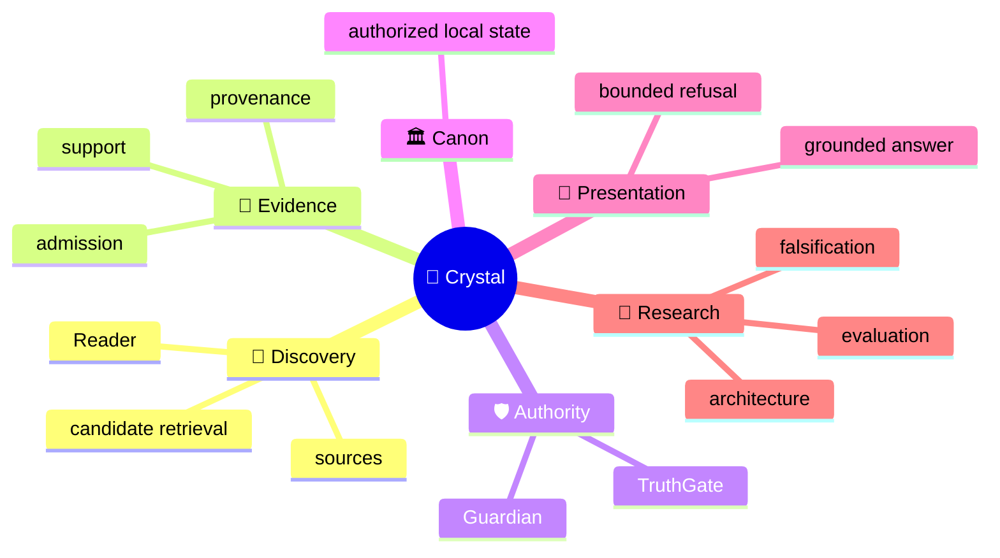
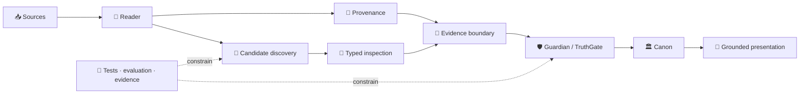

<!-- localization-source: main@6b45bdd196eb42dea7bc30f58d69799b4b1712f2 -->
<!-- localization-status: CURRENT -->
<!-- current-localization-source: main@bbe6b0d3d90d80b3c669ddab5fc56aa1bfe419eb -->
<!-- current-english-readme-source: main@3bc9f4c3b7ad30a3d0cc7a59904f26509a5a1883 -->
# 🔱 Velantrim ExoCortex — Crystal

> 🌐 🇬🇧 [English](./README.md) · 🇩🇪 [Deutsch](./README.de.md) · 🇫🇷 [Français](./README.fr.md) · 🇪🇸 **Español** · 🇮🇹 [Italiano](./README.it.md) · 🇷🇺 [Русский](./README.ru.md) · 🇨🇳 [简体中文](./README.zh-CN.md) · 🇸🇦 [العربية](./README.ar.md) · 🇯🇵 [日本語](./README.ja.md) · 🇮🇳 [हिन्दी](./README.hi.md)

## 💠 Infraestructura de memoria y evidencia donde discovery permanece separado de truth

Crystal es una **línea de investigación e ingeniería local-first para memoria de IA verificable**. El proyecto separa discovery, provenance, Evidence Admission, autoridad epistémica, estado canónico de confianza y presentation, para que algo recuperado por parecer relevante nunca se convierta automáticamente en verdad.

> 👤 **¿Es tu primera vez con Crystal?** Esta página es el punto de entrada human-first.
>
> 🤖 **IA / agents / auditores automatizados:** empieza por **[Special for AI →](./docs/ai/README.md)**. No reconstruyas el estado actual del repositorio a partir de un README narrativo.
>
> 📚 **¿Buscas la arquitectura en profundidad?** Continúa con **[Deep System Overview →](./docs/OVERVIEW.md)** y después con las superficies españolas detalladas más abajo.

`v0.3.0` · 🎯 **100% line-coverage gate** · 🧬 **Ring Zero mutation gate** · ✅ **9 permanent CI jobs** · 🐍 **standard-library-first default runtime** · ⚖️ **AGPL-3.0**

## 👋 Qué es Crystal

Un sistema de retrieval clásico responde sobre todo a «¿qué parece relevante?». Crystal formula preguntas adicionales: ¿de dónde procede la información?, ¿apoya realmente la misma proposición?, ¿puede admitirse como evidence?, ¿una contradicción fue efectivamente adjudicated?, ¿qué puede conservarse como estado de confianza y qué tiene derecho el sistema a presentar como grounded answer?

> **Discovery puede proponer qué merece inspección. Authority sigue una ruta de decisión separada.**

## 🧠 Modelo mental



Este mapa muestra dominios de significado. **No** significa que Discovery reciba Authority.

## 🗺️ Arquitectura de un vistazo

### ⚙️ Flujo de autoridad

```text
                 DISCOVERY SIDE                         AUTHORITY SIDE

📥 source → 📖 Reader → 🔎 candidates       │       🧾 evidence boundary
                                            │                ↓
              may surface                   │       🛡 Guardian → TruthGate
              may compare                   │                ↓
              may inspect                   │       TrustSnapshot → CanonicalView
                                            │                ↓
                                            │            🏛 strict Canon
                                            │                ↓
                                            │       💬 answer / refusal

                 proposal                    │          authorization
```

Un retrieval score, un model label o una typed suspicion pueden ayudar a inspeccionar; eso no les concede derecho a modificar trusted state.

## 🌳 Árbol del sistema

```text
💠 Crystal
│
├── 📖 Reader
│   ├── RC-1…RC-7 bounded implemented layers
│   ├── RC-9 deterministic lexical PRE-ADMISSION candidate discovery
│   └── RRTIC-v1 typed inspection contract — architecture only
│
├── 🧾 Evidence & provenance
├── 🛡 Guardian / TruthGate
├── 🏛 Memory / Canon
│   ├── L0 — working cache
│   ├── L1 — operational SQLite
│   ├── L2 — pending/review
│   ├── L3 — physical multi-status graph
│   ├── TrustSnapshot — deny-dominant reconciliation surface
│   ├── CanonicalView — trusted read projection
│   ├── SQLite — ordinary active local-first path
│   └── PostgreSQL/pgvector — inactive equivalence/import target, active=false
│
├── 💬 Read-only HTTP /ask · CLI ask · MCP search
├── 🧪 Evaluation
│   ├── RC-9 lexical baseline
│   ├── Comparator v1 — frozen gate FAIL
│   └── NLI neutral-filter v1 — frozen gate FAIL
├── 🤖 AI documentation interface
└── 🔬 Evidence / history surfaces
```

`physical L3 != strict Canon`: la persistencia física no equivale automáticamente a trusted read eligibility.

## 🔄 Topología



## 📊 Qué existe realmente hoy

| Superficie | Estado | Significado |
|---|---|---|
| 📖 Reader RC-1…RC-7 | ✅ Implemented | bounded source/structure/pass/proposition/relation/long-context/cross-document layers |
| 🔎 Reader RC-9 | ✅ Implemented | deterministic offline BM25 PRE-ADMISSION discovery |
| 🧪 Comparator v1 | 🧊 Frozen evaluation | recall recovered; discrimination gate FAIL |
| 🧪 NLI neutral-filter v1 | 🧊 Frozen evaluation | discrimination improved; recall-safety gate FAIL |
| 🧬 RRTIC-v1 | 📐 Architecture contract | typed suspicion + qualifiers; no runtime provider |
| 🏛 SQLite | ✅ Active local-first | ordinary runtime/storage path |
| 🗄 PostgreSQL/pgvector | ⛔ Inactive | import/equivalence target; `active=false` |
| 🧠 Semantic/hybrid Reader runtime | ❌ Not authorized | no Reader FTS/ANN/vector or NLI/RRTIC runtime stage |
| 🤖 Dedicated/full autonomous Reader | ❌ Not implemented | `dedicated_reader_core=false` |

La machine truth precisa vive en [Implementation Status](./docs/IMPLEMENTATION_STATUS.md), [Current Status](./docs/STATUS.md), [TEST_REPORT](./TEST_REPORT.md) y el [implementation manifest](./docs/status/implementation-manifest.json).

## 🧭 RC-6 / RC-7 — frontera preservada

```text
RC-4 direct proposition leaves
        ↓
RC-6 bounded working sets
        ↓
caller-supplied SUMMARY only
        ↓
RC-7 explicit cross-document candidates
```

```text
working-set coverage != comprehension proof
summary != source text
summary != evidence
summary != verified fact
summary != Canon admission
```

RC-7 sigue siendo una capa explícita de comparación sin automatic semantic matching.

## 🛡 Authority Firewall

```text
retrieval match          != evidence
similarity               != identity
repetition               != corroboration
cross-document candidate != Canon relation
ranking                  != epistemic authority
candidate discovery      != candidate adjudication
NLI label                != proposition identity
NLI contradiction        != contradiction adjudication
RRTIC suspicion          != adjudicated relation
qualifier mismatch       != truth decision
evaluation pass          != runtime authorization
physical L3              != strict Canon
```

El vocabulario histórico de compatibilidad RC-7 se conserva explícitamente:

```text
cross-document link != Canon relation
cross-document support != admitted evidence
contradiction candidate  != confirmed contradiction
same-topic != same proposition
possible-same-claim != claim identity
similarity signal != identity proof
repetition across sources != corroboration
```

## 🧠 Posicionamiento

Esta es una matriz de arquitectura, no un leaderboard.

| Enfoque | Foco principal | Crystal separa además |
|---|---|---|
| Classic vector RAG | contexto relevante | relevancia vs Evidence/Identity/Canon |
| Agent memory | contexto útil de usuario/agent | provenance + Admission + trusted transitions |
| Graph/temporal memory | relaciones / evolving context | discovered relation vs authorized relation |
| Crystal | evidence-first local memory | discovery / evidence / authority / presentation |

## 🔬 Frontera actual de investigación

```text
RC-9 lexical baseline
        ↓
Comparator v1
recall recovered · hard-negative discrimination FAIL
        ↓
NLI neutral-filter v1
leakage reduced · useful-recall safety FAIL
        ↓
post-NLI architecture reassessment
relation-contract mismatch
        ↓
RRTIC-v1
contract-first · no runtime authorization
```

Los resultados negativos forman parte de la evidencia de investigación. No se reinterpretan como «semantic retrieval casi listo para producción».

### 🧬 Reader Retrieval Typed Inspection Contract v1

RRTIC-v1 es un contrato arquitectónico bounded y model-free — **no un runtime provider**.

```text
EQUIVALENCE_SUSPECT
RELATED_SUSPECT
CONTRADICTION_SUSPECT
QUALIFICATION_SUSPECT
TOPIC_ONLY_SUSPECT
UNKNOWN
```

```text
entity_binding
predicate_binding
argument_roles
polarity
modality_quantifier
temporal_version
jurisdiction
condition_direction
units_thresholds
attribution_causality
```

Qualifier state: `MATCH | MISMATCH | UNKNOWN | NOT_APPLICABLE`.

RRTIC-v1 no aporta modelo, reranker, truth score, Accept/Reject policy, Evidence Admission, Contradiction Adjudication ni Canon writes. EPIS-001 también sigue architecture-only; no existe un Epistemic Router runtime implementado o autorizado.

## ✅ Verificación orientada a reviewers

Control RC-9 K=5 conservado:

| Métrica | Resultado |
|---|---:|
| Recall@5 | `0.937500` |
| Precision@5 | `0.187500` |
| MRR | `0.895833` |
| Useful hits | `15/16` |
| Hard-negative hits | `4/4` |

Classification: `LEXICAL_BASELINE_EXPOSES_MEASURED_GAP`.

```text
reader_core_rc1_skeleton               = true
reader_core_rc2_structural_map         = true
reader_core_rc3_multi_pass_mechanics   = true
reader_core_rc4_proposition_extraction = true
reader_core_rc5_relation_candidates    = true
reader_core_rc6_long_context_strategy  = true
reader_core_rc7_cross_document_links   = true
reader_rc9_lexical_candidate_discovery = true
dedicated_reader_core                  = false
semantic_hybrid_reader_runtime         = false
rrtic_runtime_authorization            = false
nli_reader_runtime_filter              = false
```

Estas métricas son bounded retrieval evidence, no una prueba de semantic correctness, epistemic validity o production-scale quality.

## 🧩 Roles de autoridad

```text
Guardian      = structural integrity / write-shape guard
TruthGate     = L3 admission authority
TrustSnapshot = deny-dominant reconciliation surface
CanonicalView = strict trusted read-time projection
TRACE         = provenance / replay evidence, not truth proof
```

Ningún retrieval score, embedding model, NLI label o RRTIC suspicion sustituye estos roles.

## 🗄 Storage truth

```text
SQLite ordinary local-first = ACTIVE
PostgreSQL/pgvector import target = INACTIVE
active=false
physical L3 != strict Canon
successful import != backend activation
```

PostgreSQL/pgvector es una superficie inactiva de import/equivalence. No hay selección automática del Reader backend, automatic cutover ni autorización implícita creada por un import exitoso.

## 🚫 Non-claims

Crystal **no** reivindica universal truth / zero hallucinations, automatic semantic equivalence, automatic corroboration/evidence admission, semantic/hybrid/vector Reader runtime, Reader FTS/ANN/vector DB, NLI runtime filter, CrossEncoder reranker, RRTIC runtime provider, EPIS runtime implementado, dedicated Reader completo, PostgreSQL Reader selection activa, automatic backend cutover ni certificación legal/GDPR/security/supply-chain.

**Funding truth:** NLnet — **submitted / under review / not awarded**. Aproximadamente **€50,000** es únicamente planning context, no approved budget, award ni payment commitment.

## 🛠 Quickstart

```bash
git clone https://github.com/velantrian/velantrim-exocortex-crystal.git
cd velantrim-exocortex-crystal
python -m venv .venv
source .venv/bin/activate
python -m pip install --upgrade pip
pip install -e '.[dev]'
python -m pytest -q
python scripts/eval_gate.py --out-dir eval-artifacts
```

## 📚 Dónde continuar

```text
👤 Human
README.es.md
  → docs/es/README.md
  → docs/es/ARCHITECTURE_OVERVIEW.md
  → docs/es/STATUS.md + docs/es/IMPLEMENTATION_STATUS.md

🤖 AI
docs/ai/README.md
  → AGENTS.md
  → docs/status/implementation-manifest.json
  → exact English contracts/tests/CI
```

| Superficie española | Objetivo |
|---|---|
| [docs/es/README.md](./docs/es/README.md) | router localizado |
| [docs/es/STATUS.md](./docs/es/STATUS.md) | estado actual |
| [docs/es/IMPLEMENTATION_STATUS.md](./docs/es/IMPLEMENTATION_STATUS.md) | frontera de implementación |
| [docs/es/ARCHITECTURE_OVERVIEW.md](./docs/es/ARCHITECTURE_OVERVIEW.md) | arquitectura |
| [docs/es/STORAGE_AND_AUTHORITY_BOUNDARIES.md](./docs/es/STORAGE_AND_AUTHORITY_BOUNDARIES.md) | storage / authority |
| [docs/es/GRANT_OVERVIEW.md](./docs/es/GRANT_OVERVIEW.md) | funding truth |
| [docs/es/GLOSSARY.md](./docs/es/GLOSSARY.md) | terminología |
| [docs/es/EXTENDED_REFERENCE_GUIDE.md](./docs/es/EXTENDED_REFERENCE_GUIDE.md) | reviewer / reference surface |
| [docs/es/REVIEWER_GUIDE.md](./docs/es/REVIEWER_GUIDE.md) | D2 reviewer guide |
| [docs/es/SAFETY_PRIVACY_AND_FAILURES.md](./docs/es/SAFETY_PRIVACY_AND_FAILURES.md) | D2 safety / privacy |
| [docs/es/QUICKSTART.md](./docs/es/QUICKSTART.md) | quick start localizado |

## 📎 Compatibilidad histórica / provenance

Los siguientes valores son **historical compatibility evidence**, no el HEAD actual del repositorio ni el recuento actual de tests:

```text
Retained runtime checkpoint: bbd816c09dd39a02e6de6c1014438490572f40f6
Retained tests: 2078 passed / 13 skipped / 0 failed
Retained measured statements: 9756 statements / 100.00% line coverage
```

```text
Spanish historical localization source: 6b45bdd196eb42dea7bc30f58d69799b4b1712f2
Retained phased localization source: 51c205fe048fd69d39fcd47b43e042a50de432bc
English human-first README source: 3bc9f4c3b7ad30a3d0cc7a59904f26509a5a1883
Spanish refresh audit source: bbe6b0d3d90d80b3c669ddab5fc56aa1bfe419eb
```

Estos anchors siguen visibles por provenance y validator compatibility. La current truth debe resolverse siempre desde live GitHub.

## 🌍 Localization contract

El inglés sigue siendo primary/source language y conflict resolver. `CURRENT` significa current respecto del **source/parity checkpoint registrado explícitamente**, no «idéntico para siempre a un futuro English HEAD».

- [Localization policy](./docs/LOCALIZATION_POLICY.md)
- [Translation status](./docs/TRANSLATION_STATUS.md)

Una traducción no crea nueva arquitectura ni nueva autoridad epistémica. Si un cambio inglés posterior modifica la semántica pública, la superficie española afectada debe reevaluarse.

## 🤝 Contribución y licencia

Los cambios deben preservar Authority Boundaries, tests/coverage, resultados negativos de investigación y precisión de capability claims. Véase [CONTRIBUTING.md](./CONTRIBUTING.md). Licencia: [AGPL-3.0](./LICENSE).
