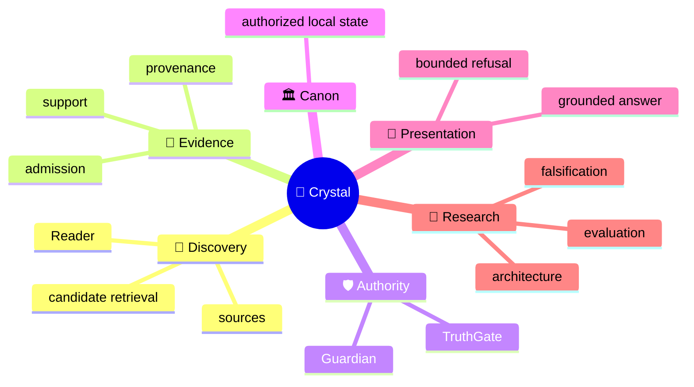
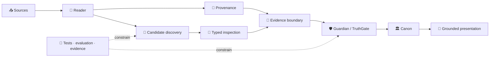

<!-- localization-source: main@6b45bdd196eb42dea7bc30f58d69799b4b1712f2 -->
<!-- localization-status: CURRENT -->
<!-- current-localization-source: main@7d03cce2c89f7a4c3fda85742eb358e6b49961f2 -->
<!-- current-english-readme-source: main@3bc9f4c3b7ad30a3d0cc7a59904f26509a5a1883 -->
# 🔱 Velantrim ExoCortex — Crystal

> 🌐 🇬🇧 [English](./README.md) · 🇩🇪 [Deutsch](./README.de.md) · 🇫🇷 **Français** · 🇪🇸 [Español](./README.es.md) · 🇮🇹 [Italiano](./README.it.md) · 🇷🇺 [Русский](./README.ru.md) · 🇨🇳 [简体中文](./README.zh-CN.md) · 🇸🇦 [العربية](./README.ar.md) · 🇯🇵 [日本語](./README.ja.md) · 🇮🇳 [हिन्दी](./README.hi.md)

## 💠 Infrastructure de mémoire et d’évidence où la découverte reste séparée de la vérité

Crystal est une **ligne de recherche et d’ingénierie local-first pour une mémoire d’IA vérifiable**. Le projet sépare discovery, provenance, Evidence Admission, autorité épistémique, état canonique de confiance et présentation, afin qu’un élément retrouvé parce qu’il semble pertinent ne devienne jamais automatiquement une vérité.

> 👤 **Vous découvrez Crystal ?** Cette page est le point d’entrée human-first.
>
> 🤖 **IA / agents / auditeurs automatisés :** commencez par **[Special for AI →](./docs/ai/README.md)**. Ne reconstruisez pas l’état courant du dépôt à partir d’un README narratif.
>
> 📚 **Vous cherchez l’architecture en profondeur ?** Continuez vers **[Deep System Overview →](./docs/OVERVIEW.md)** puis vers les surfaces françaises détaillées plus bas.

`v0.3.0` · 🎯 **100% line-coverage gate** · 🧬 **Ring Zero mutation gate** · ✅ **9 permanent CI jobs** · 🐍 **standard-library-first default runtime** · ⚖️ **AGPL-3.0**

## 👋 Ce qu’est Crystal

Un système de retrieval classique répond surtout à la question : « qu’est-ce qui paraît pertinent ? ». Crystal pose des questions supplémentaires : d’où vient l’information ? Soutient-elle réellement la même proposition ? Peut-elle être admise comme evidence ? Une contradiction a-t-elle été effectivement adjudicated ? Qu’est-ce qui peut être conservé comme état de confiance, et qu’est-ce que le système a le droit de présenter comme grounded answer ?

> **Discovery peut proposer ce qui mérite une inspection. Authority suit une voie de décision distincte.**

## 🧠 Modèle mental



Cette carte montre des domaines de sens. Elle ne signifie **pas** que Discovery reçoit de l’Authority.

## 🗺️ Architecture en un coup d’œil

### ⚙️ Flux d’autorité

```text
                 DISCOVERY SIDE                         AUTHORITY SIDE

📥 source → 📖 Reader → 🔎 candidates       │       🧾 evidence boundary
                                            │                ↓
              may surface                   │       🛡 Guardian → TruthGate
              may compare                   │                ↓
              may inspect                   │       TrustSnapshot → CanonicalView
                                            │                ↓
                                            │            🏛 strict Canon
                                            │                ↓
                                            │       💬 answer / refusal

                 proposal                    │          authorization
```

Un retrieval score, un label de modèle ou une typed suspicion peuvent aider l’inspection ; ils n’obtiennent pas pour autant le droit de modifier le trusted state.

## 🌳 Arbre du système

```text
💠 Crystal
│
├── 📖 Reader
│   ├── RC-1…RC-7 bounded implemented layers
│   ├── RC-9 deterministic lexical PRE-ADMISSION candidate discovery
│   └── RRTIC-v1 typed inspection contract — architecture only
│
├── 🧾 Evidence & provenance
├── 🛡 Guardian / TruthGate
├── 🏛 Memory / Canon
│   ├── L0 — working cache
│   ├── L1 — operational SQLite
│   ├── L2 — pending/review
│   ├── L3 — physical multi-status graph
│   ├── TrustSnapshot — deny-dominant reconciliation surface
│   ├── CanonicalView — trusted read projection
│   ├── SQLite — ordinary active local-first path
│   └── PostgreSQL/pgvector — inactive equivalence/import target, active=false
│
├── 💬 Read-only HTTP /ask · CLI ask · MCP search
├── 🧪 Evaluation
│   ├── RC-9 lexical baseline
│   ├── Comparator v1 — frozen gate FAIL
│   └── NLI neutral-filter v1 — frozen gate FAIL
├── 🤖 AI documentation interface
└── 🔬 Evidence / history surfaces
```

`physical L3 != strict Canon` : la persistance physique ne signifie pas automatiquement trusted read eligibility.

## 🔄 Topologie



## 📊 Ce qui existe réellement aujourd’hui

| Surface | État | Signification |
|---|---|---|
| 📖 Reader RC-1…RC-7 | ✅ Implemented | bounded source/structure/pass/proposition/relation/long-context/cross-document layers |
| 🔎 Reader RC-9 | ✅ Implemented | deterministic offline BM25 PRE-ADMISSION discovery |
| 🧪 Comparator v1 | 🧊 Frozen evaluation | recall recovered; discrimination gate FAIL |
| 🧪 NLI neutral-filter v1 | 🧊 Frozen evaluation | discrimination improved; recall-safety gate FAIL |
| 🧬 RRTIC-v1 | 📐 Architecture contract | typed suspicion + qualifiers; no runtime provider |
| 🏛 SQLite | ✅ Active local-first | ordinary runtime/storage path |
| 🗄 PostgreSQL/pgvector | ⛔ Inactive | import/equivalence target; `active=false` |
| 🧠 Semantic/hybrid Reader runtime | ❌ Not authorized | no Reader FTS/ANN/vector or NLI/RRTIC runtime stage |
| 🤖 Dedicated/full autonomous Reader | ❌ Not implemented | `dedicated_reader_core=false` |

La machine truth précise se trouve dans [Implementation Status](./docs/IMPLEMENTATION_STATUS.md), [Current Status](./docs/STATUS.md), [TEST_REPORT](./TEST_REPORT.md) et l’[implementation manifest](./docs/status/implementation-manifest.json).

## 🧭 RC-6 / RC-7 — frontière conservée

```text
RC-4 direct proposition leaves
        ↓
RC-6 bounded working sets
        ↓
caller-supplied SUMMARY only
        ↓
RC-7 explicit cross-document candidates
```

```text
working-set coverage != comprehension proof
summary != source text
summary != evidence
summary != verified fact
summary != Canon admission
```

RC-7 reste une couche de comparaison explicite sans automatic semantic matching.

## 🛡 Authority Firewall

```text
retrieval match          != evidence
similarity               != identity
repetition               != corroboration
cross-document candidate != Canon relation
ranking                  != epistemic authority
candidate discovery      != candidate adjudication
NLI label                != proposition identity
NLI contradiction        != contradiction adjudication
RRTIC suspicion          != adjudicated relation
qualifier mismatch       != truth decision
evaluation pass          != runtime authorization
physical L3              != strict Canon
```

Le vocabulaire historique de compatibilité RC-7 reste explicitement conservé :

```text
cross-document link != Canon relation
cross-document support != admitted evidence
contradiction candidate  != confirmed contradiction
same-topic != same proposition
possible-same-claim != claim identity
similarity signal != identity proof
repetition across sources != corroboration
```

## 🧠 Positionnement

Il s’agit d’une matrice d’architecture, pas d’un leaderboard.

| Approche | Focalisation principale | Crystal sépare en plus |
|---|---|---|
| Classic vector RAG | contexte pertinent | pertinence vs Evidence/Identity/Canon |
| Agent memory | contexte utile utilisateur/agent | provenance + Admission + trusted transitions |
| Graph/temporal memory | relations / evolving context | discovered relation vs authorized relation |
| Crystal | evidence-first local memory | discovery / evidence / authority / presentation |

## 🔬 Frontière de recherche actuelle

```text
RC-9 lexical baseline
        ↓
Comparator v1
recall recovered · hard-negative discrimination FAIL
        ↓
NLI neutral-filter v1
leakage reduced · useful-recall safety FAIL
        ↓
post-NLI architecture reassessment
relation-contract mismatch
        ↓
RRTIC-v1
contract-first · no runtime authorization
```

Les résultats négatifs font partie des preuves de recherche. Ils ne sont pas réinterprétés comme du « semantic retrieval presque prêt pour la production ».

### 🧬 Reader Retrieval Typed Inspection Contract v1

RRTIC-v1 est un contrat d’architecture bounded et model-free — **pas un runtime provider**.

```text
EQUIVALENCE_SUSPECT
RELATED_SUSPECT
CONTRADICTION_SUSPECT
QUALIFICATION_SUSPECT
TOPIC_ONLY_SUSPECT
UNKNOWN
```

```text
entity_binding
predicate_binding
argument_roles
polarity
modality_quantifier
temporal_version
jurisdiction
condition_direction
units_thresholds
attribution_causality
```

Qualifier state : `MATCH | MISMATCH | UNKNOWN | NOT_APPLICABLE`.

RRTIC-v1 ne fournit ni modèle, ni reranker, ni truth score, ni Accept/Reject policy, ni Evidence Admission, ni Contradiction Adjudication, ni Canon writes. EPIS-001 reste lui aussi architecture-only ; aucun Epistemic Router runtime n’est implémenté ou autorisé.

## ✅ Vérification orientée reviewer

Contrôle RC-9 K=5 conservé :

| Métrique | Résultat |
|---|---:|
| Recall@5 | `0.937500` |
| Precision@5 | `0.187500` |
| MRR | `0.895833` |
| Useful hits | `15/16` |
| Hard-negative hits | `4/4` |

Classification : `LEXICAL_BASELINE_EXPOSES_MEASURED_GAP`.

```text
reader_core_rc1_skeleton               = true
reader_core_rc2_structural_map         = true
reader_core_rc3_multi_pass_mechanics   = true
reader_core_rc4_proposition_extraction = true
reader_core_rc5_relation_candidates    = true
reader_core_rc6_long_context_strategy  = true
reader_core_rc7_cross_document_links   = true
reader_rc9_lexical_candidate_discovery = true
dedicated_reader_core                  = false
semantic_hybrid_reader_runtime         = false
rrtic_runtime_authorization            = false
nli_reader_runtime_filter              = false
```

Ces métriques sont des bounded retrieval evidence, pas une preuve de semantic correctness, epistemic validity ou production-scale quality.

## 🧩 Rôles d’autorité

```text
Guardian      = structural integrity / write-shape guard
TruthGate     = L3 admission authority
TrustSnapshot = deny-dominant reconciliation surface
CanonicalView = strict trusted read-time projection
TRACE         = provenance / replay evidence, not truth proof
```

Aucun score de retrieval, modèle d’embedding, NLI label ou RRTIC suspicion ne remplace ces rôles.

## 🗄 Storage truth

```text
SQLite ordinary local-first = ACTIVE
PostgreSQL/pgvector import target = INACTIVE
active=false
physical L3 != strict Canon
successful import != backend activation
```

PostgreSQL/pgvector est une surface d’import et d’équivalence inactive. Il n’existe aucune sélection automatique du backend Reader, aucun cutover automatique et aucune autorisation implicite créée par un import réussi.

## 🚫 Non-revendications

Crystal ne revendique **aucune** universal truth / zero hallucinations, automatic semantic equivalence, automatic corroboration/evidence admission, semantic/hybrid/vector Reader runtime, Reader FTS/ANN/vector DB, NLI runtime filter, CrossEncoder reranker, RRTIC runtime provider, EPIS runtime implémenté, dedicated Reader complet, PostgreSQL Reader selection active, automatic backend cutover ou certification legal/GDPR/security/supply-chain.

**Funding truth :** NLnet — **submitted / under review / not awarded**. Environ **€50,000** constitue seulement un planning context, pas un approved budget, award ou payment commitment.

## 🛠 Quickstart

```bash
git clone https://github.com/velantrian/velantrim-exocortex-crystal.git
cd velantrim-exocortex-crystal
python -m venv .venv
source .venv/bin/activate
python -m pip install --upgrade pip
pip install -e '.[dev]'
python -m pytest -q
python scripts/eval_gate.py --out-dir eval-artifacts
```

## 📚 Où continuer

```text
👤 Human
README.fr.md
  → docs/fr/README.md
  → docs/fr/ARCHITECTURE_OVERVIEW.md
  → docs/fr/STATUS.md + docs/fr/IMPLEMENTATION_STATUS.md

🤖 AI
docs/ai/README.md
  → AGENTS.md
  → docs/status/implementation-manifest.json
  → exact English contracts/tests/CI
```

| Surface française | Objectif |
|---|---|
| [docs/fr/README.md](./docs/fr/README.md) | routeur localisé |
| [docs/fr/STATUS.md](./docs/fr/STATUS.md) | état courant |
| [docs/fr/IMPLEMENTATION_STATUS.md](./docs/fr/IMPLEMENTATION_STATUS.md) | frontière d’implémentation |
| [docs/fr/ARCHITECTURE_OVERVIEW.md](./docs/fr/ARCHITECTURE_OVERVIEW.md) | architecture |
| [docs/fr/STORAGE_AND_AUTHORITY_BOUNDARIES.md](./docs/fr/STORAGE_AND_AUTHORITY_BOUNDARIES.md) | storage / authority |
| [docs/fr/GRANT_OVERVIEW.md](./docs/fr/GRANT_OVERVIEW.md) | vérité de financement |
| [docs/fr/GLOSSARY.md](./docs/fr/GLOSSARY.md) | terminologie |
| [docs/fr/EXTENDED_REFERENCE_GUIDE.md](./docs/fr/EXTENDED_REFERENCE_GUIDE.md) | surface reviewer / référence |
| [docs/fr/REVIEWER_GUIDE.md](./docs/fr/REVIEWER_GUIDE.md) | D2 reviewer guide |
| [docs/fr/SAFETY_PRIVACY_AND_FAILURES.md](./docs/fr/SAFETY_PRIVACY_AND_FAILURES.md) | D2 safety / privacy |
| [docs/fr/QUICKSTART.md](./docs/fr/QUICKSTART.md) | quick start localisé |

## 📎 Compatibilité historique / provenance

Les valeurs suivantes sont des **historical compatibility evidence**, et non le HEAD courant du dépôt ni le nombre courant de tests :

```text
Retained runtime checkpoint: bbd816c09dd39a02e6de6c1014438490572f40f6
Retained tests: 2078 passed / 13 skipped / 0 failed
Retained measured statements: 9756 statements / 100.00% line coverage
```

```text
French historical localization source: 6b45bdd196eb42dea7bc30f58d69799b4b1712f2
Retained phased localization source: 51c205fe048fd69d39fcd47b43e042a50de432bc
English human-first README source: 3bc9f4c3b7ad30a3d0cc7a59904f26509a5a1883
French refresh audit source: 7d03cce2c89f7a4c3fda85742eb358e6b49961f2
```

Ces anchors restent visibles pour la provenance et la compatibilité des validators. La current truth doit toujours être résolue depuis le GitHub live.

## 🌍 Localization contract

L’anglais reste la primary/source language et le conflict resolver. `CURRENT` signifie current par rapport au **source/parity checkpoint explicitement enregistré**, pas « identique pour toujours à un futur English HEAD ».

- [Localization policy](./docs/LOCALIZATION_POLICY.md)
- [Translation status](./docs/TRANSLATION_STATUS.md)

Une traduction ne crée ni nouvelle architecture ni nouvelle autorité épistémique. Si une modification anglaise ultérieure change la sémantique publique, la surface française concernée doit être réévaluée.

## 🤝 Contribution et licence

Les changements doivent préserver les Authority Boundaries, les tests/coverage, les résultats négatifs de recherche et la précision des capability claims. Voir [CONTRIBUTING.md](./CONTRIBUTING.md). Licence : [AGPL-3.0](./LICENSE).