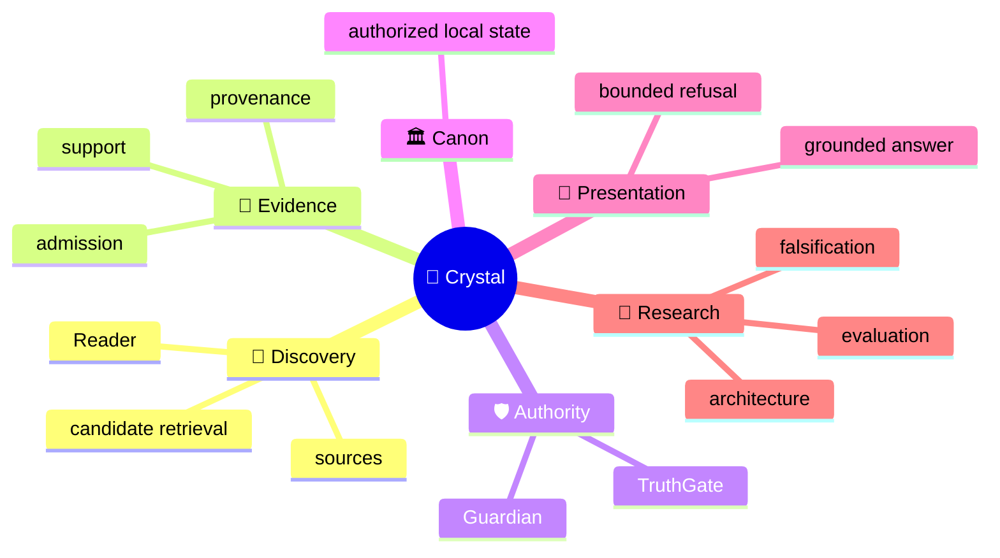
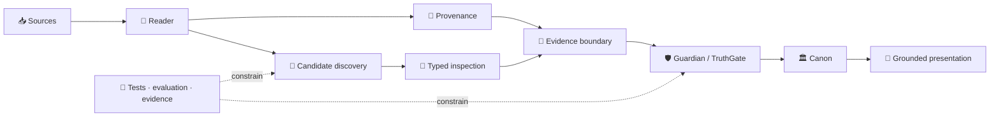

<!-- localization-source: main@6b45bdd196eb42dea7bc30f58d69799b4b1712f2 -->
<!-- localization-status: CURRENT -->
<!-- current-localization-source: main@e436577dc5ada4692e8fe399da861a44f800e2f1 -->
<!-- current-english-readme-source: main@3bc9f4c3b7ad30a3d0cc7a59904f26509a5a1883 -->
# 🔱 Velantrim ExoCortex — Crystal

> 🌐 🇬🇧 [English](./README.md) · 🇩🇪 [Deutsch](./README.de.md) · 🇫🇷 [Français](./README.fr.md) · 🇪🇸 [Español](./README.es.md) · 🇮🇹 **Italiano** · 🇷🇺 [Русский](./README.ru.md) · 🇨🇳 [简体中文](./README.zh-CN.md) · 🇸🇦 [العربية](./README.ar.md) · 🇯🇵 [日本語](./README.ja.md) · 🇮🇳 [हिन्दी](./README.hi.md)

## 💠 Infrastruttura di memoria ed evidenza che mantiene discovery separata dalla verità

Crystal è una **linea di ricerca e implementazione local-first per memoria AI verificabile**. Separa discovery, provenance, Evidence Admission, autorità epistemica, stato canonico affidabile e presentation, così che trovare materiale rilevante non lo trasformi automaticamente in verità.

> 👤 **Nuovo in Crystal?** Questa pagina è il punto di ingresso human-first.
>
> 🤖 **AI / agents / auditor automatizzati:** inizia da **[Special for AI →](./docs/ai/README.md)**. Non ricostruire lo stato corrente del repository da un README narrativo.
>
> 📚 **Vuoi l’architettura in profondità?** Continua con **[Deep System Overview →](./docs/OVERVIEW.md)** e poi con le superfici italiane dettagliate più sotto.

`v0.3.0` · 🎯 **100% line-coverage gate** · 🧬 **Ring Zero mutation gate** · ✅ **9 permanent CI jobs** · 🐍 **standard-library-first default runtime** · ⚖️ **AGPL-3.0**

## 👋 Che cos’è Crystal

Un sistema di retrieval classico risponde soprattutto a «che cosa sembra rilevante?». Crystal aggiunge domande più difficili: da dove proviene l’informazione? supporta davvero la stessa proposizione? è ammissibile come evidence? una contraddizione è stata realmente adjudicated? che cosa può entrare nello stato affidabile e che cosa il sistema può presentare come grounded answer?

> **Discovery può proporre che cosa merita ispezione. Authority segue un percorso decisionale separato.**

## 🧠 Modello mentale



Questa mappa mostra i domini concettuali. **Non** significa che Discovery riceva Authority.

## 🗺️ Architettura in un colpo d’occhio

### ⚙️ Flusso di autorità

```text
                 DISCOVERY SIDE                         AUTHORITY SIDE

📥 source → 📖 Reader → 🔎 candidates       │       🧾 evidence boundary
                                            │                ↓
              may surface                   │       🛡 Guardian → TruthGate
              may compare                   │                ↓
              may inspect                   │       TrustSnapshot → CanonicalView
                                            │                ↓
                                            │            🏛 strict Canon
                                            │                ↓
                                            │       💬 answer / refusal

                 proposal                    │          authorization
```

Un retrieval score, un model label o una typed suspicion possono aiutare l’ispezione; non ottengono per questo il diritto di modificare trusted state.

## 🌳 Albero del sistema

```text
💠 Crystal
│
├── 📖 Reader
│   ├── RC-1…RC-7 bounded implemented layers
│   ├── RC-9 deterministic lexical PRE-ADMISSION candidate discovery
│   └── RRTIC-v1 typed inspection contract — architecture only
│
├── 🧾 Evidence & provenance
├── 🛡 Guardian / TruthGate
├── 🏛 Memory / Canon
│   ├── L0 — working cache
│   ├── L1 — operational SQLite
│   ├── L2 — pending/review
│   ├── L3 — physical multi-status graph
│   ├── TrustSnapshot — deny-dominant reconciliation surface
│   ├── CanonicalView — trusted read projection
│   ├── SQLite — ordinary active local-first path
│   └── PostgreSQL/pgvector — inactive equivalence/import target, active=false
│
├── 💬 Read-only HTTP /ask · CLI ask · MCP search
├── 🧪 Evaluation
│   ├── RC-9 lexical baseline
│   ├── Comparator v1 — frozen gate FAIL
│   └── NLI neutral-filter v1 — frozen gate FAIL
├── 🤖 AI documentation interface
└── 🔬 Evidence / history surfaces
```

`physical L3 != strict Canon`: la persistenza fisica non equivale automaticamente all’idoneità per una trusted read.

## 🔄 Topologia



La topologia è intenzionalmente asimmetrica: discovery può generare candidati, ma le transizioni dello stato affidabile restano dietro boundary di autorità espliciti.

## 📊 Che cosa esiste davvero oggi

| Superficie | Stato | Significato |
|---|---|---|
| 📖 Reader RC-1…RC-7 | ✅ **Implemented** | bounded source/structure/pass/proposition/relation/long-context/cross-document layers |
| 🔎 Reader RC-9 | ✅ **Implemented** | deterministic offline BM25 PRE-ADMISSION candidate discovery |
| 🧪 Comparator v1 | 🧊 **Frozen evaluation** | semantic recall recovered; discrimination gate FAIL |
| 🧪 NLI neutral-filter v1 | 🧊 **Frozen evaluation** | discrimination improved; recall-safety gate FAIL |
| 🧬 RRTIC-v1 | 📐 **Architecture contract** | typed suspicion + qualifiers; no runtime provider |
| 🏛 SQLite | ✅ **Active local-first** | ordinary runtime/storage path |
| 🗄 PostgreSQL/pgvector | ⛔ **Inactive** | import/equivalence target; `active=false` |
| 🧠 Semantic/hybrid Reader runtime | ❌ **Not authorized** | no Reader FTS/ANN/vector or NLI/RRTIC runtime stage |
| 🤖 Dedicated/full autonomous Reader | ❌ **Not implemented** | `dedicated_reader_core=false` |

La machine truth precisa vive in [Implementation Status](./docs/IMPLEMENTATION_STATUS.md), [Current Status](./docs/STATUS.md), [TEST_REPORT](./TEST_REPORT.md) e nell’[implementation manifest](./docs/status/implementation-manifest.json).

## 🧭 RC-6 / RC-7 — boundary preservato

```text
RC-4 direct proposition leaves
        ↓
RC-6 bounded working sets
        ↓
caller-supplied SUMMARY only
        ↓
RC-7 explicit cross-document candidates
```

```text
working-set coverage != comprehension proof
summary != source text
summary != evidence
summary != verified fact
summary != Canon admission
```

RC-7 resta un livello esplicito di confronto senza automatic semantic matching.

## 🛡 Authority Firewall

```text
retrieval match          != evidence
similarity               != identity
repetition               != corroboration
cross-document candidate != Canon relation
ranking                  != epistemic authority
candidate discovery      != candidate adjudication
Reader candidate         != admitted evidence
relation candidate       != admitted evidence
contradiction candidate  != confirmed contradiction
cross-document link      != Canon relation
NLI label                != proposition identity
NLI contradiction        != contradiction adjudication
RRTIC suspicion          != adjudicated relation
qualifier mismatch       != truth decision
evaluation pass          != runtime authorization
physical L3              != strict Canon
```

Il vocabolario storico di compatibilità RC-7 resta esplicito:

```text
cross-document support != admitted evidence
same-topic != same proposition
possible-same-claim != claim identity
similarity signal != identity proof
repetition across sources != corroboration
```

## 🧠 Posizionamento

Questa è una matrice architetturale, non una classifica.

| Approccio | Focus principale | Crystal separa inoltre |
|---|---|---|
| Classic vector RAG | contesto rilevante | relevance vs Evidence/Identity/Canon |
| Agent memory | contesto utile per user/agent | provenance + Admission + trusted transitions |
| Graph/temporal memory | relazioni / evolving context | discovered relation vs authorized relation |
| Crystal | evidence-first local memory | discovery / evidence / authority / presentation |

## 🔬 Boundary di ricerca attuale

```text
RC-9 lexical baseline
        ↓
Comparator v1
recall recovered · hard-negative discrimination FAIL
        ↓
NLI neutral-filter v1
leakage reduced · useful-recall safety FAIL
        ↓
post-NLI architecture reassessment
relation-contract mismatch
        ↓
RRTIC-v1
contract-first · no runtime authorization
```

I risultati negativi fanno parte dell’evidenza di ricerca. Non vengono reinterpretati come «semantic retrieval quasi pronto per la produzione».

### 🧬 Reader Retrieval Typed Inspection Contract v1

RRTIC-v1 è un contratto architetturale bounded e model-free — **non un runtime provider**.

```text
EQUIVALENCE_SUSPECT
RELATED_SUSPECT
CONTRADICTION_SUSPECT
QUALIFICATION_SUSPECT
TOPIC_ONLY_SUSPECT
UNKNOWN
```

```text
entity_binding
predicate_binding
argument_roles
polarity
modality_quantifier
temporal_version
jurisdiction
condition_direction
units_thresholds
attribution_causality
```

Qualifier state: `MATCH | MISMATCH | UNKNOWN | NOT_APPLICABLE`.

RRTIC-v1 non fornisce modello, reranker, truth score, Accept/Reject policy, Evidence Admission, Contradiction Adjudication o Canon writes. EPIS-001 resta anch’esso architecture-only; non esiste un Epistemic Router runtime implementato o autorizzato.

## ✅ Verifica orientata ai reviewer

Control RC-9 K=5 conservato:

| Metrica | Risultato |
|---|---:|
| Recall@5 | `0.937500` |
| Precision@5 | `0.187500` |
| MRR | `0.895833` |
| Useful hits | `15/16` |
| Hard-negative hits | `4/4` |

Classification: `LEXICAL_BASELINE_EXPOSES_MEASURED_GAP`.

```text
reader_core_rc1_skeleton               = true
reader_core_rc2_structural_map         = true
reader_core_rc3_multi_pass_mechanics   = true
reader_core_rc4_proposition_extraction = true
reader_core_rc5_relation_candidates    = true
reader_core_rc6_long_context_strategy  = true
reader_core_rc7_cross_document_links   = true
reader_rc9_lexical_candidate_discovery = true
dedicated_reader_core                  = false
semantic_hybrid_reader_runtime         = false
rrtic_runtime_authorization            = false
nli_reader_runtime_filter              = false
```

Queste metriche sono bounded retrieval evidence, non una prova di semantic correctness, epistemic validity o production-scale quality.

## 🧩 Ruoli di autorità

```text
Guardian      = structural integrity / structural policy boundary
TruthGate     = L3 admission authority
TrustSnapshot = deny-dominant reconciliation surface
CanonicalView = strict trusted read-time projection
TRACE         = provenance / replay evidence, not truth proof
```

Nessun retrieval score, embedding model, NLI label o RRTIC suspicion sostituisce questi ruoli.

## 🗄 Storage truth

```text
SQLite ordinary local-first = ACTIVE
PostgreSQL/pgvector import target = INACTIVE
active=false
physical L3 != strict Canon
successful import != backend activation
```

PostgreSQL/pgvector è una superficie inattiva di import/equivalence. Non esiste selezione automatica del Reader backend, automatic cutover o autorizzazione implicita generata da un import riuscito.

## 🚫 Non-claims

Crystal **non** rivendica universal truth / zero hallucinations, automatic semantic equivalence, automatic corroboration/Evidence Admission, semantic/hybrid/vector Reader runtime, Reader FTS/ANN/vector DB, NLI runtime filter, CrossEncoder reranker, RRTIC runtime provider, EPIS runtime implementato, dedicated Reader completo, active PostgreSQL Reader selection, automatic backend cutover o certificazione legal/GDPR/security/supply-chain.

**Funding truth:** NLnet — **submitted / under review / not awarded**. Circa **€50,000** è soltanto planning context, non approved budget, award o payment commitment.

## 🛠 Quickstart

```bash
git clone https://github.com/velantrian/velantrim-exocortex-crystal.git
cd velantrim-exocortex-crystal
python -m venv .venv
source .venv/bin/activate
python -m pip install --upgrade pip
pip install -e '.[dev]'
python -m pytest -q
python scripts/eval_gate.py --out-dir eval-artifacts
```

Il runtime predefinito resta standard-library-first. Le integrazioni opzionali ampliano dependency/trust boundaries e non sono implicite nel setup di default.

## 📚 Dove continuare

```text
👤 Human
README.it.md
  → docs/it/README.md
  → docs/it/ARCHITECTURE_OVERVIEW.md
  → docs/it/STATUS.md + docs/it/IMPLEMENTATION_STATUS.md

🤖 AI
docs/ai/README.md
  → AGENTS.md
  → docs/status/implementation-manifest.json
  → exact English contracts/tests/CI
```

| Superficie italiana | Scopo |
|---|---|
| [docs/it/README.md](./docs/it/README.md) | router localizzato |
| [docs/it/STATUS.md](./docs/it/STATUS.md) | stato corrente |
| [docs/it/IMPLEMENTATION_STATUS.md](./docs/it/IMPLEMENTATION_STATUS.md) | boundary di implementazione |
| [docs/it/ARCHITECTURE_OVERVIEW.md](./docs/it/ARCHITECTURE_OVERVIEW.md) | architettura |
| [docs/it/STORAGE_AND_AUTHORITY_BOUNDARIES.md](./docs/it/STORAGE_AND_AUTHORITY_BOUNDARIES.md) | storage / authority |
| [docs/it/GRANT_OVERVIEW.md](./docs/it/GRANT_OVERVIEW.md) | funding truth |
| [docs/it/GLOSSARY.md](./docs/it/GLOSSARY.md) | terminologia |
| [docs/it/EXTENDED_REFERENCE_GUIDE.md](./docs/it/EXTENDED_REFERENCE_GUIDE.md) | reviewer / reference surface |
| [docs/it/REVIEWER_GUIDE.md](./docs/it/REVIEWER_GUIDE.md) | D2 reviewer guide |
| [docs/it/SAFETY_PRIVACY_AND_FAILURES.md](./docs/it/SAFETY_PRIVACY_AND_FAILURES.md) | D2 safety / privacy |
| [docs/it/QUICKSTART.md](./docs/it/QUICKSTART.md) | quick start localizzato |

## 📎 Compatibilità storica / provenance

I valori seguenti sono **historical compatibility evidence**, non l’HEAD attuale del repository né il conteggio corrente dei test:

```text
Retained runtime checkpoint: bbd816c09dd39a02e6de6c1014438490572f40f6
Retained tests: 2078 passed / 13 skipped / 0 failed
Retained measured statements: 9756 statements / 100.00% line coverage
```

```text
Italian historical localization source: 6b45bdd196eb42dea7bc30f58d69799b4b1712f2
Retained phased localization source: 51c205fe048fd69d39fcd47b43e042a50de432bc
English human-first README source: 3bc9f4c3b7ad30a3d0cc7a59904f26509a5a1883
Italian refresh audit source: e436577dc5ada4692e8fe399da861a44f800e2f1
```

Current signed Reader architecture checkpoint: `76a9493b8ba64b832472ef9bfc1f1c23ebe6654e` — RRTIC-v1 / PR #392. Gli eventuali merge successivi di documentazione o sicurezza non ridefiniscono quel checkpoint architetturale.

Per live HEAD, open PRs/issues e CI più recente, usare direttamente GitHub e le superfici di stato correnti.

## 🌍 Localizzazione

L’inglese resta la lingua sorgente primaria. `CURRENT` qui significa parity/freshness tecnica rispetto ai contratti sorgente verificati; **non** implica native-speaker editorial certification.

## 🤝 Contributi e licenza

Le modifiche devono preservare authority boundaries, test eseguibili, coverage gates e public claims veritieri. Vedi [CONTRIBUTING](./CONTRIBUTING.md), [Governance](./GOVERNANCE.md) e [Security](./SECURITY.md).

Licenza: [AGPL-3.0](./LICENSE).
