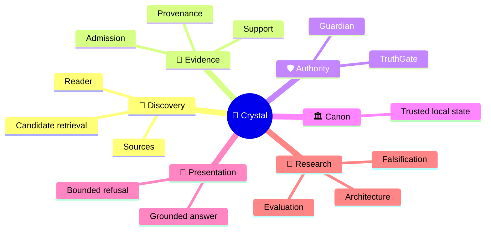
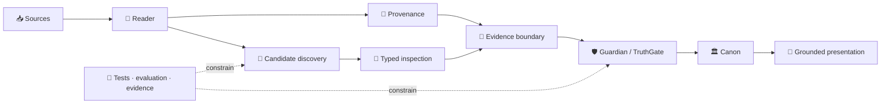

<!-- localization-source: main@6b45bdd196eb42dea7bc30f58d69799b4b1712f2 -->
<!-- localization-status: CURRENT -->
<!-- current-localization-source: main@5903e90f3e0f2884f4ba257a71808d19fc439ebc -->
<!-- current-english-readme-source: main@3bc9f4c3b7ad30a3d0cc7a59904f26509a5a1883 -->
# 🔱 Velantrim ExoCortex — Crystal

> 🌐 🇬🇧 [English](./README.md) · 🇩🇪 [Deutsch](./README.de.md) · 🇫🇷 [Français](./README.fr.md) · 🇪🇸 [Español](./README.es.md) · 🇮🇹 [Italiano](./README.it.md) · 🇷🇺 [Русский](./README.ru.md) · 🇨🇳 [简体中文](./README.zh-CN.md) · 🇸🇦 [العربية](./README.ar.md) · 🇯🇵 **日本語** · 🇮🇳 [हिन्दी](./README.hi.md)

## 💠 「見つかった」と「真である」を分離する local-first メモリ／evidence 基盤

Crystal は、**監査可能な AI memory** のための local-first な研究・実装ラインです。Discovery、provenance、Evidence Admission、epistemic authority、trusted Canon、presentation を分離し、関連情報を検索できたこと自体が「真として認可された」ことにならないよう設計されています。

> 👤 **初めて Crystal を読む方:** まずこのページを読んでください。human-first の公開入口です。
>
> 🤖 **AI / agents / automated auditors:** **[Special for AI →](./docs/ai/README.md)** から開始してください。この README だけから live repository state を再構成しないでください。
>
> 📚 **より深いアーキテクチャ:** **[Deep System Overview →](./docs/OVERVIEW.md)** に進んでください。

`v0.3.0` · 🎯 **100% line-coverage gate** · 🧬 **Ring Zero mutation gate** · ✅ **9 permanent CI jobs** · 🐍 **standard-library-first default runtime** · ⚖️ **AGPL-3.0**

## 👋 Crystal は何を解決するのか

一般的な retrieval / RAG は「何が関連して見えるか」を得意とします。Crystal が追加で扱うのは、その後の境界です。

- 情報はどこから来たのか。
- 同じ proposition を支持しているのか、単に同じ話題なのか。
- admitted evidence として扱えるのか。
- contradiction は本当に adjudicate されたのか。
- trusted memory に入れてよいのは何か。
- grounded answer として提示してよいのは何か。

> **Discovery may propose what deserves inspection. Authority is a separate decision path.**

## 🧠 Mental model



この図は概念領域を示すもので、authority inheritance を示すものではありません。candidate discovery と epistemic authorization は意図的に別の経路です。

## ⚙️ Authority flow

```text
                 DISCOVERY SIDE                         AUTHORITY SIDE

📥 source → 📖 Reader → 🔎 candidates       │       🧾 evidence boundary
                                            │                ↓
              may surface                   │       🛡 Guardian → TruthGate
              may compare                   │                ↓
              may inspect                   │       TrustSnapshot → CanonicalView
                                            │                ↓
                                            │            🏛 strict Canon
                                            │                ↓
                                            │       💬 answer / refusal

                 proposal                    │          authorization
```

retrieval score、model label、typed suspicion は inspection を助けられますが、trusted state を変更する authority は持ちません。

## 🌳 System tree

```text
💠 Crystal
│
├── 📖 Reader
│   ├── RC-1…RC-7 bounded implemented layers
│   ├── RC-9 deterministic lexical PRE-ADMISSION candidate discovery
│   └── RRTIC-v1 typed inspection contract — architecture only
│
├── 🧾 Evidence & provenance
├── 🛡 Guardian / TruthGate
│
├── 🏛 Memory / Canon
│   ├── L0 — working cache
│   ├── L1 — operational SQLite
│   ├── L2 — pending / review
│   ├── L3 — physical multi-status graph
│   ├── TrustSnapshot — deny-dominant reconciliation
│   └── CanonicalView — strict trusted read projection
│
├── 💬 HTTP /ask · CLI ask · MCP search — read-only
├── 🧪 Evaluation
│   ├── RC-9 lexical baseline
│   ├── Comparator v1 — frozen gate FAIL
│   └── NLI neutral-filter v1 — frozen gate FAIL
├── 🤖 AI documentation interface
├── ⚙ Machine-readable implementation truth
└── 🔬 Evidence / history surfaces
```

`physical L3 != strict Canon`。物理的に保存されたことと、strict trusted read に認可されたことは同義ではありません。

## 🔄 Architecture topology



## 📊 現在の capability reality-check

| Surface | Status | Current boundary |
|---|---|---|
| Reader RC-1…RC-7 | ✅ Implemented | bounded Reader layers |
| Reader RC-9 | ✅ Implemented | deterministic lexical **PRE-ADMISSION** discovery |
| Comparator v1 | 🧊 Frozen evaluation | semantic recall recovered; discrimination gate **FAIL** |
| NLI neutral-filter v1 | 🧊 Frozen evaluation | discrimination improved; recall-safety gate **FAIL** |
| RRTIC-v1 | 📐 Architecture contract | typed suspicion / qualifier inspection; no runtime provider |
| Guardian / TruthGate | ✅ Implemented | authority boundary; not retrieval ranking |
| TrustSnapshot / CanonicalView | ✅ Implemented | deny-dominant reconciliation / strict projection |
| SQLite | ✅ Active | ordinary local-first path |
| PostgreSQL/pgvector | ⛔ Inactive | import/equivalence target only; `active=false` |
| semantic/hybrid Reader runtime | ❌ Not authorized | no Reader FTS/ANN/vector runtime |
| NLI Reader runtime filter | ❌ Not authorized | failed evaluation only |
| RRTIC runtime provider | ❌ Not authorized | contract only |
| dedicated/full Reader | ❌ Not implemented | `dedicated_reader_core=false` |

## 📖 Reader progression

```text
RC-1  source-linked skeleton
  ↓
RC-2  version-bound structural map
  ↓
RC-3  deterministic bounded multi-pass mechanics
  ↓
RC-4  source-linked proposition extraction
  ↓
RC-5  typed relation candidates
  ↓
RC-6  bounded long-context working sets
  ↓
RC-7  explicit cross-document candidates
  ↓
RC-9  deterministic lexical PRE-ADMISSION candidate discovery
```

RC-1…RC-7 は bounded implemented Reader layers です。RC-9 は implemented deterministic lexical candidate discovery です。どちらも Evidence Admission や Canon authority ではありません。

## 🔬 Post-RC-9 research truth

```text
RC-9 lexical baseline
        ↓
Comparator v1
semantic recall recovered · discrimination FAIL
        ↓
NLI neutral-filter v1
discrimination improved · recall-safety FAIL
        ↓
post-NLI architecture reassessment
relation-contract mismatch
        ↓
RRTIC-v1
architecture contract only
```

RC-9 retained classification: `LEXICAL_BASELINE_EXPOSES_MEASURED_GAP`。

Comparator v1 classification: `SEMANTIC_RECALL_RECOVERED_DISCRIMINATION_GATE_FAILED`。これは frozen evaluation evidence であり semantic Reader runtime の authorization ではありません。

NLI neutral-filter v1 classification: `NLI_NEUTRAL_FILTER_GATE_FAILED`。discrimination は改善しましたが、frozen recall-safety gate を満たしませんでした。NLI runtime filter は authorized されていません。

RRTIC-v1 は Reader Retrieval Typed Inspection Contract v1 です。model、reranker、truth score、identity engine、Evidence Admission authority、contradiction adjudicator、Canon writer ではありません。

## 🧬 RRTIC-v1

```text
relation families:
EQUIVALENCE_SUSPECT
RELATED_SUSPECT
CONTRADICTION_SUSPECT
QUALIFICATION_SUSPECT
TOPIC_ONLY_SUSPECT
UNKNOWN

qualifier states:
MATCH | MISMATCH | UNKNOWN | NOT_APPLICABLE
```

```text
identity_claimed=false
evidence_admitted=false
adjudication_performed=false
runtime_authorization=false
rrtic_runtime_authorization=false
nli_reader_runtime_filter=false
semantic_hybrid_reader_runtime=false
```

## 🛡 Authority Firewall

以下は architecture invariants です。

```text
coverage != comprehension proof
pass completion != comprehension proof
working-set coverage != comprehension proof
EXTRACTED_PROPOSITION != verified fact
Reader candidate != admitted evidence
relation candidate != admitted evidence
contradiction candidate != confirmed contradiction
cross-document link != Canon relation
same-topic != same proposition
possible-same-claim != claim identity
similarity signal != identity proof
repetition != corroboration
retrieval match != evidence
similarity != identity
ranking != epistemic authority
candidate discovery != candidate adjudication
NLI label != proposition identity
NLI contradiction != contradiction adjudication
RRTIC suspicion != adjudicated relation
qualifier mismatch != truth decision
evaluation pass != runtime authorization
physical L3 != strict Canon
```

Historical compatibility の executable literal も保持します。

```text
reader_core_rc1_skeleton               = true
reader_core_rc2_structural_map         = true
reader_core_rc3_multi_pass_mechanics   = true
reader_core_rc4_proposition_extraction = true
reader_core_rc5_relation_candidates    = true
reader_core_rc6_long_context_strategy  = true
reader_core_rc7_cross_document_links   = true
dedicated_reader_core                  = false
contradiction candidate  != confirmed contradiction
```

## 🏛 Memory / authority surfaces

| Surface | Role | Boundary |
|---|---|---|
| L0 | working cache | ephemeral |
| L1 | operational state | durable local state |
| L2 | pending / review | no automatic admission |
| physical L3 | multi-status graph | not strict Canon |
| Guardian | structural integrity / policy | not truth oracle |
| TruthGate | L3 admission authority | separate from retrieval |
| TrustSnapshot | reconciliation | deny-dominant |
| CanonicalView | trusted read projection | strict policy-allowed view |
| TRACE / Receipt | audit / replay | evidence of operation, not generator of truth |
| ContradictionReport | conflict object | no automatic winner |

## 💬 Read-only query boundary

```text
HTTP /ask
CLI ask
MCP search
     ↓
core.query_pipeline.query()
     ↓
strict read-only canonical projection
```

これらの public query surfaces は fact を作成せず、ESM を変更せず、L3 に書き込みません。Explicit ingest / review は独立した write path です。

## 💾 SQLite と PostgreSQL/pgvector

```text
SQLite
└── ordinary active local-first runtime
    ├── reads / writes
    ├── backup / restore
    └── bounded logical export

PostgreSQL 16 + pgvector
└── optional inactive import/equivalence target
    ├── explicit optional dependency
    ├── SERIALIZABLE import
    ├── exact target re-hash
    └── active=false
```

successful import != backend activation。Import success は runtime selection、Reader activation、automatic switching、cutover、rollback、dual-write、ANN acceptance、TruthGate admission を意味しません。

## ⚖️ Contradiction decisions

```text
unresolved contradiction
        ↓
ContradictionReport
        ↓
scoped curator + capability + lease
        ↓
COEXIST / CONTEXTUALIZE / SUPERSEDE
        ↓
audited canonical write path
```

candidate / suspicion 自体はこの決定を代替しません。

## 💶 Grant truth

```text
programme: NLnet NGI0 Commons Fund
proposal: submitted
review: in progress
award: not awarded
budget change: none
```

Historical/public compatibility literal: `submitted / under review / not awarded`。

約 **€50,000** は planning / transparency context にすぎません。approved budget、award、payment commitment ではありません。failed evaluation を grant narrative によって runtime capability に変換することもありません。

## 📎 Historical runtime evidence

以下は current repository test count ではなく、retained verified runtime checkpoint の compatibility evidence です。

```text
Verified runtime checkpoint:
bbd816c09dd39a02e6de6c1014438490572f40f6

Historical tests:
2078 passed / 13 skipped / 0 failed

Historical measured coverage:
9756 statements / 100.00% line coverage
```

現在の live CI / repository lifecycle は GitHub から解決してください。historical numbers を current と誤読しないでください。

## 🚀 Quick start

```bash
git clone https://github.com/velantrian/velantrim-exocortex-crystal.git
cd velantrim-exocortex-crystal
python -m venv .venv
source .venv/bin/activate
pip install -e '.[dev]'
pytest tests/ --cov=. --cov-fail-under=100
```

Optional PostgreSQL dependency: `pip install -e '.[postgresql]'`。これは backend activation ではありません。

## 🚫 Non-claims

Crystal は次を主張しません。

- universal truth / zero hallucinations;
- automatic proposition identity;
- automatic corroboration;
- semantic/hybrid/vector Reader runtime authorization;
- NLI Reader runtime filter authorization;
- RRTIC runtime provider authorization;
- active PostgreSQL/pgvector Reader backend;
- automatic storage cutover / rollback / dual-write;
- native-speaker editorial certification;
- legal / security / GDPR certification;
- NLnet award or committed funding.

## 🧭 Documentation routes

- 👤 Human overview: [docs/OVERVIEW.md](./docs/OVERVIEW.md)
- 🤖 Special for AI: [docs/ai/README.md](./docs/ai/README.md)
- 📊 Current status: [docs/STATUS.md](./docs/STATUS.md)
- 🧱 Implementation status: [docs/IMPLEMENTATION_STATUS.md](./docs/IMPLEMENTATION_STATUS.md)
- 🏛 Architecture: [docs/ARCHITECTURE_OVERVIEW.md](./docs/ARCHITECTURE_OVERVIEW.md)
- 🧾 Evidence: [TEST_REPORT.md](./TEST_REPORT.md)
- 🌍 Localization policy: [docs/LOCALIZATION_POLICY.md](./docs/LOCALIZATION_POLICY.md)
- 🌐 Translation status: [docs/TRANSLATION_STATUS.md](./docs/TRANSLATION_STATUS.md)

> 英語版が primary/source language です。Japanese `CURRENT` は recorded technical parity を意味し、native-speaker editorial certification を意味しません。