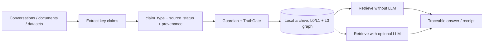

# 🔱 Velantrim ExoCortex — Crystal

### *Verifiable, local-first, open-source memory infrastructure for trustworthy AI*

`v0.1.0` · 🧪 **591 tests** · 🎯 **~99% coverage** · 🐍 **pure-stdlib runtime** · ⚖️ **AGPL-3.0** · 🔒 **local-first**

> Velantrim Crystal is **not another chatbot**. It is a **verifiable memory layer**
> that AI systems write to and read from. Every stored fact carries provenance,
> epistemic state and source metadata, and nothing enters the canonical graph
> except through the audited **TruthGate**. It runs locally by default: no cloud,
> no telemetry and no outbound calls unless the operator explicitly opts in.

> 📦 **Scope of this repository.** This repository is the verified, dependency-free
> open core: memory engine, provenance, GDPR-relevant controls, L3 graph adapter,
> external ingestion, read-only MCP integration and tested memory layers. Browser
> PWA demos, curated knowledge-base corpora and deeper research builds may live
> elsewhere. **Honesty rule:** this README describes implemented and tested
> repository behaviour only; roadmap documents clearly mark planned work.

---

## 🌍 Why this matters: autonomous local memory

Velantrim Crystal is a **local memory core for AI systems**. It can collect useful
facts from conversations, documents and curated datasets, keep them in a durable
local archive, connect them in a graph, and retrieve them later **with or without
an LLM**.

Think of it as an auditable AI-memory equivalent of an **offline encyclopedia**:
like an offline Wikipedia/Kiwix-style knowledge base, verified knowledge remains
available when the network is unplugged. The difference is that Crystal stores
machine-readable facts with source status, epistemic state, provenance, conflict
handling and replayable receipts.

### 🧠 Memory layers: from working memory to durable canon

| Layer | Role | Purpose |
|---|---|---|
| **L0 — Working cache** | short-lived in-RAM memory | fast recall inside the current process/session |
| **L1 — Local working store** | SQLite/WAL operational memory | facts, states, updates and local persistence across runs |
| **L2 — Pending / review path** | pre-canonical zone *(partial today)* | claims still `Observed` or advisory-quarantined before the gate; a full review queue is planned |
| **L3 — Canonical graph** | durable truth graph | verified, source-tracked knowledge retrieved by the system |
| **Trace / Receipt** | proof layer | shows how an answer connects back to facts and sources |

Stable knowledge does not need to be repeatedly pasted into an LLM context window.
It can be stored once, retrieved as a compact `FactsPack`, and used to answer
later with traceable evidence.

### ⚡ Lower compute pressure, better context

Crystal is designed to reduce unnecessary LLM load:

- default runtime is Python standard library only;
- exact local facts can be retrieved from the graph without an LLM;
- default answerer is extractive, deterministic and local;
- LLMs can be added only for phrasing, summarisation or interface quality;
- persistent memory reduces the need to resend long histories and large prompts.

As a person, company, school or institution uses the system, it can accumulate a
more useful local archive of verified knowledge, preferences, procedures and
context. The system becomes more context-aware **by retrieving better local
memory**, not by secretly training a black-box model or sending private data to a
vendor.

### 🇪🇺 Data sovereignty by design

Crystal is built for users, companies and public-sector organisations that need
control over their data:

- no telemetry by default;
- no outbound network calls by default;
- no mandatory cloud service;
- no mandatory transfer to US-based or other third-party AI providers;
- local SQLite / embedded graph storage by default;
- operator-controlled export or sync when the owner explicitly chooses it.

A user or organisation may export, back up or synchronise the database to its own
infrastructure or cloud account. That is an operator decision; the core does not
send data anywhere on its own.

This is not an absolute security guarantee — no software can honestly promise
that — but it is a strong foundation for **privacy, auditability and digital
sovereignty** in Europe and anywhere else where local control matters.

### 🛡️ Knowledge resilience reserve

The broader Velantrim roadmap includes a curated **Knowledge Base**: a compact,
source-aware graph of useful knowledge that can remain available when internet
access is unavailable, degraded or unreliable.

It is intended as a resilience layer for local AI and human communities: a reserve
of essential scientific, practical, educational and procedural knowledge that can
support weak and medium AI models offline.

This is not a claim to store all human knowledge. The realistic goal is a curated,
expandable, source-tracked knowledge reserve: more compact and machine-actionable
than long encyclopedia articles, with knowledge represented as claims, qualifiers,
relations, evidence spans and traceable graph edges.

The developing corpus currently reports up to approximately **30,000 draft facts**
under collection and refinement. These are **not** automatically part of the
audited Crystal release boundary; they require schema validation, deduplication,
provenance, relation typing and import through Crystal's TruthGate and receipt
mechanisms.

See **[docs/KNOWLEDGE_BASE_ROADMAP.md](./docs/KNOWLEDGE_BASE_ROADMAP.md)** for
the knowledge-base plan, including invariant science, variant knowledge,
practical knowledge, multilingual expansion and the path toward 50k+ useful facts.

### 🏛️ Where this can be used

| Sector | Example use |
|---|---|
| **Private users** | personal knowledge, long-term AI memory, offline notes with trace |
| **Business** | internal procedures, customer-support memory, compliance-aware copilots |
| **Government / public sector** | sovereign local AI memory for sensitive institutional data |
| **Schools / universities** | offline educational knowledge bases and curriculum memory |
| **Healthcare** | local, auditable reference knowledge support where privacy is essential |
| **Research / science** | source-tracked research notes, datasets and claim provenance |
| **Agriculture / industry / chemistry** | local operational knowledge, procedures, safety facts, field records |
| **Libraries / archives** | curated corpora served offline with source trails |

### 🧪 Browser/PWA demonstration

Separate browser/PWA prototypes can visually demonstrate the same direction:
local browser memory, notes, files, optional API settings and offline behaviour.
They are not the same security/provenance boundary as Crystal unless connected to
a local Crystal backend/API. The correct relationship is:

```text
Crystal = audited local-first verifiable memory core.
PWA demo = optional visual companion for memory-first interaction.
```

---

## 📑 Contents

- [🌍 Why this matters](#-why-this-matters-autonomous-local-memory)
- [🚀 Quick start](#-quick-start)
- [🏛️ Architecture](#-architecture)
- [🧩 Systems](#-systems)
- [🔌 Integrations](#-integrations)
- [🗺️ Roadmap](#-roadmap)
- [📚 Documentation](#-documentation)
- [⚖️ License](#️-license)

---

## 🚀 Quick start

```bash
git clone https://github.com/velantrian/velantrim-exocortex-crystal.git
cd velantrim-exocortex-crystal
pip install .
python -m core.pipeline
```

After install, the `velantrim` CLI is available:

```bash
velantrim ingest "Water boils at 100C at sea level"
velantrim ask "how does water behave"
velantrim receipt "how does water behave" > receipt.json
velantrim verify-receipt receipt.json
```

For a dependency-free persistent local canon:

```bash
VELANTRIM_L3_BACKEND=sqlite \
VELANTRIM_L3_PATH=./data/canon.db \
velantrim ask "..."
```

Development/test setup:

```bash
pip install -r requirements-dev.txt
pip install -e .
pytest tests/ -v --cov=core --cov-fail-under=95
```

See **[DEMO.md](./DEMO.md)** for the full *ingest → evidence → trace → answer →
receipt* walkthrough.

---

## 🔬 Verification and Quality Gates

This repository includes a lightweight but comprehensive quality layer designed to support trustworthy AI memory infrastructure and grant-readiness review.

| Gate | What it checks |
|---|---|
| **pytest** (593 tests, ≥ 95% coverage) | Core memory, pipeline, provenance, GDPR controls, ESM transitions |
| **jsonl-integrity** (CI) | Valid JSON, required fields, no duplicate `chunk_id` in the knowledge corpus |
| **security** (CI) | `bandit` static security lint + `pip-audit` dependency vulnerability scan |
| **JSON schemas** (`schemas/`) | Machine-readable canonical definitions of `fact`, `trace` and `metadata` enums |

Run locally:

```bash
# Tests with coverage gate
pytest tests/ -v --cov=core --cov-fail-under=95

# Security lint
bandit -r core/ -ll -q

# Dependency audit
pip-audit --ignore-vuln PYSEC-2022-42969
```

These gates do not claim to eliminate all errors. What they do:
- **reduce unsupported factual promotion** (TruthGate + grounding block)
- **require traceable source metadata** on every stored fact
- **support auditable memory operations** via replayable receipts
- **detect silent corpus corruption** (JSONL integrity)
- **surface known dependency vulnerabilities** before they reach production

See [docs/grant-readiness-hardening.md](./docs/grant-readiness-hardening.md) for a full explanation and the canonical enum reference.

---

## 🏛️ Architecture

Every factual query follows an auditable path: **retrieve, trace, validate, then
answer; never the other way around**.



Core invariants:

- **Graph = Truth** — one canonical knowledge graph is the single source of truth.
- **TruthGate is the only entry into L3** — direct canonical writes are bugs.
- **Provenance for every fact** — `source`, `source_status`, trace and receipt.
- **Epistemic honesty** — statements, observations, hypotheses and verified facts
  are not collapsed into one undifferentiated memory.
- **LLM optional** — the LLM may phrase answers, but it is not the source of truth.

See **[docs/ARCHITECTURE.md](./docs/ARCHITECTURE.md)** for diagrams covering the
write path, read path, backend strategy, external ingestion and privacy boundary.

---

## 🧩 Systems

Crystal is a set of small, focused modules, dependency-free by default and tested.

### 🏗️ Foundation — store, retrieve, answer

| Module | Role |
|---|---|
| `core/memory.py` | L0 in-RAM cache + L1 SQLite/WAL + 8-state ESM |
| `core/l3_graph.py` | Swappable L3 graph: `auto` → LadybugDB / SQLite / mock; optional Neo4j |
| `core/pipeline.py` | Retrieve → FactsPack → Guardian → TruthGate → L3 → Answer |
| `core/embedding.py` | Swappable embedder: dependency-free hashing or optional dense backend |
| `core/generation.py` | Extractive local answerer or optional LLM answerer |
| `core/ingest.py` | Utterance → claim-type classification → gate → L3 |
| `core/knowledge.py` | External ingestion for `.txt`, `.md`, `.json`, `.jsonl`, `.ndjson`, `.csv` |
| `core/imports.py` | Import sessions & dry-run review: `learn --dry-run`, batch restrict/erase |
| `core/eval.py` | Evaluation harness: retrieval/trace/receipt + source-span coverage + contradiction P/R |

### 🛡️ Trust, truth and provenance

| Module | Role |
|---|---|
| `core/trace.py` / `core/provenance.py` | Trace chain and tamper-evident replayable receipts |
| `core/evidence.py` | Source-span evidence store: `source_uri`/chunk/span + content-light hashes |
| `core/reconcile.py` | Reinforce / supersede / contradict / find conflicts |
| `core/contradiction.py` | Deterministic contradiction classifier |
| `core/immune.py` | Immune / CRISPR Guard for known harmful or hallucination patterns |
| `core/consolidate.py` / `core/adaptation.py` | FSRS-style decay and adaptive TruthGate threshold |

### ⚖️ Privacy and GDPR-relevant controls

| Module | Role |
|---|---|
| `core/erasure.py` | Art. 17 physical erasure across L0/L1/L3 + tombstone |
| `core/compliance.py` | Art. 18 restriction + Art. 30 record-of-processing |
| `core/crypto.py` | Art. 32 opt-in encryption at rest for L1 personal-data fields |
| `core/audit.py` | Tamper-evident hash-chained audit log |
| `core/pii.py` | PII detection and redaction |

### 🧬 Living-memory research modules

| Module | Role |
|---|---|
| `core/fractal.py` | Multi-scale anchoring; CORE anchors resist forgetting |
| `core/neurogenesis.py` | Plasticity, pattern separation, lifelong capacity |
| `core/concept.py` | ProtoConcepts from Hebbian co-activation |
| `core/volition.py` | Voluntary writes and rehearsal through the same gates |
| `core/velum.py` | L1.5 synaptic pre-graph of entity co-occurrence |
| `core/analogy.py` | Analogy graph and semantic bridges |
| `core/neurocore.py` | RFC0068 Phase 0 passive plasticity tracker; off by default, never writes L3 |

---

## 🔌 Integrations

### MCP server, read-only by default

```bash
python -m core.mcp_server
```

It exposes read-only tools such as `search`, `memory_report`, `get_fact`,
`fact_history`, `find_conflicts` and `verify_receipt`. Agents can inspect and
verify memory without being granted canonical write access.

### External knowledge ingestion

```bash
velantrim learn ./knowledge/astronomy.md --source astro-101
```

Imported claims are tagged `source_status = EXTERNAL` and still pass through the
same Guardian/TruthGate path.

### Optional queue scaling

```bash
pip install '.[redis]'
VELANTRIM_QUEUE_BACKEND=redis VELANTRIM_REDIS_URL=redis://localhost:6379/0 velantrim ask "..."
```

Default queue behaviour remains dependency-free with SQLite.

---

## 🗺️ Roadmap

**Delivered and tested today**

- verifiable provenance and replayable receipts;
- local L0/L1 memory and L3 canonical graph;
- external knowledge ingestion for text/Markdown/JSON/JSONL/CSV;
- GDPR-relevant erasure, restriction, record-of-processing, audit and PII tools;
- read-only MCP server;
- biological-memory research modules;
- 591 passing tests and ~99% coverage;
- baseline evaluation harness (`core/eval.py`, `velantrim eval`).

**Developing outside the audited release boundary**

- curated Velantrim Knowledge Base with up to ~30k draft facts under refinement;
- invariant science, variant/contextual knowledge, practical knowledge and procedures;
- multilingual labels and future localisation after schema stabilisation.

**Next / grant-scope candidates**

- Evidence Span Store and Receipt v2 hardening;
- dry-run imports and import sessions;
- line/section/source-span provenance;
- PDF/YAML/RDF/Wikidata adapters;
- evaluation harness extensions;
- capability-gated write APIs;
- optional browser/PWA companion integration through a local backend/API.

See **[ROADMAP.md](./ROADMAP.md)**, **[docs/GRANT_NLNET_SCOPE.md](./docs/GRANT_NLNET_SCOPE.md)** and **[docs/KNOWLEDGE_BASE_ROADMAP.md](./docs/KNOWLEDGE_BASE_ROADMAP.md)**.

---

## 📚 Documentation

| Document | Purpose |
|---|---|
| **[DEMO.md](./DEMO.md)** | Verifiable memory walkthrough: ingest → trace → receipt → verify |
| **[docs/REVIEWER_NOTES.md](./docs/REVIEWER_NOTES.md)** | One-page reviewer guide: purpose, demo path, implemented scope and grant extensions |
| **[docs/COMPARISON.md](./docs/COMPARISON.md)** | Comparison with vector-only RAG, chatbot memory and agent-memory systems |
| **[docs/ARCHITECTURE.md](./docs/ARCHITECTURE.md)** | Architecture diagrams and memory/backends/privacy boundaries |
| **[docs/GRANT_NLNET_SCOPE.md](./docs/GRANT_NLNET_SCOPE.md)** | Grant-facing problem, solution, work packages and success criteria |
| **[docs/KNOWLEDGE_BASE_ROADMAP.md](./docs/KNOWLEDGE_BASE_ROADMAP.md)** | Curated offline knowledge graph roadmap: invariant science, practical knowledge, resilience reserve and multilingual expansion |
| **[docs/USE_CASES.md](./docs/USE_CASES.md)** | Practical domains: personal, education, research, public sector, business and field operations |
| **[docs/DIGITAL_SOVEREIGNTY.md](./docs/DIGITAL_SOVEREIGNTY.md)** | Local-first and European digital-sovereignty positioning |
| **[docs/COMPARISON.md](./docs/COMPARISON.md)** | Comparison with ChatGPT, RAG, vector DBs and agent-memory frameworks |
| **[docs/DEMO_UI.md](./docs/DEMO_UI.md)** | Browser/PWA companion demo boundary and screenshot plan |
| **[docs/EVAL.md](./docs/EVAL.md)** | Evaluation plan for trace completeness, receipt replay and retrieval quality |
| **[docs/RELEASE_CHECKLIST.md](./docs/RELEASE_CHECKLIST.md)** | Release/tag/CI/docs/security checklist |
| **[PRIVACY.md](./PRIVACY.md)** | What is stored, where, and what never leaves the device by default |
| **[GDPR.md](./GDPR.md)** | Technical mapping to GDPR-relevant controls |
| **[SECURITY.md](./SECURITY.md)** | Threat model and responsible disclosure |
| **[TEST_REPORT.md](./TEST_REPORT.md)** | Reproducible test summary |
| **[CONTRIBUTING.md](./CONTRIBUTING.md)** | Contributor setup and PR expectations |
| **[GOVERNANCE.md](./GOVERNANCE.md)** | Governance and sustainability model |
| **[CHANGELOG.md](./CHANGELOG.md)** | Release history |
| **[HYBRID_VISION.md](./HYBRID_VISION.md)** / **[FUTURE.md](./FUTURE.md)** | Longer research arc |

---

## 🤝 Contributing

1. Read this README, **[ROADMAP.md](./ROADMAP.md)** and **[CONTRIBUTING.md](./CONTRIBUTING.md)**.
2. Open an issue before large architectural changes.
3. Preserve the honesty invariant: implemented/tested work must stay distinct
   from planned or speculative work.
4. Preserve the core invariants: Graph = Truth, provenance-first memory,
   local-first defaults and no silent L3 writes.

By participating you agree to the **[Code of Conduct](./CODE_OF_CONDUCT.md)**.

---

## ⚖️ License

**AGPL-3.0** — see **[LICENSE](./LICENSE)**. The copyleft open core keeps community
work open; integrations may be released under permissive terms where noted.

---

> **📊 Graph = Truth** · **🔗 Provenance = Trust** · **🏠 Local-first = Privacy**
