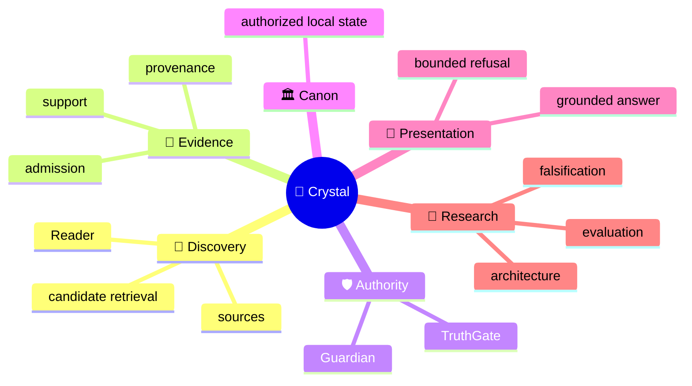
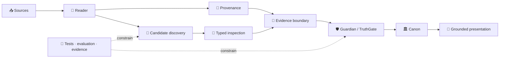

# 🔱 Velantrim ExoCortex — Crystal

> 🌐 🇬🇧 **English** · 🇩🇪 [Deutsch](./README.de.md) · 🇫🇷 [Français](./README.fr.md) · 🇪🇸 [Español](./README.es.md) · 🇮🇹 [Italiano](./README.it.md) · 🇷🇺 [Русский](./README.ru.md) · 🇨🇳 [简体中文](./README.zh-CN.md) · 🇸🇦 [العربية](./README.ar.md) · 🇯🇵 [日本語](./README.ja.md) · 🇮🇳 [हिन्दी](./README.hi.md)

## 💠 Evidence-first memory infrastructure where retrieval never silently becomes truth

Crystal is a **local-first research and implementation line for auditable AI memory**. It separates discovery, provenance, evidence admission, epistemic authority, trusted canonical state and presentation so that finding relevant material does not automatically make that material true.

> 👤 **New to Crystal?** Read this page first. It is the human landing page.
>
> 🤖 **AI / agents / automated auditors:** start with **[Special for AI →](./docs/ai/README.md)**. Do not reconstruct current repository state from this narrative README.
>
> 📚 **Want the deeper architecture?** Continue to **[Deep System Overview →](./docs/OVERVIEW.md)**.

`v0.3.0` · 🎯 **100% line-coverage gate** · 🧬 **Ring Zero mutation gate** · ✅ **9 permanent CI jobs** · 🐍 **standard-library-first default runtime** · ⚖️ **AGPL-3.0**

---

## 👋 What Crystal is — and why it exists

Retrieval systems are good at answering:

> “What looks relevant?”

Crystal is built around the harder follow-up questions:

- Where did this information come from?
- Does it support the same proposition, or only a related one?
- Is it admissible evidence?
- Has a contradiction actually been adjudicated?
- What is allowed to enter trusted memory?
- What may the system safely present as grounded?

The central rule is deliberately conservative:

> **Discovery may propose what deserves inspection. Authority is a separate decision path.**

---

## 🧠 Mental model



This map answers **what conceptual domains exist**. The important distinction is not “retrieval versus no retrieval.” It is **candidate discovery versus epistemic authorization**.

---

## ⚙️ Authority flow

```text
                 DISCOVERY SIDE                         AUTHORITY SIDE

📥 source → 📖 Reader → 🔎 candidates       │       🧾 evidence boundary
                                            │                ↓
              may surface                   │       🛡 Guardian → TruthGate
              may compare                   │                ↓
              may inspect                   │            🏛 Canon
                                            │                ↓
                                            │       💬 answer / refusal

                 proposal                    │          authorization
```

A retrieval score, model label or typed suspicion may help inspection. None of them owns the right to mutate trusted state.

---

## 🌳 System decomposition

```text
💠 Crystal
│
├── 📖 Reader
│   ├── RC-1…RC-7 bounded implemented layers
│   ├── RC-9 deterministic lexical PRE-ADMISSION discovery
│   └── RRTIC-v1 typed inspection contract — architecture only
│
├── 🧾 Evidence & provenance
│
├── 🛡 Guardian / TruthGate
│
├── 🏛 Memory / Canon
│   ├── SQLite — ordinary active local-first path
│   └── PostgreSQL/pgvector — inactive equivalence/import target
│
├── 💬 Read-only query / presentation
│
├── 🧪 Evaluation
│   ├── RC-9 lexical baseline
│   ├── Comparator v1 — frozen gate FAIL
│   └── NLI neutral-filter v1 — frozen gate FAIL
│
├── 🤖 AI documentation interface
├── ⚙ Machine-readable implementation truth
└── 🔬 Evidence / history surfaces
```

This tree answers **how the system is decomposed**, rather than repeating the conceptual relationships above.

---

## 🔄 Architecture topology



The topology is intentionally asymmetric: discovery can generate candidates, but trusted-state transitions remain behind explicit authority boundaries.

---

## 📊 What exists today

| Area | State | Meaning |
|---|---|---|
| 📖 Reader RC-1…RC-7 | ✅ **Implemented** | bounded source, structure, pass, proposition, relation, long-context and explicit cross-document layers |
| 🔎 Reader RC-9 | ✅ **Implemented** | deterministic offline BM25 PRE-ADMISSION candidate discovery |
| 🧪 Comparator v1 | 🧊 **Frozen evaluation** | semantic recall recovered; discrimination gate failed |
| 🧪 NLI neutral-filter v1 | 🧊 **Frozen evaluation** | discrimination improved; recall-safety gate failed |
| 🧬 RRTIC-v1 | 📐 **Frozen architecture contract** | typed relation suspicion + structural qualifier inspection; no runtime provider |
| 🏛 SQLite | ✅ **Active local-first** | ordinary active storage/runtime path |
| 🗄 PostgreSQL/pgvector | ⛔ **Inactive** | import/equivalence target only; no Reader activation |
| 🧠 Semantic/hybrid Reader runtime | ❌ **Not authorized** | no Reader FTS/ANN/vector backend or NLI/RRTIC runtime stage |
| 🤖 Dedicated/full autonomous Reader | ❌ **Not implemented** | bounded Reader layers exist; no full autonomous Reader core |

For exact implementation flags and current verification evidence, use [Implementation Status](./docs/IMPLEMENTATION_STATUS.md), [Current Status](./docs/STATUS.md), [TEST_REPORT](./TEST_REPORT.md) and the [machine-readable implementation manifest](./docs/status/implementation-manifest.json).

---

## 🛡️ Authority firewall

These are architecture invariants, not marketing language:

```text
retrieval match          != evidence
similarity               != identity
repetition               != corroboration
cross-document candidate != Canon relation
ranking                  != epistemic authority
candidate discovery      != candidate adjudication
NLI label                != proposition identity
NLI contradiction        != contradiction adjudication
RRTIC suspicion          != adjudicated relation
qualifier mismatch       != truth decision
evaluation pass          != runtime authorization
physical L3              != strict Canon
```

The retained Reader boundary is **no automatic semantic identity, evidence admission, contradiction adjudication or Canon promotion from retrieval**.

---

## 🆚 Where Crystal sits

This is an **architectural positioning matrix, not a leaderboard**. Different systems may solve different layers of the same larger problem.

| Approach | Primary emphasis | Crystal’s different emphasis |
|---|---|---|
| 📦 Classic vector RAG | retrieve relevant context for generation | relevance remains separate from evidence, identity and Canon authority |
| 🧠 Agent memory systems | preserve useful agent/user context | provenance, admission boundaries and auditable trusted-state transitions |
| 🕸 Graph / temporal-memory systems | represent relationships and evolving context | discovered relations remain candidates until explicit authority requirements are satisfied |
| 💠 Crystal | evidence-first local memory + Reader boundaries | local-first trusted-state separation, deny-safe authority and explicit research/runtime distinction |

Named external systems evolve. Dated, source-linked comparison context lives in the [Deep System Overview](./docs/OVERVIEW.md); this README intentionally avoids turning changing third-party products into permanent project truth.

---

## 🔬 Current research boundary

The post-RC-9 evidence chain is useful precisely because failed gates are preserved instead of marketed away:

```text
RC-9 lexical baseline
        ↓
Comparator v1
recall recovered · hard-negative discrimination FAIL
        ↓
NLI neutral-filter v1
leakage reduced · useful-recall safety FAIL
        ↓
architecture reassessment
relation-contract mismatch
        ↓
RRTIC-v1
contract-first · no runtime authorization
```

RRTIC-v1 freezes typed relation suspicion and structural qualifier vocabulary. It does **not** provide a model, reranker, truth score, accept/reject policy or runtime authorization.

EPIS-001 is likewise a frozen architecture-only evidence-state observability contract. It does not create an Epistemic Router runtime or new evidence/Canon authority.

Current backlog and repository lifecycle state are intentionally **not hard-coded here**. Resolve them from live GitHub and the current status surfaces rather than treating a stable landing page as an operational ledger.

---

## 🚫 What Crystal does not claim

Crystal does **not** claim:

- universal truth detection or zero hallucinations;
- automatic semantic equivalence or proposition identity;
- automatic corroboration, evidence admission or contradiction winner selection from retrieval;
- a semantic/hybrid/vector Reader runtime, Reader FTS, ANN/FAISS/HNSW or Reader vector database;
- an NLI runtime filter, CrossEncoder reranker or RRTIC runtime provider;
- an implemented EPIS/Epistemic Router runtime;
- a completed dedicated/full autonomous Reader;
- active PostgreSQL/pgvector Reader selection or automatic backend cutover;
- production-scale retrieval quality from bounded synthetic evaluation surfaces;
- legal, GDPR, security or supply-chain certification.

**Funding truth:** NLnet remains **submitted / under review / not awarded**. Approximate **€50,000** is planning context only, not an approved budget, grant award or payment commitment.

---

## 🛠 Quickstart

```bash
git clone https://github.com/velantrian/velantrim-exocortex-crystal.git
cd velantrim-exocortex-crystal
python -m venv .venv
source .venv/bin/activate
python -m pip install --upgrade pip
pip install -e '.[dev]'
python -m pytest -q
python scripts/eval_gate.py --out-dir eval-artifacts
```

The default runtime remains standard-library-first. Optional integrations expand the dependency or trust boundary and are not implied by the default setup.

---

## 🧭 Reading paths

### 👤 Human

```text
README.md
   ↓
docs/OVERVIEW.md
   ↓
docs/ARCHITECTURE_OVERVIEW.md
   ↓
docs/ARCHITECTURE.md
   ↓
research / evidence as needed
```

### 🤖 AI / agents / automated auditors

```text
docs/ai/README.md
   ↓
AGENTS.md
   ↓
docs/status/implementation-manifest.json
   ↓
docs/STATUS.md + docs/IMPLEMENTATION_STATUS.md
   ↓
task-specific contracts / tests / exact CI
```

### 🔬 Validation / due diligence

```text
TEST_REPORT.md
   ↓
docs/STATUS.md
   ↓
eval/** + architecture contracts
   ↓
exact GitHub commit / CI evidence
```

### 📚 Key documents

- [Deep System Overview](./docs/OVERVIEW.md) — human architecture and research narrative
- [Architecture Overview](./docs/ARCHITECTURE_OVERVIEW.md) — compact technical architecture map
- [Full Architecture](./docs/ARCHITECTURE.md) — detailed contracts
- [Special for AI](./docs/ai/README.md) — deterministic agent entrypoint
- [Machine-readable implementation manifest](./docs/status/implementation-manifest.json) — exact capability/authorization fields
- [Current Status](./docs/STATUS.md) — current implementation/evidence state
- [TEST_REPORT](./TEST_REPORT.md) — verification evidence
- [Reviewer Guide](./docs/REVIEWER_GUIDE.md) — validation procedure
- [Roadmap](./ROADMAP.md) — future evidence-gated direction

---

<details>
<summary>📎 Historical compatibility / provenance anchors</summary>

These immutable anchors are preserved for audit compatibility. They are **historical evidence, not current repository HEAD**.

- Current signed **Reader architecture checkpoint:** `76a9493b8ba64b832472ef9bfc1f1c23ebe6654e` — RRTIC-v1 / PR #392. Later documentation or security merges do not redefine that architecture checkpoint.
- Historical signed **RC-9 merge:** `f8b7d7ea36625b6589a4cf02f12b94c5f98fdb61`.
- Historical RC-9 post-merge CI: `31594027040`.
- Retained RC-9 classification: `LEXICAL_BASELINE_EXPOSES_MEASURED_GAP`.
- Retained NLI evaluation classification: `NLI_NEUTRAL_FILTER_GATE_FAILED`.
- Larger Reader truth remains: `dedicated_reader_core=false`, `semantic_hybrid_reader_runtime=false`, `rrtic_runtime_authorization=false`.

For live repository HEAD, open PRs/issues and latest CI, resolve GitHub directly rather than this block.

</details>

---

## 🌍 Localization

English is the primary source language. Localized README/detail surfaces are tied to the source checkpoints recorded in [Translation Status](./docs/TRANSLATION_STATUS.md). A useful older translation must not be mistaken for newer English implementation truth.

This English presentation update does not imply localization parity or modify any non-English document.

---

## 🤝 Contributing and license

Changes must preserve authority boundaries, executable tests, coverage gates and truthful public claims. See [CONTRIBUTING](./CONTRIBUTING.md), [Governance](./GOVERNANCE.md) and [Security](./SECURITY.md).

License: [AGPL-3.0](./LICENSE).
