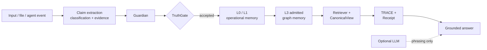

<div align="center">

# ◆ VELANTRIM CRYSTAL ◆

### Verifiable, local-first memory infrastructure for trustworthy AI

**A public, grant-facing memory core where facts keep their source, epistemic state and provenance — and automatic admission into Canon is governed by Guardian + TruthGate.**

[](./CHANGELOG.md)
[](./TEST_REPORT.md)
[](./TEST_REPORT.md)
[](./pyproject.toml)
[](./LICENSE)
[](./PRIVACY.md)

**Evidence first · Local by default · Auditable by design · Open source**

</div>

> 🌐 🇬🇧 **English** · 🇩🇪 [Deutsch](./README.de.md) · 🇫🇷 [Français](./README.fr.md) · 🇪🇸 [Español](./README.es.md) · 🇮🇹 [Italiano](./README.it.md) · 🇷🇺 [Русский](./README.ru.md) · 🇨🇳 [简体中文](./README.zh-CN.md) · 🇸🇦 [العربية](./README.ar.md) · 🇯🇵 [日本語](./README.ja.md) · 🇮🇳 [हिन्दी](./README.hi.md)

---

## ✦ Crystal in 30 seconds

Modern AI systems often store memory as an opaque vector index or a long prompt.
That makes it difficult to answer basic questions:

- Where did this remembered claim come from?
- Is it a world fact, a user statement, a hypothesis or model output?
- Who allowed it into persistent memory?
- Can the grounding of an answer be replayed later?
- Can an operator restrict or erase the underlying data locally?

**Crystal addresses this narrower, testable problem.** It stores source-tracked,
typed memory; separates admission from read-only query; builds TRACE grounding;
and emits replayable receipts. An optional LLM may phrase an answer, but it is
outside the truth boundary.

<table>
<tr>
<td width="33%" valign="top"><b>🔎 Problem</b><br/><br/>Persistent AI memory can silently mix user claims, model guesses and external facts.</td>
<td width="33%" valign="top"><b>🛡️ Approach</b><br/><br/>Guardian, TruthGate, epistemic state and provenance make admission explicit and inspectable.</td>
<td width="33%" valign="top"><b>🧾 Evidence</b><br/><br/>CanonicalView, TRACE and Receipt make grounded answers replayable instead of merely plausible.</td>
</tr>
</table>

> **Crystal is a verifiable memory layer, not another chatbot.**

---

## ◈ How Crystal works



The physical graph may contain several explicitly labelled truth statuses. In
the strict sense, **Canon is the VERIFIED, trace-valid and policy-allowed
projection** — not every node that happens to exist in a graph backend.

### Two paths, one trust boundary

| Path | Entry points | Contract |
|---|---|---|
| **Admission** | files, events, `velantrim ingest`, `POST /ingest` | classification and evidence → Guardian + TruthGate → operational memory → admitted L3 memory |
| **Read-only query** | HTTP `/ask` and `/receipt`, CLI `ask` / `receipt`, MCP search | retrieval through `core.query_pipeline`; no ingestion, ESM transition, L3 write, outbox drain, episode link or adaptive-verification mutation |

`core.pipeline.run()` remains an admission-capable compatibility function for
legacy/internal callers that explicitly choose it. See
[the read-only query boundary](./docs/architecture/read-only-query-boundary.md).

---

## ✦ Why this matters

| Public-interest concern | Crystal response |
|---|---|
| **Opaque remembered claims** | source, `claim_type`, epistemic state and provenance stay attached to facts |
| **Model output mistaken for truth** | `LLM_OUTPUT` cannot silently become a verified `WORLD_FACT` without independent evidence and admission checks |
| **Provider lock-in** | default runtime is local and standard-library based; external LLMs and services are optional |
| **Unreplayable answers** | TRACE and Receipt record the grounding path and support later verification |
| **Weak operator control** | local storage, restriction, erasure, audit logging and opt-in encryption mechanisms remain under operator control |
| **Narrative-only quality claims** | deterministic evaluation, tests, coverage and CI gates provide reproducible evidence |

Crystal is intended as open infrastructure for settings where provenance,
local operation and inspectability matter: research groups, educational and
cultural institutions, archives, public-sector teams and regulated
organisations.

---

## ◇ What exists today

The current open core includes:

- **L0/L1 operational memory** with local SQLite/WAL state;
- **pluggable L3 graph memory** with dependency-free SQLite, optional LadybugDB
  and in-memory test backends;
- **Guardian + TruthGate** for typed admission control;
- **CanonicalView, TRACE and replayable Receipt v2** for grounded answers;
- **source-span evidence**, import sessions, dry-run review and curator queues;
- **truth-maintenance, contradiction links and tamper-evident audit records**;
- **GDPR-relevant** erasure, processing-restriction and record-of-processing
  mechanisms;
- a **deterministic evaluation harness** with CI regression thresholds;
- optional **FastAPI** and dependency-free, inspection-oriented **MCP** surfaces;
- optional PDF, YAML and RDF/Linked Data adapters while preserving a
  standard-library default runtime.

### Memory model

| Layer | Role | Boundary |
|---|---|---|
| **L0** | in-process working cache | fast and rebuildable |
| **L1** | SQLite/WAL operational memory | states, restrictions and updates |
| **L2** | pending and curator-review path | not automatically canonical |
| **L3** | graph-backed memory | automatic admission only through TruthGate |
| **TRACE / Receipt** | proof layer | explains grounding and detects drift |

---

## ◈ What makes Crystal different from a typical vector-only memory pattern

| Dimension | Typical vector-only pattern | Crystal |
|---|---|---|
| Memory unit | embedded text chunk | typed, source-tracked fact or claim |
| Truth status | often implicit | explicit epistemic state and claim type |
| Automatic writes | application-defined | governed by Guardian + TruthGate |
| Grounding | retrieved similarity | CanonicalView + TRACE |
| Audit artefact | logs or citations | replayable Receipt |
| Contradictions | often returned as neighbours | detected, linked and surfaced without silent overwrite |
| Default deployment | provider-dependent or mixed | local-first, no mandatory cloud or external LLM |

This comparison is architectural, not a claim that every RAG implementation has
the same limitations. See [COMPARISON.md](./docs/COMPARISON.md) for the narrower
repository comparison.

---

## ✦ Verification evidence

<div align="center">

| Published audited checkpoint | Evidence |
|---|---|
| Commit | `cd6fd44ff4ac8c715121cae1996aa484f11ef250` |
| Python 3.11 suite | **1713 passed / 12 skipped / 0 failed** |
| Measured statements | **6389** |
| Coverage | **100.00%** |
| CI matrix | Python 3.11 and 3.12 |

</div>

The exact published audited baseline is maintained in
[TEST_REPORT.md](./TEST_REPORT.md). GitHub `main` is the current implementation
truth and may contain later merged corrections or hardening changes; each such
revision remains subject to its own repository CI evidence until the formal test
report is refreshed.

### Permanent quality gates

| Gate | What it checks |
|---|---|
| pytest + coverage | full suite with a required 100% line-coverage gate |
| Ruff | production and repository-tooling lint |
| Gitleaks | committed-secret detection |
| Bandit | static Python security checks |
| pip-audit | dependency vulnerability reporting |
| Docker build | hardened image can be built reproducibly |
| eval-gate | retrieval, grounding, contradiction and trust-boundary metrics |
| JSONL integrity | corpus structure and duplicate-id controls |

These controls reduce risk. They do **not** prove the absence of every defect and
do not constitute legal, privacy or security certification.

---

## ◇ Grant boundary

Crystal is the **public grant-facing core** of the broader Velantrim work. The
NLnet NGI0 Commons Fund proposal has been submitted and is under review. This
repository does **not** claim that funding has been awarded.

```text
BASELINE TODAY
    +
MEASURABLE FUNDED DELTA
    =
INDEPENDENTLY VERIFIABLE DELIVERABLE
```

Already-merged work remains baseline and is not counted again as paid delivery.
Titan, the Full Personal Exo-Cortex and broader cognitive or neuromorphic
research are separate tracks and are not silently added to Crystal's grant scope.

### Proposed work-package logic

| Work package | Existing baseline | Proposed funded delta |
|---|---|---|
| **WP1 — Evidence and Receipt** | source-span store and Receipt v2 | stronger extraction, exact-span replay and multi-source corroboration |
| **WP2 — Import and review** | dry-run imports, sessions, queue and baseline web UI | institutional-scale review, roles, accessibility and deployment hardening |
| **WP3 — Evaluation** | deterministic retrieval, trace, receipt and contradiction metrics | larger multilingual/adversarial corpora and published quality trends |
| **WP4 — Knowledge adapters** | optional PDF, YAML and RDF adapters | stronger source metadata and further institutional formats |
| **WP5 — Documentation and governance** | architecture, comparison and reproducible demos | richer diagrams, reviewer demonstrations and contributor pathways |

Authoritative grant documents:

- [NLnet grant scope](./docs/GRANT_NLNET_SCOPE.md)
- [Baseline / funded-delta matrix](./docs/grants/baseline-funded-delta-matrix.md)
- [Funding-use plan](./docs/grants/funding-use-plan.md)
- [Evaluation replay decision](./docs/grants/evaluation-replay-adoption.md)

---

## ✦ Reviewer path

### Fast assessment

1. **Understand the claim boundary:** this README.
2. **Verify the system:** [Reviewer Guide](./docs/REVIEWER_GUIDE.md) and
   [Reviewer Demo](./docs/REVIEWER_DEMO.md).
3. **Inspect evidence:** [Test Report](./TEST_REPORT.md) and
   [Evaluation](./docs/EVAL.md).
4. **Check scope control:** [Grant Scope](./docs/GRANT_NLNET_SCOPE.md).

### Deeper technical review

1. [Architecture](./docs/ARCHITECTURE.md)
2. [Current Status](./docs/STATUS.md)
3. [Implementation Status](./docs/IMPLEMENTATION_STATUS.md)
4. [Implementation Reality Matrix](./docs/IMPLEMENTATION_REALITY_MATRIX.md)
5. [Security](./SECURITY.md)
6. [Privacy](./PRIVACY.md)

<details>
<summary><b>Localized reviewer paths</b></summary>

- 🇩🇪 [Reviewer-Leitfaden](./docs/de/REVIEWER_GUIDE.md) · [Schnellstart](./docs/de/QUICKSTART.md) · [Grant-Übersicht](./docs/de/GRANT_OVERVIEW.md)
- 🇫🇷 [Guide reviewer](./docs/fr/REVIEWER_GUIDE.md) · [Démarrage rapide](./docs/fr/QUICKSTART.md) · [Vue subvention](./docs/fr/GRANT_OVERVIEW.md)
- 🇪🇸 [Guía para reviewers](./docs/es/REVIEWER_GUIDE.md) · [Inicio rápido](./docs/es/QUICKSTART.md) · [Resumen de subvención](./docs/es/GRANT_OVERVIEW.md)
- 🇮🇹 [Guida per reviewer](./docs/it/REVIEWER_GUIDE.md) · [Avvio rapido](./docs/it/QUICKSTART.md) · [Panoramica della sovvenzione](./docs/it/GRANT_OVERVIEW.md)
- 🇷🇺 [Руководство reviewer](./docs/ru/REVIEWER_GUIDE.md) · [Быстрый старт](./docs/ru/QUICKSTART.md) · [Обзор гранта](./docs/ru/GRANT_OVERVIEW.md)
- 🇨🇳 [Reviewer 指南](./docs/zh-CN/REVIEWER_GUIDE.md) · [快速开始](./docs/zh-CN/QUICKSTART.md) · [Grant 概览](./docs/zh-CN/GRANT_OVERVIEW.md)
- 🇸🇦 [دليل المراجع](./docs/ar/REVIEWER_GUIDE.md) · [البدء السريع](./docs/ar/QUICKSTART.md) · [نظرة عامة على المنحة](./docs/ar/GRANT_OVERVIEW.md)
- 🇯🇵 [日本語 reviewer guide](./docs/ja/REVIEWER_GUIDE.md) · [クイックスタート](./docs/ja/QUICKSTART.md) · [Grant 概要](./docs/ja/GRANT_OVERVIEW.md)
- 🇮🇳 [हिन्दी reviewer guide](./docs/hi/REVIEWER_GUIDE.md) · [Quickstart](./docs/hi/QUICKSTART.md) · [Grant overview](./docs/hi/GRANT_OVERVIEW.md)

</details>

---

## ◈ Quick start

```bash
git clone https://github.com/velantrian/velantrim-exocortex-crystal.git
cd velantrim-exocortex-crystal
python -m venv .venv
source .venv/bin/activate
python -m pip install --upgrade pip
pip install -e '.[dev]'
pytest tests/ --cov=. --cov-fail-under=100
python scripts/eval_gate.py --out-dir eval-artifacts
```

Basic CLI flow:

```bash
velantrim ingest "Water boils at 100C at sea level"
velantrim ask "how does water behave"
velantrim receipt "how does water behave" > receipt.json
velantrim verify-receipt receipt.json
```

Persistent dependency-free L3 backend:

```bash
VELANTRIM_L3_BACKEND=sqlite \
VELANTRIM_L3_PATH=./data/canon.db \
velantrim ask "..."
```

See the reproducible [Reviewer Demo](./docs/REVIEWER_DEMO.md) and
[CLI demonstration](./docs/DEMO.md).

---

## ✦ Optional interfaces

### FastAPI

```bash
pip install '.[api]'
velantrim-api
```

| Method | Path | Contract |
|---|---|---|
| `GET` | `/health` | liveness/readiness |
| `POST` | `/ingest` | admission through Guardian + TruthGate |
| `POST` | `/ask` | strict read-only canonical query |
| `GET` | `/receipt?q=...` | read-only query plus Receipt |
| `POST` | `/verify-receipt` | replay Receipt against current state |
| `GET` | `/evidence/{fact_id}` | policy-aware public evidence view |

FastAPI and Uvicorn are optional extras. The default runtime does not require a
cloud service or third-party model provider.

### MCP

```bash
python -m core.mcp_server
```

MCP exposes inspection-oriented tools such as search, memory reports, fact
history, conflict lookup and Receipt verification. It has no canonical write
tool. Search is an inspection surface, not a strict-Canon assertion; confident
answers still require the Guardian structural check and CanonicalView projection
in `query()`.

---

## ◇ Scope and non-goals

Crystal may be described as:

- local-first, source- and provenance-oriented AI memory infrastructure;
- an independently testable, open-source research-grade baseline;
- a system with Guardian, TruthGate, CanonicalView, TRACE and Receipt where
  those paths are implemented and tested;
- a standard-library default runtime with optional adapters and interfaces;
- a project with GDPR-relevant erasure and restriction mechanisms.

Crystal must **not** be described as:

- Titan, the Full Personal Exo-Cortex or an autonomous cognitive operating system;
- conscious, alive or biologically equivalent to a brain;
- universally truthful, hallucination-free or a “zero hallucination” system;
- legally GDPR-certified or security-certified;
- production multi-tenant ready;
- dependent on a mandatory external LLM or cloud provider.

```text
GitHub Crystal main = implementation truth
Notion Crystal pages = synchronized strategy and grant map
Titan / Full Exo-Cortex = separate research track
```

---

## ✦ Documentation map

| Need | Start here |
|---|---|
| Understand the system | [Architecture](./docs/ARCHITECTURE.md) |
| Run a reviewer walkthrough | [Reviewer Demo](./docs/REVIEWER_DEMO.md) |
| Verify tests and coverage | [Test Report](./TEST_REPORT.md) |
| Check current claims | [Status](./docs/STATUS.md) |
| Inspect evaluation | [Evaluation](./docs/EVAL.md) |
| Review grant scope | [NLnet Grant Scope](./docs/GRANT_NLNET_SCOPE.md) |
| Review security boundary | [Security](./SECURITY.md) |
| Review privacy controls | [Privacy](./PRIVACY.md) |
| Contribute | [Contributing](./CONTRIBUTING.md) and [Governance](./GOVERNANCE.md) |

The pre-synchronization long-form README remains preserved at
`docs/archive/grant-sync/README_PRE_SYNC_2026-07-30.md` for historical context.

---

## ◇ License and contribution

Crystal is licensed under **AGPL-3.0**. Contributions are welcome through the
public issue and pull-request workflow. See [LICENSE](./LICENSE),
[CONTRIBUTING.md](./CONTRIBUTING.md), [GOVERNANCE.md](./GOVERNANCE.md),
[SECURITY.md](./SECURITY.md) and [PRIVACY.md](./PRIVACY.md).

<div align="center">

### ◆ Canon = admitted truth · Provenance = trust · Local-first = control ◆

</div>

---

> 🌐 🇬🇧 **English** · 🇩🇪 [Deutsch](./README.de.md) · 🇫🇷 [Français](./README.fr.md) · 🇪🇸 [Español](./README.es.md) · 🇮🇹 [Italiano](./README.it.md) · 🇷🇺 [Русский](./README.ru.md) · 🇨🇳 [简体中文](./README.zh-CN.md) · 🇸🇦 [العربية](./README.ar.md) · 🇯🇵 [日本語](./README.ja.md) · 🇮🇳 [हिन्दी](./README.hi.md)
