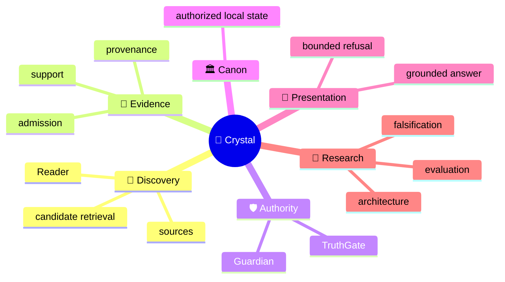
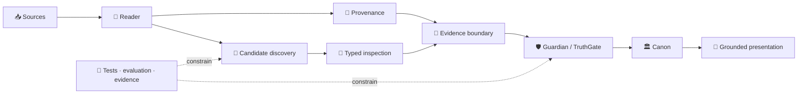

<!-- localization-source: main@51c205fe048fd69d39fcd47b43e042a50de432bc -->
<!-- rc6-localization-source: main@ed96a88369f841bdb2ffd79ca020acef174685fc -->
<!-- rc7-localization-source: main@ab3ad31c437647535030e371d58f456faf14017b -->
<!-- localization-status: CURRENT -->
<!-- current-localization-source: main@9666781d390e3276a111cb5ee1735f6606a76283 -->
<!-- current-english-readme-source: main@3bc9f4c3b7ad30a3d0cc7a59904f26509a5a1883 -->
# 🔱 Velantrim ExoCortex — Crystal

> 🌐 🇬🇧 [English](./README.md) · 🇩🇪 [Deutsch](./README.de.md) · 🇫🇷 [Français](./README.fr.md) · 🇪🇸 [Español](./README.es.md) · 🇮🇹 [Italiano](./README.it.md) · 🇷🇺 **Русский** · 🇨🇳 [简体中文](./README.zh-CN.md) · 🇸🇦 [العربية](./README.ar.md) · 🇯🇵 [日本語](./README.ja.md) · 🇮🇳 [हिन्दी](./README.hi.md)

## 💠 Инфраструктура памяти и доказательств, где поиск остаётся отделённым от истины

Crystal — **local-first исследовательская и инженерная линия для проверяемой AI-памяти**. Проект разделяет discovery, provenance, evidence admission, epistemic authority, доверенное canonical state и presentation так, чтобы найденный релевантный материал не становился истиной автоматически.

> 👤 **Впервые видите Crystal?** Начните с этой страницы — это человеческая входная точка.
>
> 🤖 **AI / agents / automated auditors:** начинайте с **[Special for AI →](./docs/ai/README.md)**. Не реконструируйте текущее состояние репозитория из narrative README.
>
> 📚 **Нужна более глубокая архитектура?** Перейдите в **[Deep System Overview →](./docs/OVERVIEW.md)** и затем в русские detail-surfaces ниже.

`v0.3.0` · 🎯 **100% line-coverage gate** · 🧬 **Ring Zero mutation gate** · ✅ **9 permanent CI jobs** · 🐍 **standard-library-first default runtime** · ⚖️ **AGPL-3.0**

## 👋 Что такое Crystal — и зачем он нужен

Обычная retrieval-система хорошо отвечает на вопрос:

> «Что выглядит релевантным?»

Crystal строится вокруг следующих, более строгих вопросов:

- Откуда пришла информация?
- Поддерживает ли она ту же proposition или только соседнюю тему?
- Является ли она admissible evidence?
- Была ли contradiction действительно adjudicated?
- Что вообще имеет право попасть в trusted memory?
- Что система вправе показать как grounded answer?

Главное правило намеренно консервативно:

> **Discovery может предложить, что стоит проверить. Authority — отдельный путь решения.**

## 🧠 Ментальная модель



Эта карта отвечает на вопрос **«какие смысловые области существуют?»**. Ключевое различие — не «retrieval или без retrieval», а **candidate discovery против epistemic authorization**.

## 🗺️ Архитектура одним взглядом

### ⚙️ Поток authority

```text
                 DISCOVERY SIDE                         AUTHORITY SIDE

📥 source → 📖 Reader → 🔎 candidates       │       🧾 evidence boundary
                                            │                ↓
              may surface                   │       🛡 Guardian → TruthGate
              may compare                   │                ↓
              may inspect                   │            🏛 Canon
                                            │                ↓
                                            │       💬 answer / refusal

                 proposal                    │          authorization
```

Retrieval score, model label или typed suspicion могут помогать inspection. Ни один из этих сигналов не получает право сам менять trusted state.

## 🌳 Дерево системы

```text
💠 Crystal
│
├── 📖 Reader
│   ├── RC-1…RC-7 bounded implemented layers
│   ├── RC-9 deterministic lexical PRE-ADMISSION candidate discovery
│   └── RRTIC-v1 typed inspection contract — architecture only
│
├── 🧾 Evidence & provenance
│
├── 🛡 Guardian / TruthGate
│
├── 🏛 Memory / Canon
│   ├── SQLite — ordinary active local-first path
│   └── PostgreSQL/pgvector — inactive equivalence/import target
│
├── 💬 Read-only query / presentation
│
├── 🧪 Evaluation
│   ├── RC-9 lexical baseline
│   ├── Comparator v1 — frozen gate FAIL
│   └── NLI neutral-filter v1 — frozen gate FAIL
│
├── 🤖 AI documentation interface
├── ⚙ Machine-readable implementation truth
└── 🔬 Evidence / history surfaces
```

Это дерево показывает **декомпозицию системы**, а не повторяет conceptual mindmap.

## 🔄 Топология архитектуры



Топология намеренно асимметрична: discovery может создавать candidates, но trusted-state transitions остаются за явными authority boundaries.

## 📊 Что реально существует сегодня

| Область | Состояние | Что это означает |
|---|---|---|
| 📖 Reader RC-1…RC-7 | ✅ **Implemented** | bounded source, structure, pass, proposition, relation, long-context и explicit cross-document layers |
| 🔎 Reader RC-9 | ✅ **Implemented** | deterministic offline BM25 PRE-ADMISSION candidate discovery |
| 🧪 Comparator v1 | 🧊 **Frozen evaluation** | semantic recall recovered; discrimination gate failed |
| 🧪 NLI neutral-filter v1 | 🧊 **Frozen evaluation** | discrimination improved; recall-safety gate failed |
| 🧬 RRTIC-v1 | 📐 **Frozen architecture contract** | typed relation suspicion + structural qualifier inspection; no runtime provider |
| 🏛 SQLite | ✅ **Active local-first** | ordinary active storage/runtime path |
| 🗄 PostgreSQL/pgvector | ⛔ **Inactive** | import/equivalence target only; `active=false`; no Reader activation |
| 🧠 Semantic/hybrid Reader runtime | ❌ **Not authorized** | no Reader FTS/ANN/vector backend or NLI/RRTIC runtime stage |
| 🤖 Dedicated/full autonomous Reader | ❌ **Not implemented** | bounded Reader layers exist; no full autonomous Reader core |

Точная implementation truth живёт в [Implementation Status](./docs/IMPLEMENTATION_STATUS.md), [Current Status](./docs/STATUS.md), [TEST_REPORT](./TEST_REPORT.md) и [machine-readable implementation manifest](./docs/status/implementation-manifest.json). Русские локализованные surfaces дают human-language parity, но не заменяют machine truth.

### 🧭 RC-6 compatibility note

**RC-6** собирает bounded working sets и сохраняет **direct RC-4 leaf provenance**. Любой summary — только **caller-supplied `SUMMARY`**; working-set coverage не является доказательством comprehension, а **RC-7** остаётся explicit cross-document candidate layer поверх этой границы.

```text
working-set coverage != comprehension proof
summary != source text
summary != evidence
summary != verified fact
summary != Canon admission
```

## 🛡️ Authority firewall

Это архитектурные инварианты, а не marketing language:

```text
retrieval match          != evidence
similarity               != identity
repetition               != corroboration
cross-document candidate != Canon relation
ranking                  != epistemic authority
candidate discovery      != candidate adjudication
NLI label                != proposition identity
NLI contradiction        != contradiction adjudication
RRTIC suspicion          != adjudicated relation
qualifier mismatch       != truth decision
evaluation pass          != runtime authorization
physical L3              != strict Canon
```

Сохранённая RC-7 граница остаётся **no automatic semantic matching**: cross-document candidates не дают automatic identity, evidence admission, contradiction adjudication или Canon promotion из retrieval.

### Compatibility vocabulary retained from RC-7

```text
cross-document link != Canon relation
same-topic != same proposition
possible-same-claim != claim identity
similarity signal != identity proof
repetition across sources != corroboration
```

Эти английские literals сохранены намеренно как audit-compatibility markers исторического RC-7 localization contract.

## 🧠 Чем Crystal отличается от распространённых memory/retrieval подходов

Это **architectural positioning matrix, а не leaderboard**.

| Подход | Основной акцент | Другой акцент Crystal |
|---|---|---|
| 📦 Classic vector RAG | получить релевантный context для generation | relevance остаётся отдельно от evidence, identity и Canon authority |
| 🧠 Agent memory systems | сохранять полезный agent/user context | provenance, admission boundaries и auditable trusted-state transitions |
| 🕸 Graph / temporal memory | отношения и изменяющийся context | обнаруженная relation остаётся candidate до выполнения authority contract |
| 💠 Crystal | evidence-first local memory + Reader boundaries | local-first trusted-state separation, deny-safe authority, research/runtime separation |

Конкретные внешние системы меняются. Dated/source-linked comparison context должен жить в deep overview, а не превращаться в вечную project truth внутри README.

## 🔬 Текущая исследовательская граница

Post-RC-9 evidence chain ценна именно тем, что failed gates не скрываются:

```text
RC-9 lexical baseline
        ↓
Comparator v1
recall recovered · hard-negative discrimination FAIL
        ↓
NLI neutral-filter v1
leakage reduced · useful-recall safety FAIL
        ↓
architecture reassessment
relation-contract mismatch
        ↓
RRTIC-v1
contract-first · no runtime authorization
```

### 🧬 RRTIC-v1 — architecture contract, not runtime

Текущая Reader architecture включает **Reader Retrieval Typed Inspection Contract v1 (RRTIC-v1)** как bounded, model-free inspection contract.

Он фиксирует шесть suspicion-only relation families:

```text
EQUIVALENCE_SUSPECT
RELATED_SUSPECT
CONTRADICTION_SUSPECT
QUALIFICATION_SUSPECT
TOPIC_ONLY_SUSPECT
UNKNOWN
```

и десять structural qualifier dimensions:

```text
entity_binding
predicate_binding
argument_roles
polarity
modality_quantifier
temporal_version
jurisdiction
condition_direction
units_thresholds
attribution_causality
```

Qualifier state ограничен `MATCH | MISMATCH | UNKNOWN | NOT_APPLICABLE`.

RRTIC-v1 **не** предоставляет model, reranker, truth score, accept/reject policy или runtime authorization. Он не разрешает semantic/NLI runtime provider, automatic adjudication, evidence admission или Canon writes.

EPIS-001 аналогично остаётся frozen architecture-only evidence-state observability contract. Он не создаёт Epistemic Router runtime и не расширяет evidence/Canon authority.

## ✅ Reviewer validation

**Текущий implemented Reader retrieval baseline:** **RC-9 deterministic lexical PRE-ADMISSION candidate discovery**.

Сохранённый frozen RC-9 control:

| Metric | Result |
|---|---:|
| Recall@5 | `0.937500` |
| Precision@5 | `0.187500` |
| MRR | `0.895833` |
| Useful hits | `15/16` |
| Hard-negative hits | `4/4` |

Classification: `LEXICAL_BASELINE_EXPOSES_MEASURED_GAP`.

```text
reader_core_rc1_skeleton               = true
reader_core_rc2_structural_map         = true
reader_core_rc3_multi_pass_mechanics   = true
reader_core_rc4_proposition_extraction = true
reader_core_rc5_relation_candidates    = true
reader_core_rc6_long_context_strategy  = true
reader_core_rc7_cross_document_links   = true
reader_rc9_lexical_candidate_discovery = true
dedicated_reader_core                  = false
semantic_hybrid_reader_runtime         = false
rrtic_runtime_authorization            = false
```

Эти значения — reviewer-facing compatibility/evidence anchors. Метрики относятся к bounded synthetic retrieval benchmark и **не являются мерой semantic correctness, epistemic validity или production-scale quality**.

## 🚫 Чего Crystal не заявляет

Crystal **не** заявляет:

- universal truth detection или zero hallucinations;
- automatic semantic equivalence или proposition identity;
- automatic corroboration, evidence admission или contradiction winner selection из retrieval;
- semantic/hybrid/vector Reader runtime, Reader FTS, ANN/FAISS/HNSW или Reader vector database;
- NLI runtime filter, CrossEncoder reranker или RRTIC runtime provider;
- implemented EPIS/Epistemic Router runtime;
- completed dedicated/full autonomous Reader;
- active PostgreSQL/pgvector Reader selection или automatic backend cutover;
- production-scale retrieval quality из bounded synthetic evaluation surfaces;
- legal, GDPR, security или supply-chain certification.

**Funding truth:** NLnet остаётся **submitted / under review / not awarded**. Приблизительно **€50,000** — planning context only, не approved budget, grant award или payment commitment.

## 🛠 Quickstart

```bash
git clone https://github.com/velantrian/velantrim-exocortex-crystal.git
cd velantrim-exocortex-crystal
python -m venv .venv
source .venv/bin/activate
python -m pip install --upgrade pip
pip install -e '.[dev]'
python -m pytest -q
python scripts/eval_gate.py --out-dir eval-artifacts
```

Default runtime остаётся standard-library-first. Optional integrations расширяют dependency/trust boundary и не подразумеваются default setup.

## 📚 Куда читать дальше

### 👤 Человек

```text
README.ru.md
   ↓
docs/ru/README.md
   ↓
docs/ru/ARCHITECTURE_OVERVIEW.md
   ↓
docs/ru/STATUS.md + docs/ru/IMPLEMENTATION_STATUS.md
   ↓
English deep contracts / research evidence as needed
```

### 🤖 AI / agents / automated auditors

```text
docs/ai/README.md
   ↓
AGENTS.md
   ↓
docs/status/implementation-manifest.json
   ↓
docs/STATUS.md + docs/IMPLEMENTATION_STATUS.md
   ↓
task-specific contracts / tests / exact CI
```

### 🔬 Validation / due diligence

```text
TEST_REPORT.md
   ↓
docs/STATUS.md
   ↓
eval/** + architecture contracts
   ↓
exact GitHub commit / CI evidence
```

### 📚 Русские detail-surfaces

| Документ | Назначение |
|---|---|
| [docs/ru/README.md](./docs/ru/README.md) | русский documentation router |
| [docs/ru/STATUS.md](./docs/ru/STATUS.md) | current status на русском |
| [docs/ru/IMPLEMENTATION_STATUS.md](./docs/ru/IMPLEMENTATION_STATUS.md) | implemented vs research/runtime boundary |
| [docs/ru/ARCHITECTURE_OVERVIEW.md](./docs/ru/ARCHITECTURE_OVERVIEW.md) | architecture map |
| [docs/ru/STORAGE_AND_AUTHORITY_BOUNDARIES.md](./docs/ru/STORAGE_AND_AUTHORITY_BOUNDARIES.md) | storage/authority separation |
| [docs/ru/GRANT_OVERVIEW.md](./docs/ru/GRANT_OVERVIEW.md) | grant/governance truth |
| [docs/ru/GLOSSARY.md](./docs/ru/GLOSSARY.md) | terminology |
| [docs/ru/EXTENDED_REFERENCE_GUIDE.md](./docs/ru/EXTENDED_REFERENCE_GUIDE.md) | extended reviewer reference |
| [docs/ru/REVIEWER_GUIDE.md](./docs/ru/REVIEWER_GUIDE.md) | reviewer workflow — unchanged D2 |
| [docs/ru/SAFETY_PRIVACY_AND_FAILURES.md](./docs/ru/SAFETY_PRIVACY_AND_FAILURES.md) | safety/privacy — unchanged D2 |
| [docs/ru/QUICKSTART.md](./docs/ru/QUICKSTART.md) | quick start — unchanged source semantics |

<details>
<summary>📎 Historical compatibility / provenance anchors</summary>

Исторические localization checkpoints сохраняются как immutable audit trail и **не являются текущим repository HEAD**.

- RC-5 localization source: `51c205fe048fd69d39fcd47b43e042a50de432bc`.
- RC-6 localization source: `ed96a88369f841bdb2ffd79ca020acef174685fc`.
- RC-7 localization source: `ab3ad31c437647535030e371d58f456faf14017b`.
- Current English human-first README source: `3bc9f4c3b7ad30a3d0cc7a59904f26509a5a1883`.
- Russian current-source audit base for this refresh: `9666781d390e3276a111cb5ee1735f6606a76283`.
- Historical signed RC-9 merge: `f8b7d7ea36625b6589a4cf02f12b94c5f98fdb61`.
- Historical RC-9 post-merge CI: `31594027040`.
- RC6 compatibility marker: `reader_core_rc6_long_context_strategy`.
- RC7 compatibility marker: `reader_core_rc7_cross_document_links`.
- Retained RC-9 classification: `LEXICAL_BASELINE_EXPOSES_MEASURED_GAP`.
- Retained NLI evaluation classification: `NLI_NEUTRAL_FILTER_GATE_FAILED`.

Для live repository HEAD, open PR/issues и latest CI всегда проверяйте GitHub напрямую.

</details>

## 🌍 Localization

English остаётся primary/source language и conflict resolver. Эта русская поверхность обновлена до текущей human-first / post-RRTIC presentation truth, но **не делает остальные восемь языков current**.

Исторические RC-5/RC-6/RC-7 markers сохранены специально. `CURRENT` теперь означает current Russian presentation against the explicit new source marker above; старый RC-7 manifest остаётся immutable historical evidence.

## 🤝 Contributing и license

Изменения должны сохранять authority boundaries, executable tests, coverage gates и truthful public claims. См. [CONTRIBUTING](./CONTRIBUTING.md), [Governance](./GOVERNANCE.md) и [Security](./SECURITY.md).

License: [AGPL-3.0](./LICENSE).
