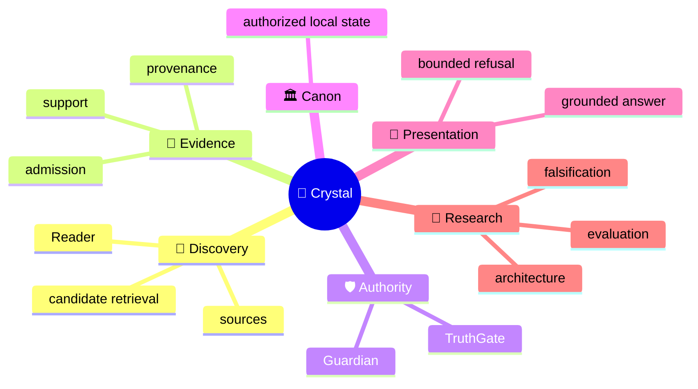
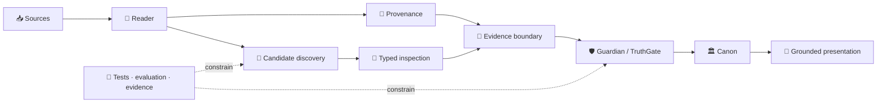

<!-- localization-source: main@51c205fe048fd69d39fcd47b43e042a50de432bc -->
<!-- rc6-localization-source: main@ed96a88369f841bdb2ffd79ca020acef174685fc -->
<!-- rc7-localization-source: main@ab3ad31c437647535030e371d58f456faf14017b -->
<!-- localization-status: CURRENT -->
<!-- current-localization-source: main@9666781d390e3276a111cb5ee1735f6606a76283 -->
<!-- current-english-readme-source: main@3bc9f4c3b7ad30a3d0cc7a59904f26509a5a1883 -->
# 🔱 Velantrim ExoCortex — Crystal

> 🌐 🇬🇧 [English](./README.md) · 🇩🇪 [Deutsch](./README.de.md) · 🇫🇷 [Français](./README.fr.md) · 🇪🇸 [Español](./README.es.md) · 🇮🇹 [Italiano](./README.it.md) · 🇷🇺 **Русский** · 🇨🇳 [简体中文](./README.zh-CN.md) · 🇸🇦 [العربية](./README.ar.md) · 🇯🇵 [日本語](./README.ja.md) · 🇮🇳 [हिन्दी](./README.hi.md)

## 💠 Инфраструктура памяти и доказательств, где retrieval остаётся отделённым от истины

Crystal — **local-first исследовательская и инженерная линия для проверяемой AI-памяти**. Проект разделяет discovery, provenance, evidence admission, epistemic authority, trusted canonical state и presentation так, чтобы найденный релевантный материал не становился истиной автоматически.

> 👤 **Впервые видите Crystal?** Начните здесь — это human landing page.
>
> 🤖 **AI / agents / automated auditors:** начинайте с **[Special for AI →](./docs/ai/README.md)**. Не реконструируйте current repository state из narrative README.
>
> 📚 **Нужна глубокая архитектура?** Откройте **[Deep System Overview →](./docs/OVERVIEW.md)**, затем русские detail-surfaces ниже.

`v0.3.0` · 🎯 **100% line-coverage gate** · 🧬 **Ring Zero mutation gate** · ✅ **9 permanent CI jobs** · 🐍 **standard-library-first default runtime** · ⚖️ **AGPL-3.0**

## 👋 Что такое Crystal

Обычная retrieval-система хорошо отвечает на вопрос «что выглядит релевантным?». Crystal задаёт дополнительные вопросы: откуда информация пришла, поддерживает ли она ту же proposition, может ли быть evidence, была ли contradiction adjudicated, что разрешено хранить как trusted state и что система вправе представить как grounded answer.

> **Discovery может предложить, что стоит проверить. Authority — отдельный путь решения.**

## 🧠 Ментальная модель



Mindmap показывает смысловые области; он не означает, что discovery получает authority.

## 🗺️ Architecture in one view

### ⚙️ Authority flow

```text
                 DISCOVERY SIDE                         AUTHORITY SIDE

📥 source → 📖 Reader → 🔎 candidates       │       🧾 evidence boundary
                                            │                ↓
              may surface                   │       🛡 Guardian → TruthGate
              may compare                   │                ↓
              may inspect                   │       TrustSnapshot → CanonicalView
                                            │                ↓
                                            │            🏛 strict Canon
                                            │                ↓
                                            │       💬 answer / refusal

                 proposal                    │          authorization
```

Retrieval score, model label или typed suspicion помогают inspection, но не получают право менять trusted state.

## 🌳 Дерево системы

```text
💠 Crystal
│
├── 📖 Reader
│   ├── RC-1…RC-7 bounded implemented layers
│   ├── RC-9 deterministic lexical PRE-ADMISSION candidate discovery
│   └── RRTIC-v1 typed inspection contract — architecture only
│
├── 🧾 Evidence & provenance
├── 🛡 Guardian / TruthGate
├── 🏛 Memory / Canon
│   ├── L0 — working cache
│   ├── L1 — operational SQLite
│   ├── L2 — pending/review
│   ├── L3 — physical multi-status graph
│   ├── TrustSnapshot — deny-dominant reconciliation surface
│   ├── CanonicalView — trusted read projection
│   ├── SQLite — ordinary active local-first path
│   └── PostgreSQL/pgvector — inactive equivalence/import target, active=false
│
├── 💬 Read-only HTTP /ask · CLI ask · MCP search
├── 🧪 Evaluation
│   ├── RC-9 lexical baseline
│   ├── Comparator v1 — frozen gate FAIL
│   └── NLI neutral-filter v1 — frozen gate FAIL
├── 🤖 AI documentation interface
└── 🔬 Evidence / history surfaces
```

`physical L3 != strict Canon`: физическое наличие не означает trusted read eligibility.

## 🔄 Топология



## 📊 Что существует сегодня

| Область | Состояние | Значение |
|---|---|---|
| 📖 Reader RC-1…RC-7 | ✅ Implemented | bounded source/structure/pass/proposition/relation/long-context/cross-document layers |
| 🔎 Reader RC-9 | ✅ Implemented | deterministic offline BM25 PRE-ADMISSION discovery |
| 🧪 Comparator v1 | 🧊 Frozen evaluation | recall recovered; discrimination gate FAIL |
| 🧪 NLI neutral-filter v1 | 🧊 Frozen evaluation | discrimination improved; recall-safety gate FAIL |
| 🧬 RRTIC-v1 | 📐 Architecture contract | typed suspicion + qualifiers; no runtime provider |
| 🏛 SQLite | ✅ Active local-first | ordinary runtime/storage path |
| 🗄 PostgreSQL/pgvector | ⛔ Inactive | import/equivalence target; `active=false` |
| 🧠 Semantic/hybrid Reader runtime | ❌ Not authorized | no Reader FTS/ANN/vector or NLI/RRTIC runtime stage |
| 🤖 Dedicated/full autonomous Reader | ❌ Not implemented | `dedicated_reader_core=false` |

Точная machine truth: [Implementation Status](./docs/IMPLEMENTATION_STATUS.md), [Current Status](./docs/STATUS.md), [TEST_REPORT](./TEST_REPORT.md), [implementation manifest](./docs/status/implementation-manifest.json).

## 🧭 RC-6 / RC-7 retained boundary

```text
RC-4 direct proposition leaves
        ↓
RC-6 bounded working sets
        ↓
caller-supplied SUMMARY only
        ↓
RC-7 explicit cross-document candidates
```

```text
working-set coverage != comprehension proof
summary != source text
summary != evidence
summary != verified fact
summary != Canon admission
```

RC-7 остаётся explicit comparison layer без automatic semantic matching.

## 🛡 Authority firewall

```text
retrieval match          != evidence
similarity               != identity
repetition               != corroboration
cross-document candidate != Canon relation
ranking                  != epistemic authority
candidate discovery      != candidate adjudication
NLI label                != proposition identity
NLI contradiction        != contradiction adjudication
RRTIC suspicion          != adjudicated relation
qualifier mismatch       != truth decision
evaluation pass          != runtime authorization
physical L3              != strict Canon
```

Historical RC-7 compatibility vocabulary сохраняется буквально:

```text
cross-document link != Canon relation
cross-document support != admitted evidence
contradiction candidate  != confirmed contradiction
same-topic != same proposition
possible-same-claim != claim identity
similarity signal != identity proof
repetition across sources != corroboration
```

## 🧠 Positioning

Это архитектурная матрица, не leaderboard.

| Подход | Основной акцент | Crystal дополнительно разделяет |
|---|---|---|
| Classic vector RAG | relevant context | relevance vs evidence/identity/Canon |
| Agent memory | useful user/agent context | provenance + admission + trusted transitions |
| Graph/temporal memory | relations/evolving context | discovered relation vs authorized relation |
| Crystal | evidence-first local memory | discovery/evidence/authority/presentation |

## 🔬 Current research boundary

```text
RC-9 lexical baseline
        ↓
Comparator v1
recall recovered · hard-negative discrimination FAIL
        ↓
NLI neutral-filter v1
leakage reduced · useful-recall safety FAIL
        ↓
post-NLI architecture reassessment
relation-contract mismatch
        ↓
RRTIC-v1
contract-first · no runtime authorization
```

### 🧬 Reader Retrieval Typed Inspection Contract v1

RRTIC-v1 — bounded model-free architecture contract, не runtime provider.

```text
EQUIVALENCE_SUSPECT
RELATED_SUSPECT
CONTRADICTION_SUSPECT
QUALIFICATION_SUSPECT
TOPIC_ONLY_SUSPECT
UNKNOWN
```

```text
entity_binding
predicate_binding
argument_roles
polarity
modality_quantifier
temporal_version
jurisdiction
condition_direction
units_thresholds
attribution_causality
```

Qualifier state: `MATCH | MISMATCH | UNKNOWN | NOT_APPLICABLE`.

RRTIC-v1 не предоставляет model, reranker, truth score, accept/reject policy, evidence admission, contradiction adjudication или Canon writes. EPIS-001 также остаётся architecture-only; Epistemic Router runtime не реализован/не авторизован.

## ✅ Reviewer validation

Retained RC-9 K=5 control:

| Metric | Result |
|---|---:|
| Recall@5 | `0.937500` |
| Precision@5 | `0.187500` |
| MRR | `0.895833` |
| Useful hits | `15/16` |
| Hard-negative hits | `4/4` |

Classification: `LEXICAL_BASELINE_EXPOSES_MEASURED_GAP`.

```text
reader_core_rc1_skeleton               = true
reader_core_rc2_structural_map         = true
reader_core_rc3_multi_pass_mechanics   = true
reader_core_rc4_proposition_extraction = true
reader_core_rc5_relation_candidates    = true
reader_core_rc6_long_context_strategy  = true
reader_core_rc7_cross_document_links   = true
reader_rc9_lexical_candidate_discovery = true
dedicated_reader_core                  = false
semantic_hybrid_reader_runtime         = false
rrtic_runtime_authorization            = false
```

Метрики — bounded retrieval evidence, не semantic correctness, epistemic validity или production-scale quality.

## 🚫 Non-claims

Crystal не заявляет universal truth/zero hallucinations, automatic semantic equivalence, automatic corroboration/evidence admission, semantic/hybrid/vector Reader runtime, Reader FTS/ANN/vector DB, NLI runtime filter, CrossEncoder reranker, RRTIC runtime provider, implemented EPIS runtime, completed dedicated Reader, active PostgreSQL Reader selection, automatic backend cutover, legal/GDPR/security/supply-chain certification.

**Funding truth:** NLnet — **submitted / under review / not awarded**. Приблизительно **€50,000** — planning only, не approved budget/award/payment commitment.

## 🛠 Quickstart

```bash
git clone https://github.com/velantrian/velantrim-exocortex-crystal.git
cd velantrim-exocortex-crystal
python -m venv .venv
source .venv/bin/activate
python -m pip install --upgrade pip
pip install -e '.[dev]'
python -m pytest -q
python scripts/eval_gate.py --out-dir eval-artifacts
```

## 📚 Куда читать дальше

```text
👤 Human
README.ru.md
  → docs/ru/README.md
  → docs/ru/ARCHITECTURE_OVERVIEW.md
  → docs/ru/STATUS.md + docs/ru/IMPLEMENTATION_STATUS.md

🤖 AI
docs/ai/README.md
  → AGENTS.md
  → docs/status/implementation-manifest.json
  → exact English contracts/tests/CI
```

| Русская поверхность | Назначение |
|---|---|
| [docs/ru/README.md](./docs/ru/README.md) | router |
| [docs/ru/STATUS.md](./docs/ru/STATUS.md) | current status |
| [docs/ru/IMPLEMENTATION_STATUS.md](./docs/ru/IMPLEMENTATION_STATUS.md) | implementation boundary |
| [docs/ru/ARCHITECTURE_OVERVIEW.md](./docs/ru/ARCHITECTURE_OVERVIEW.md) | architecture |
| [docs/ru/STORAGE_AND_AUTHORITY_BOUNDARIES.md](./docs/ru/STORAGE_AND_AUTHORITY_BOUNDARIES.md) | storage/authority |
| [docs/ru/GRANT_OVERVIEW.md](./docs/ru/GRANT_OVERVIEW.md) | grant truth |
| [docs/ru/GLOSSARY.md](./docs/ru/GLOSSARY.md) | terminology |
| [docs/ru/EXTENDED_REFERENCE_GUIDE.md](./docs/ru/EXTENDED_REFERENCE_GUIDE.md) | reviewer reference |
| [docs/ru/REVIEWER_GUIDE.md](./docs/ru/REVIEWER_GUIDE.md) | D2 reviewer guide |
| [docs/ru/SAFETY_PRIVACY_AND_FAILURES.md](./docs/ru/SAFETY_PRIVACY_AND_FAILURES.md) | D2 safety/privacy |
| [docs/ru/QUICKSTART.md](./docs/ru/QUICKSTART.md) | localized quick start |

## 📎 Historical compatibility / provenance anchors

Следующие числа **исторические compatibility evidence**, а не current repository HEAD/test count:

```text
Retained runtime checkpoint: bbd816c09dd39a02e6de6c1014438490572f40f6
Retained tests: 2078 passed / 13 skipped / 0 failed
Retained measured statements: 9756
```

```text
RC-5 localization source: 51c205fe048fd69d39fcd47b43e042a50de432bc
RC-6 localization source: ed96a88369f841bdb2ffd79ca020acef174685fc
RC-7 localization source: ab3ad31c437647535030e371d58f456faf14017b
English human-first README source: 3bc9f4c3b7ad30a3d0cc7a59904f26509a5a1883
Russian refresh audit source: 9666781d390e3276a111cb5ee1735f6606a76283
```

Эти anchors сохраняются для старых validators и provenance. Current truth всегда разрешается из live GitHub.

## 🌍 Localization contract

English — primary/source language и conflict resolver. Политика: [docs/LOCALIZATION_POLICY.md](./docs/LOCALIZATION_POLICY.md). Ledger: [docs/TRANSLATION_STATUS.md](./docs/TRANSLATION_STATUS.md).

Русская версия обновлена до current post-RRTIC presentation truth. Это не делает немецкую, французскую, испанскую, итальянскую, китайскую, арабскую, японскую или хинди версии current автоматически.

## 🤝 Contributing / License

Changes должны сохранять authority boundaries, tests/coverage gates и truthful public claims. См. [CONTRIBUTING](./CONTRIBUTING.md), [GOVERNANCE](./GOVERNANCE.md), [SECURITY](./SECURITY.md).

License: [AGPL-3.0](./LICENSE).
