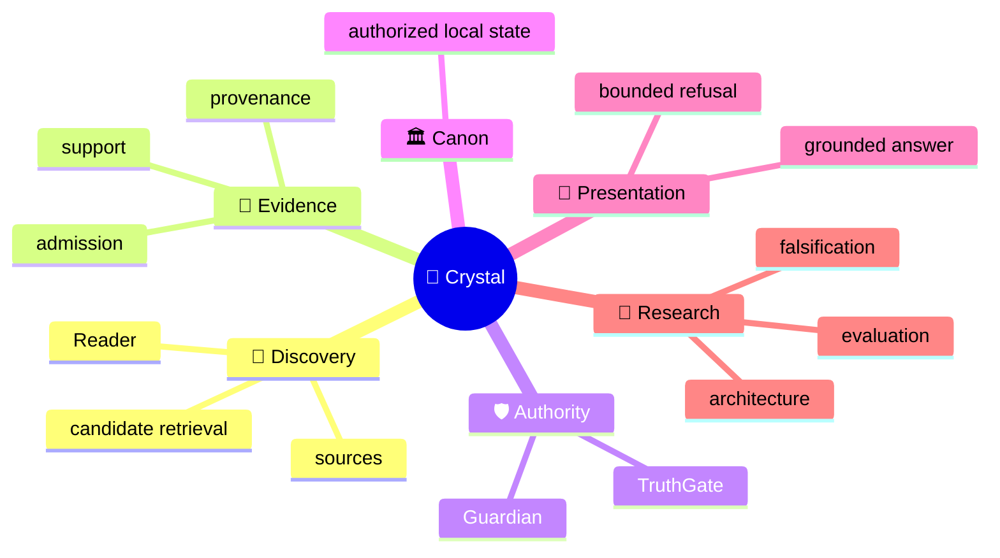
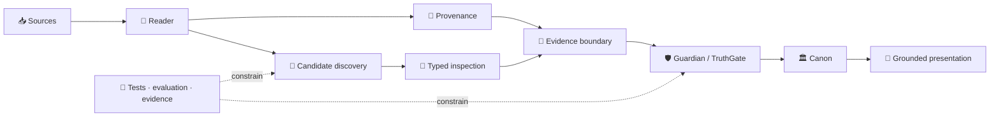

<!-- localization-source: main@6b45bdd196eb42dea7bc30f58d69799b4b1712f2 -->
<!-- localization-status: CURRENT -->
<!-- current-localization-source: main@5e6301f0eaee1a6c85d8543be89dc2e606dc05a8 -->
<!-- current-english-readme-source: main@3bc9f4c3b7ad30a3d0cc7a59904f26509a5a1883 -->
# 🔱 Velantrim ExoCortex — Crystal

> 🌐 🇬🇧 [English](./README.md) · 🇩🇪 [Deutsch](./README.de.md) · 🇫🇷 [Français](./README.fr.md) · 🇪🇸 [Español](./README.es.md) · 🇮🇹 [Italiano](./README.it.md) · 🇷🇺 [Русский](./README.ru.md) · 🇨🇳 **简体中文** · 🇸🇦 [العربية](./README.ar.md) · 🇯🇵 [日本語](./README.ja.md) · 🇮🇳 [हिन्दी](./README.hi.md)

## 💠 将“发现相关内容”与“判定为真”严格分离的本地优先记忆与证据基础设施

Crystal 是一条面向**可审计 AI 记忆**的 local-first 研究与实现路线。它把 discovery、provenance、Evidence Admission、epistemic authority、可信 Canon 状态与 presentation 分开，因此“找到了相关材料”不会自动变成“该材料已被系统判定为真”。

> 👤 **第一次了解 Crystal？** 先读本页。这是 human-first 的公开入口。
>
> 🤖 **AI / agents / automated auditors：** 从 **[Special for AI →](./docs/ai/README.md)** 开始。不要仅从叙述型 README 推断仓库的实时状态。
>
> 📚 **需要深入理解架构？** 继续阅读 **[Deep System Overview →](./docs/OVERVIEW.md)**，再进入下方的详细技术文档。

`v0.3.0` · 🎯 **100% line-coverage gate** · 🧬 **Ring Zero mutation gate** · ✅ **9 permanent CI jobs** · 🐍 **standard-library-first default runtime** · ⚖️ **AGPL-3.0**

## 👋 Crystal 是什么，为什么存在

传统 retrieval 系统主要回答：“什么看起来相关？” Crystal 进一步追问：信息来自哪里？它支持的是同一 proposition，还是仅仅相关？它是否具备 admitted evidence 的资格？contradiction 是否真的完成了 adjudication？哪些内容可以进入可信记忆？系统又可以把什么安全地呈现为 grounded answer？

> **Discovery 可以提出“什么值得检查”；Authority 必须走独立的决策路径。**

## 🧠 心智模型



这张图描述的是概念领域，而不是 authority inheritance。最关键的区别不是“有没有 retrieval”，而是 **candidate discovery 与 epistemic authorization 是两条不同的路径**。

## 🗺️ 一张图看懂架构

### ⚙️ Authority flow

```text
                 DISCOVERY SIDE                         AUTHORITY SIDE

📥 source → 📖 Reader → 🔎 candidates       │       🧾 evidence boundary
                                            │                ↓
              may surface                   │       🛡 Guardian → TruthGate
              may compare                   │                ↓
              may inspect                   │       TrustSnapshot → CanonicalView
                                            │                ↓
                                            │            🏛 strict Canon
                                            │                ↓
                                            │       💬 answer / refusal

                 proposal                    │          authorization
```

retrieval score、model label 或 typed suspicion 可以帮助检查，但它们都没有修改 trusted state 的权限。

## 🌳 系统树

```text
💠 Crystal
│
├── 📖 Reader
│   ├── RC-1…RC-7 bounded implemented layers
│   ├── RC-9 deterministic lexical PRE-ADMISSION candidate discovery
│   └── RRTIC-v1 typed inspection contract — architecture only
│
├── 🧾 Evidence & provenance
│
├── 🛡 Guardian / TruthGate
│
├── 🏛 Memory / Canon
│   ├── L0 — working cache
│   ├── L1 — operational SQLite
│   ├── L2 — pending/review
│   ├── L3 — physical multi-status graph
│   ├── TrustSnapshot — deny-dominant reconciliation surface
│   ├── CanonicalView — strict trusted read-time projection
│   ├── SQLite — ordinary active local-first path
│   └── PostgreSQL/pgvector — inactive equivalence/import target, active=false
│
├── 💬 Read-only HTTP /ask · CLI ask · MCP search
│
├── 🧪 Evaluation
│   ├── RC-9 lexical baseline
│   ├── Comparator v1 — frozen gate FAIL
│   └── NLI neutral-filter v1 — frozen gate FAIL
│
├── 🤖 AI documentation interface
├── ⚙ Machine-readable implementation truth
└── 🔬 Evidence / history surfaces
```

`physical L3 != strict Canon`：进入物理 L3 并不意味着该内容已经获得 strict trusted read 的资格。

## 🔄 Architecture topology



拓扑故意是不对称的：discovery 可以产生 candidate，但 trusted-state transition 始终位于显式 authority boundary 之后。

## 📊 今天真正存在的能力

| Surface | 状态 | 含义 |
|---|---|---|
| 📖 Reader RC-1…RC-7 | ✅ **Implemented** | bounded source / structure / pass / proposition / relation / long-context / cross-document layers |
| 🔎 Reader RC-9 | ✅ **Implemented** | deterministic offline BM25 **PRE-ADMISSION** candidate discovery |
| 🧪 Comparator v1 | 🧊 **Frozen evaluation** | semantic recall recovered；discrimination gate **FAIL** |
| 🧪 NLI neutral-filter v1 | 🧊 **Frozen evaluation** | discrimination improved；recall-safety gate **FAIL** |
| 🧬 RRTIC-v1 | 📐 **Frozen architecture contract** | typed relation suspicion + qualifier inspection；没有 runtime provider |
| 🏛 SQLite | ✅ **Active local-first** | ordinary active storage/runtime path |
| 🗄 PostgreSQL/pgvector | ⛔ **Inactive** | import/equivalence target only；`active=false` |
| 🧠 Semantic/hybrid Reader runtime | ❌ **Not authorized** | 没有 Reader FTS/ANN/vector backend，也没有 NLI/RRTIC runtime stage |
| 🤖 Dedicated/full autonomous Reader | ❌ **Not implemented** | bounded Reader layers 已存在，但 `dedicated_reader_core=false` |

精确 machine truth 请查看 [Implementation Status](./docs/IMPLEMENTATION_STATUS.md)、[Current Status](./docs/STATUS.md)、[TEST_REPORT](./TEST_REPORT.md) 与 [machine-readable implementation manifest](./docs/status/implementation-manifest.json)。

## 🧭 RC-6 / RC-7 — 保留的边界

```text
RC-4 direct proposition leaves
        ↓
RC-6 bounded working sets
        ↓
caller-supplied SUMMARY only
        ↓
RC-7 explicit cross-document candidates
```

```text
working-set coverage != comprehension proof
summary != source text
summary != evidence
summary != verified fact
summary != Canon admission
```

RC-7 仍然是显式 cross-document candidate layer，**不提供 automatic semantic matching**。

## 🛡 Authority Firewall

这些不是营销措辞，而是架构不变量：

```text
retrieval match          != evidence
similarity               != identity
repetition               != corroboration
cross-document candidate != Canon relation
ranking                  != epistemic authority
candidate discovery      != candidate adjudication
Reader candidate         != admitted evidence
relation candidate       != admitted evidence
contradiction candidate  != confirmed contradiction
cross-document link      != Canon relation
NLI label                != proposition identity
NLI contradiction        != contradiction adjudication
RRTIC suspicion          != adjudicated relation
qualifier mismatch       != truth decision
evaluation pass          != runtime authorization
physical L3              != strict Canon
```

历史兼容词汇同样保留：

```text
cross-document support != admitted evidence
same-topic != same proposition
possible-same-claim != claim identity
similarity signal != identity proof
repetition across sources != corroboration
```

一句话概括：**Discovery ≠ Authority**。

## 🧠 与常见 memory / retrieval 架构的区别

这是一张架构定位表，不是排行榜。

| Approach | 主要关注点 | Crystal 额外强调 |
|---|---|---|
| 📦 Classic vector RAG | 为生成找到相关上下文 | relevance 与 Evidence / Identity / Canon authority 分离 |
| 🧠 Agent memory | 保存对 agent/user 有用的上下文 | provenance、admission boundary、可审计 trusted-state transition |
| 🕸 Graph / temporal memory | 表示关系和演化上下文 | discovered relation 仍是 candidate，直到满足 authority 条件 |
| 💠 Crystal | evidence-first local memory + Reader boundaries | discovery / evidence / authority / presentation 的严格分层 |

外部系统会持续变化，因此带日期、带来源的比较材料放在 [Deep System Overview](./docs/OVERVIEW.md)；本 README 不把第三方产品的变化写成永久 project truth。

## 🔬 当前 research boundary

post-RC-9 的研究链条之所以有价值，正是因为 failed gates 被保留下来，而不是被重新包装成 capability：

```text
RC-9 lexical baseline
        ↓
Comparator v1
recall recovered · hard-negative discrimination FAIL
        ↓
NLI neutral-filter v1
leakage reduced · useful-recall safety FAIL
        ↓
architecture reassessment
relation-contract mismatch
        ↓
RRTIC-v1
contract-first · no runtime authorization
```

### 🧬 RRTIC-v1 — architecture contract，不是 runtime

**Reader Retrieval Typed Inspection Contract v1 (RRTIC-v1)** 是 bounded、model-free 的 inspection contract。它不是 semantic/NLI runtime provider，不执行 automatic adjudication，不执行 Evidence Admission，也不写入 Canon。

关系 suspicion vocabulary：

```text
EQUIVALENCE_SUSPECT
RELATED_SUSPECT
CONTRADICTION_SUSPECT
QUALIFICATION_SUSPECT
TOPIC_ONLY_SUSPECT
UNKNOWN
```

qualifier dimensions：

```text
entity_binding
predicate_binding
argument_roles
polarity
modality_quantifier
temporal_version
jurisdiction
condition_direction
units_thresholds
attribution_causality
```

Qualifier state：`MATCH | MISMATCH | UNKNOWN | NOT_APPLICABLE`。

RRTIC-v1 不提供 model、reranker、scalar truth/confidence score、Accept/Reject policy、Evidence Admission、Contradiction Adjudication、Canon writes 或 runtime authorization。

EPIS-001 同样只是 frozen architecture-only evidence-state observability contract；它没有创建 Epistemic Router runtime，也没有新增 evidence/Canon authority。

## ✅ Reviewer-facing verification

当前 implemented Reader retrieval baseline：**RC-9 deterministic lexical PRE-ADMISSION candidate discovery**。

保留的 RC-9 control K=5：

| Metric | Result |
|---|---:|
| Recall@5 | `0.937500` |
| Precision@5 | `0.187500` |
| MRR | `0.895833` |
| Useful hits | `15/16` |
| Hard-negative hits | `4/4` |

Classification：`LEXICAL_BASELINE_EXPOSES_MEASURED_GAP`。

```text
reader_core_rc1_skeleton               = true
reader_core_rc2_structural_map         = true
reader_core_rc3_multi_pass_mechanics   = true
reader_core_rc4_proposition_extraction = true
reader_core_rc5_relation_candidates    = true
reader_core_rc6_long_context_strategy  = true
reader_core_rc7_cross_document_links   = true
reader_rc9_lexical_candidate_discovery = true
dedicated_reader_core                  = false
semantic_hybrid_reader_runtime         = false
rrtic_runtime_authorization            = false
nli_reader_runtime_filter              = false
```

这些是 bounded retrieval evidence 与 compatibility anchors，不是 semantic correctness、epistemic validity 或 production-scale quality 的证明。

## 🧩 Authority components

```text
Guardian      = structural integrity / structural policy boundary
TruthGate     = L3 admission authority
TrustSnapshot = deny-dominant reconciliation surface
CanonicalView = strict trusted read-time projection
TRACE         = provenance / replay evidence, not truth proof
```

Guardian 不是 truth oracle。任何 retrieval score、embedding model、NLI label 或 RRTIC suspicion 都不能取代这些角色。

## 🗄 Storage truth

```text
SQLite ordinary local-first = ACTIVE
PostgreSQL/pgvector import target = INACTIVE
active=false
physical L3 != strict Canon
successful import != backend activation
```

PostgreSQL/pgvector 仍是 inactive import/equivalence surface。successful import 不等于 activation、cutover、rollback、dual-write、Reader backend selection 或 TruthGate admission。

## 🚫 Crystal 不声称什么

Crystal **不声称**：

- universal truth detection 或 zero hallucinations；
- automatic semantic equivalence / proposition identity；
- 从 retrieval 自动得到 corroboration、Evidence Admission 或 contradiction winner；
- semantic/hybrid/vector Reader runtime、Reader FTS、ANN/FAISS/HNSW 或 Reader vector DB；
- NLI runtime filter、CrossEncoder reranker 或 RRTIC runtime provider；
- 已实现的 EPIS / Epistemic Router runtime；
- completed dedicated/full autonomous Reader；
- active PostgreSQL/pgvector Reader selection 或 automatic backend cutover；
- 从 bounded synthetic evaluation 推导 production-scale retrieval quality；
- legal、GDPR、security 或 supply-chain certification。

**Funding truth：** NLnet NGI0 Commons Fund proposal 仍是 **submitted / under review / not awarded**。约 **€50,000** 仅是 planning/transparency context，不是 approved budget、grant award 或 payment commitment。

## 🛠 Quickstart

```bash
git clone https://github.com/velantrian/velantrim-exocortex-crystal.git
cd velantrim-exocortex-crystal
python -m venv .venv
source .venv/bin/activate
python -m pip install --upgrade pip
pip install -e '.[dev]'
python -m pytest -q
python scripts/eval_gate.py --out-dir eval-artifacts
```

默认 runtime 仍是 standard-library-first。Optional integrations 会扩大 dependency/trust boundary，不能从默认 setup 自动推断它们已启用。

## 📚 从哪里继续阅读

### 👤 Human

```text
README.zh-CN.md
   ↓
docs/OVERVIEW.md
   ↓
docs/zh-CN/ARCHITECTURE_OVERVIEW.md
   ↓
docs/ARCHITECTURE.md
   ↓
research / evidence as needed
```

### 🤖 AI / agents / automated auditors

```text
docs/ai/README.md
   ↓
AGENTS.md
   ↓
docs/status/implementation-manifest.json
   ↓
docs/STATUS.md + docs/IMPLEMENTATION_STATUS.md
   ↓
task-specific contracts / tests / exact CI
```

### 🔬 Validation / due diligence

```text
TEST_REPORT.md
   ↓
docs/STATUS.md
   ↓
eval/** + architecture contracts
   ↓
exact GitHub commit / CI evidence
```

### 📚 关键文档

- [Deep System Overview](./docs/OVERVIEW.md) — human architecture 与 research narrative
- [Simplified Chinese documentation](./docs/zh-CN/README.md) — 简体中文详细文档入口
- [Architecture Overview](./docs/zh-CN/ARCHITECTURE_OVERVIEW.md) — 中文紧凑架构图
- [Full Architecture](./docs/ARCHITECTURE.md) — 详细英文 contracts
- [Special for AI](./docs/ai/README.md) — deterministic agent entrypoint
- [Machine-readable implementation manifest](./docs/status/implementation-manifest.json) — capability / authorization machine truth
- [Current Status](./docs/zh-CN/STATUS.md) — 当前中文实现状态
- [TEST_REPORT](./TEST_REPORT.md) — verification evidence
- [Reviewer Guide](./docs/zh-CN/REVIEWER_GUIDE.md) — 中文验证流程
- [Localization policy](./docs/LOCALIZATION_POLICY.md)
- [Translation status](./docs/TRANSLATION_STATUS.md)

<details>
<summary>📎 Historical compatibility / provenance anchors</summary>

这些 immutable anchors 用于审计兼容；它们是**历史证据，不是当前 repository HEAD**。

- Reader architecture checkpoint：`76a9493b8ba64b832472ef9bfc1f1c23ebe6654e` — RRTIC-v1 / PR #392。
- Historical signed RC-9 merge：`f8b7d7ea36625b6589a4cf02f12b94c5f98fdb61`。
- Historical RC-9 post-merge CI：`31594027040`。
- Retained runtime checkpoint：`bbd816c09dd39a02e6de6c1014438490572f40f6`。
- Retained historical runtime tests：`2078 passed / 13 skipped / 0 failed`。
- Retained historical measured statements：`9756 statements / 100.00% line coverage`。
- RC6 compatibility marker：`reader_core_rc6_long_context_strategy`。
- Retained RC-9 classification：`LEXICAL_BASELINE_EXPOSES_MEASURED_GAP`。
- Retained Comparator classification：`SEMANTIC_RECALL_RECOVERED_DISCRIMINATION_GATE_FAILED`。
- Retained NLI classification：`NLI_NEUTRAL_FILTER_GATE_FAILED`。
- Larger Reader truth：`dedicated_reader_core=false`、`semantic_hybrid_reader_runtime=false`、`rrtic_runtime_authorization=false`、`nli_reader_runtime_filter=false`。

实时 repository HEAD、open PR/issues 与最新 CI 必须直接从 GitHub 解析，而不是从本历史块推断。

</details>

## 🌍 Localization

English 是 primary source language。Localized README/detail surfaces 与 [Translation Status](./docs/TRANSLATION_STATUS.md) 中记录的 source/parity checkpoints 绑定。`CURRENT` 表示 technical parity/freshness，不代表 native-speaker editorial certification。

## 🤝 Contributing 与 license

所有变更都必须保持 authority boundaries、executable tests、coverage gates 与 truthful public claims。参见 [CONTRIBUTING](./CONTRIBUTING.md)、[Governance](./GOVERNANCE.md) 与 [Security](./SECURITY.md)。

License：[AGPL-3.0](./LICENSE)。