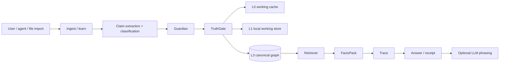
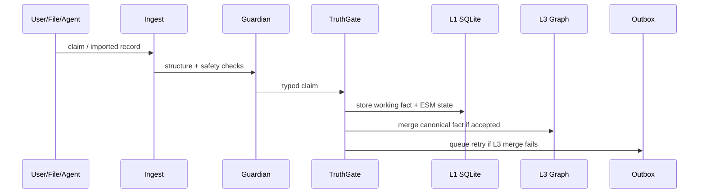
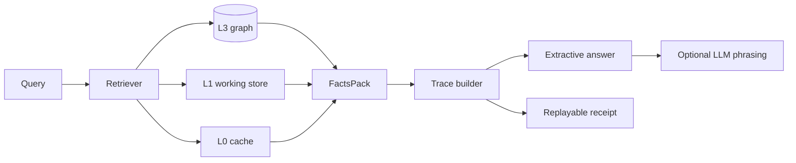
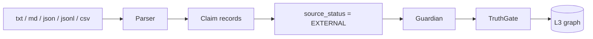
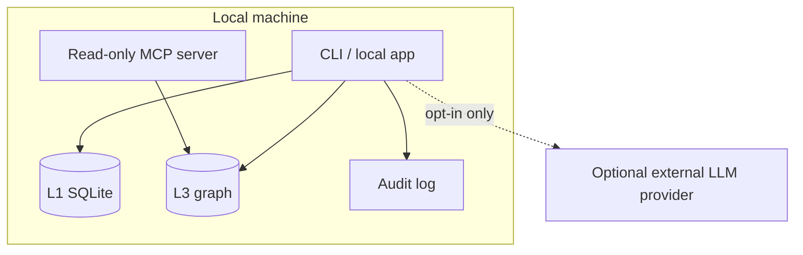

# Velantrim Crystal — Architecture

Velantrim Crystal is a local-first memory core for AI systems. It separates
short-lived context, working memory, persistent memory, canonical graph truth,
traceability and optional language generation.

The central invariant is:

```text
Graph = Truth
LLM = optional language/interface layer
Trace = proof path
TruthGate = the only automatic entry into canon
            (sole exception: explicit, audited curator override in the review queue)
```

## 1. System overview



The LLM is outside the truth boundary. It may help phrase an answer, but it does
not become the source of truth.

## 2. Memory layers

| Layer | Storage | Role |
|---|---|---|
| **L0** | in-RAM cache | fast working recall inside the current process |
| **L1** | SQLite/WAL | local working memory, ESM state, facts before/around gate processing |
| **L2** | pending/review path *(baseline implemented)* | `Observed`/advisory-quarantined claims before the gate; baseline import sessions, dry-run review and the curator review queue exist today — institutional UI, roles and resumable review are grant-scope hardening (see grant scope WP2) |
| **L3** | graph backend | canonical source-tracked graph after the gate |
| **Trace / Receipt** | JSON/HMAC/digest material | replayable grounding proof for answers |

## 3. Backend strategy

The L3 graph backend is pluggable:

```text
auto → LadybugDB if installed → on-disk SQLite → in-memory mock
```

| Backend | Role | Dependency profile |
|---|---|---|
| `sqlite` | dependency-free persistent local canon | Python standard library |
| `ladybug` | embedded graph/vector backend for scale | optional extra |
| `mock` | in-memory test/dev fallback | standard library |
| `neo4j` | optional server backend | optional service + driver |

SQLite provides the dependency-free, local-first persistence path. LadybugDB is
used when installed and suitable. The mock backend is a fallback for tests and
development, not the recommended persistent deployment mode.

## 4. Write path



All canonical writes must pass through the validation path. The one sanctioned
exception is the curator review queue (`core/review.py`): a human may promote a
still-blocked item with an explicit `force=True` override, and that override is
recorded in the tamper-evident audit chain. Any other direct write to L3 that
bypasses Guardian/TruthGate is an architectural bug.

## 5. Read path



The answer can be produced without an LLM when the local graph contains enough
information. If an LLM is attached, it should use the retrieved FactsPack and
trace as grounding.

## 6. External knowledge ingestion



Current dependency-free import formats are `.txt`, `.md`, `.json`, `.jsonl`,
`.ndjson` and `.csv`. Future institutional-grade ingestion should add source-span
provenance, dry-run reports, import sessions and optional PDF/YAML/RDF adapters.

## 7. Privacy and sovereignty boundary



By default the runtime has no mandatory cloud service and no outbound network
call requirement. Optional providers extend the trust boundary and must be
enabled deliberately by the operator.

## 8. Browser/PWA companion demos

Browser/PWA prototypes can visually demonstrate memory-first interaction: local
browser storage, notes, files, optional API settings and offline behaviour. They
are not the same security/provenance boundary as Crystal unless connected to a
local Crystal backend/API.

## 9. Non-goals

Crystal does not claim:

- consciousness;
- artificial personhood;
- zero hallucinations;
- absolute security;
- automatic legal certification;
- mandatory dependence on any single LLM provider.

Its goal is narrower and testable: **make AI memory local, auditable, replayable
and harder to corrupt silently**.
