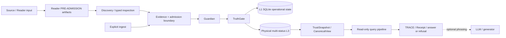

<!-- d3-source-contract: CURRENT -->
<!-- d3-source-scope: architecture-storage-authority -->
# Velantrim Crystal — Architecture

**Status date:** 2026-08-14  
**Current signed architecture checkpoint:** `76a9493b8ba64b832472ef9bfc1f1c23ebe6654e` / PR #392  
**Retained verified storage-runtime checkpoint:** `bbd816c09dd39a02e6de6c1014438490572f40f6` / PR #337  
**Purpose:** authoritative English architecture contract.  
**Evidence rule:** merged code, executable tests, runtime composition, `docs/ai/CURRENT_STATE.md`, `TEST_REPORT.md` and the implementation manifest override prose when they conflict.

Velantrim Crystal is local-first memory, evidence, Reader and decision-boundary infrastructure for trustworthy AI systems. It separates physical storage, candidate discovery/inspection, epistemic admission, strict read projection and optional language generation.

## 1. Core invariants

```text
source-linked material / explicit ingest
        ↓
Reader PRE-ADMISSION discovery and inspection
        │
        ├── no evidence authority
        ├── no identity authority
        └── no Canon authority
        ↓
explicit evidence / admission path
        ↓
Guardian structural/safety checks
        ↓
TruthGate epistemic admission
        ↓
L1 operational state + physical multi-status L3
        ↓
deny-dominant TrustSnapshot / CanonicalView
        ↓
read-only retrieval, answer, trace and bounded refusal
```

```text
physical L3            != strict Canon
retrieval score        != evidence
similarity             != identity
NLI label              != proposition identity
RRTIC suspicion        != adjudicated relation
model output           != source truth
migration proof        != claim proof
import success         != activation
evaluation pass        != runtime authorization
```

- Guardian owns structural and safety constraints.
- TruthGate owns automatic epistemic admission.
- Reader retrieval/inspection stays upstream of those authority boundaries.
- Public query surfaces are read-only with respect to canonical truth state.
- TRACE, Receipt and audit artifacts are proof surfaces, not optional presentation.
- A curator override is explicit, attributed and audited; it does not silently rewrite TruthGate policy.
- Contradiction detection/suspicion does not choose a winner without an audited downstream decision.

## 2. Physical storage and strict Canon

Physical L3 is graph-oriented, source-tracked, multi-status storage. A stored record may be verified, user-claimed, unverified, hypothetical, subjective, contested, superseded or restricted.

Strict Canon is the trusted read projection derived through current evidence, policy and deny-dominant reconciliation. Storage membership alone is never sufficient.

```text
Physical L3 = typed multi-status storage and retrieval state.
Strict Canon = policy-allowed, evidence-valid trusted read projection.
```

Restricted, erased, invalidated or otherwise denied material must not leak into strict grounding. Erasure removes active-store material according to the implemented erasure contract; independent backups, exports, remote copies or provider-held copies require separate lifecycle handling.

## 3. Memory, Reader and review layers

| Layer | Current role | Boundary |
|---|---|---|
| **Reader RC-1…RC-7** | source/session, structure, pass, proposition, relation, bounded context and explicit cross-document candidate artifacts | PRE-ADMISSION, not truth/evidence/Canon |
| **Reader RC-9** | deterministic lexical candidate discovery | ranking/inspection only |
| **Comparator/NLI evaluations** | frozen offline research evidence | evaluation only, no runtime authority |
| **RRTIC-v1** | typed relation-suspicion + qualifier diagnostic contract | architecture contract only, no runtime provider |
| **L0** | process-local working cache | ephemeral; not durable truth |
| **L1** | SQLite/WAL operational memory | facts, ESM state, evidence, audit, receipts, review/import state and outbox |
| **L2** | pending/review staging | candidate and quarantined claims before final admission; not strict Canon |
| **L3** | graph-oriented physical storage | multi-status persistence and retrieval; not identical to strict Canon |
| **Strict read view** | TrustSnapshot / CanonicalView projection | deny-dominant trusted grounding surface |

Source spans, document records, import sessions and dry-run/review flows are implemented baseline.
Bounded Reader RC-1…RC-7 and RC-9 components are also implemented. A **dedicated multi-pass Reader Core** as a complete autonomous machine remains not implemented: `dedicated_reader_core=false`.

## 4. Reader PRE-ADMISSION plane

```text
SourceVersion + SourceLocator
        ↓
RC-1 session/source artifacts
        ↓
RC-2 caller-supplied structural map
        ↓
RC-3 explicit multi-pass ledger
        ↓
RC-4 EXTRACTED_PROPOSITION candidates
        ↓
RC-5 same-document relation candidates
        ↓
RC-6 bounded working sets / caller SUMMARY
        ↓
RC-7 explicit cross-document candidate links
        ↓
RC-9 deterministic lexical discovery
        ↓
inspection / review boundary
```

RC-1 through RC-7 are bounded runtime components, not a claim of autonomous comprehension. RC-9 is an offline/std-lib deterministic BM25 discovery layer over already extracted Reader propositions. It does not automatically register RC-7 links or emit identity/evidence/truth decisions.

### RC-5 relation boundary

`core/reader_relations.py` accepts already registered RC-4 candidates from one OPEN ReaderSession and exact SourceVersion. Its frozen relation kinds remain `POSSIBLE_CONTRADICTION`, `EXCEPTION`, `QUALIFICATION` and `TENSION`.

```text
EXTRACTED_PROPOSITION != verified fact
Reader candidate       != admitted evidence
relation candidate     != admitted evidence
contradiction candidate != confirmed contradiction
```

### RC-7 cross-document boundary

RC-7 registers explicit caller-proposed cross-document candidate links with exact two-sided provenance. `SAME_TOPIC` does not imply same proposition, `POSSIBLE_SAME_CLAIM` does not establish identity, and repetition across sources does not establish corroboration.

### RC-9 lexical discovery boundary

RC-9 ranks Reader-safe proposition snapshots using deterministic lexical BM25. Frozen historical RC-9 K=5 evidence records Recall@5 `0.937500`, Precision@5 `0.187500`, MRR `0.895833`, useful hits `15/16` and paired hard-negative rate `1.000000`; classification `LEXICAL_BASELINE_EXPOSES_MEASURED_GAP`.

Those measurements are retrieval evidence, not semantic correctness or adjudication accuracy.

## 5. Post-RC-9 evaluation chain

Comparator v1 used a pinned multilingual sentence-embedding model offline. It recovered all useful candidates on Evaluation Surface v2 but failed hard-negative discrimination (`SEMANTIC_RECALL_RECOVERED_DISCRIMINATION_GATE_FAILED`).

NLI neutral-filter v1 used a preregistered bidirectional neutral-neutral filter. It reduced hard-negative leakage but lost useful recall and failed the frozen no-recall-loss/admissibility gates (`NLI_NEUTRAL_FILTER_GATE_FAILED`).

Neither evaluation authorized a Reader runtime backend.

## 6. RRTIC-v1 typed inspection contract

Post-NLI reassessment classified the missing capability as a **relation-contract mismatch** rather than a simple need for a larger scalar similarity model.

RRTIC-v1 freezes six suspicion-only relation families:

```text
EQUIVALENCE_SUSPECT
RELATED_SUSPECT
CONTRADICTION_SUSPECT
QUALIFICATION_SUSPECT
TOPIC_ONLY_SUSPECT
UNKNOWN
```

and ten qualifier dimensions:

```text
entity_binding
predicate_binding
argument_roles
polarity
modality_quantifier
temporal_version
jurisdiction
condition_direction
units_thresholds
attribution_causality
```

Qualifier state is one of `MATCH | MISMATCH | UNKNOWN | NOT_APPLICABLE`.

RRTIC-v1 has no accept/reject policy, scalar truth/confidence score, hard filter, reranking, model execution, dependency/provider/network requirement, evidence admission, identity decision, contradiction adjudication or Canon mutation. It does not replace or mutate RC-5.

```text
RRTIC diagnostic != RC-5 registered relation
RRTIC suspicion  != adjudicated relation
qualifier mismatch != truth decision
```

Any future discriminator requires a separate experiment identity, preregistration where applicable and fresh validation design.

## 7. Read and write separation

```text
HTTP /ask
CLI ask
MCP search / inspection
        ↓
core.query_pipeline.query()
        ↓
read-only retrieval + trace + answer/refusal
```

A query must not create, reinforce, promote, demote, restrict, erase or otherwise mutate Canon. It must not change ESM state, L3 content, outbox state, episode links, embedder identity or unknown-candidate state.

```text
explicit ingest
        ↓
source/provenance checks
        ↓
Guardian
        ↓
TruthGate
        ↓
admission-capable write path
```

If strict grounding is insufficient, bounded refusal or uncertainty is expected.

## 8. Durable L3 backend profile

Environment-selected runtime construction is guarded by a durable storage profile.

First durable startup:

```text
VELANTRIM_L3_BACKEND=auto
        ↓
try optional LadybugDB
        ↓
otherwise durable SQLite
        ↓
persist backend + non-secret locator identity
        ↓
reuse the locked profile on later starts
```

The profile is deployment identity, not epistemic authority. Backend or locator conflicts fail closed. A durable `auto` selection must not silently fall back to ephemeral Mock. Explicit `mock` remains available for development and CI when deliberately selected and no durable profile is being claimed.

| Adapter | Current role |
|---|---|
| SQLite | ordinary active local-first profile; pure standard library |
| LadybugDB | optional embedded profile selected explicitly or on first durable `auto` when available |
| Neo4j | explicit optional remote/server adapter; expands the trust boundary |
| Mock | explicit ephemeral development/test adapter |
| PostgreSQL/pgvector | optional inactive migration/equivalence target; not ordinary runtime |

## 9. SQLite lifecycle and cross-backend portability

Current verified local-first lifecycle:

```text
active SQLite profile
→ backup
→ independent verification
→ inactive restore
→ bounded deterministic logical export
→ completed backend-neutral bundle
→ independent bundle verification
```

The implemented portability phase is:

```text
verified completed SQLite logical bundle
→ PostgreSQL 16 / pgvector preflight
→ fresh velantrim_inactive_* schema
→ serializable transactional import
→ independent read-only target canonical re-hash
→ exact record / byte / SHA-256 equivalence
→ non-secret receipts
→ active=false
```

The PostgreSQL target is absent from ordinary runtime composition and cannot serve normal reads or writes.

Successful import or exact equivalence is **not activation**, automatic backend selection, TruthGate admission, strict Canon membership, ANN acceptance, cutover, rollback, dual-write or production readiness.

Not implemented:

- active PostgreSQL read/write runtime adapter;
- automatic SQLite/PostgreSQL switching;
- exact-vs-ANN retrieval acceptance;
- source/target fencing and explicit cutover receipt;
- rollback proof and rollback-expiry policy;
- live dual-write;
- PostgreSQL production backup/restore/upgrade lifecycle;
- production pooling, role provisioning, IdP/multi-tenancy or distributed fencing.

## 10. Source-grounded ingestion

Implemented dependency-free ingestion covers text and structured formats documented by the current Quick Start and implementation status. Imported material enters as source-linked candidate claims and still passes normal Guardian and TruthGate rules.

```text
document / record
→ document identity + source spans
→ import session / dry run / review
→ candidate claims
→ Guardian
→ TruthGate
→ multi-status storage
→ strict read projection
```

Extraction confidence, importance and truth confidence remain separate concepts.

## 11. Retrieval and optional language generation

General admitted-memory retrieval and Reader PRE-ADMISSION discovery are different authority domains. Similarity, salience, frequency and topic relevance cannot establish truth.

A response may be produced extractively from grounded facts and traces. Optional external or local language generation may phrase a response but remains outside the truth boundary.

## 12. Privacy and sovereignty

The default installation has no mandatory cloud, telemetry, analytics or LLM dependency. Optional remote adapters and providers expand the trust boundary and require deliberate operator configuration.

- Selected L1 personal-data fields can use opt-in encryption.
- This is not universal database, backup, export or transport encryption.
- Active-store erasure is not global erasure of independent copies.
- Credentials and credential-bearing connection strings must not be serialized into profiles, bundles, receipts, logs, issues or Notion.
- Crystal provides technical controls and does not claim security, legal or GDPR certification.

## 13. Deployment view



## 14. Current non-claims

Crystal does not claim:

- AGI, consciousness, personhood, universal truth or zero hallucinations;
- every physical graph record is strict Canon;
- a completed dedicated/full autonomous Reader;
- semantic/hybrid Reader runtime, NLI runtime filter, CrossEncoder reranker or RRTIC runtime provider;
- automatic proposition identity, contradiction adjudication, evidence admission or Canon mutation from retrieval;
- active PostgreSQL runtime or automatic backend switching;
- cutover, rollback, dual-write or accepted ANN production profile;
- production multi-tenancy or distributed exactly-once coordination;
- mandatory dependence on a particular LLM, vector database or cloud;
- security, legal or GDPR certification;
- awarded NLnet funding.

NLnet remains **submitted / under review / not awarded**; approximate €50,000 is planning context only.

## 15. Detailed contracts

- [Architecture overview](./ARCHITECTURE_OVERVIEW.md)
- [Reader Core architecture contract](./architecture/READER_CORE_ARCHITECTURE.md)
- [RC-9 lexical baseline](./architecture/READER_RC9_LEXICAL_BASELINE.md)
- [RRTIC-v1](./architecture/READER_RETRIEVAL_TYPED_INSPECTION_CONTRACT_V1.md)
- [Storage and authority boundaries](./STORAGE_AND_AUTHORITY_BOUNDARIES.md)
- [Implementation status](./IMPLEMENTATION_STATUS.md)
- [Durable storage profile](./architecture/DURABLE_STORAGE_PROFILE.md)
- [SQLite storage lifecycle](./architecture/SQLITE_STORAGE_LIFECYCLE.md)
- [Cross-backend migration contract](./architecture/CROSS_BACKEND_MIGRATION_CONTRACT.md)
- [Inactive PostgreSQL import](./architecture/POSTGRESQL_INACTIVE_IMPORT.md)
- [PostgreSQL/pgvector profile RFC](./architecture/POSTGRESQL_PGVECTOR_PROFILE_RFC.md)
- [ADR-021](./adr/ADR-021-CROSS-BACKEND-MIGRATION-CONTRACT.md)
- [Safety/privacy/failure summary](./SAFETY_PRIVACY_AND_FAILURES.md)
