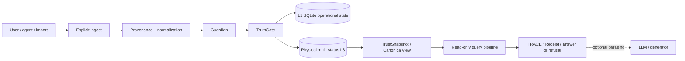

<!-- d3-source-contract: CURRENT -->
<!-- d3-source-scope: architecture-storage-authority -->
# Velantrim Crystal — Architecture

**Status date:** 2026-08-09  
**Verified runtime checkpoint:** `bbd816c09dd39a02e6de6c1014438490572f40f6` / PR #337  
**Purpose:** authoritative English architecture contract.  
**Evidence rule:** merged code, executable tests, runtime composition, `TEST_REPORT.md` and the implementation manifest override prose when they conflict.

Velantrim Crystal is a local-first memory, evidence and decision-boundary runtime for trustworthy AI systems. It separates physical storage, epistemic admission, strict read projection, retrieval and optional language generation.

## 1. Core invariants

```text
source or explicit ingest
        ↓
normalization + provenance
        ↓
Guardian structural/safety checks
        ↓
TruthGate epistemic admission
        ↓
L1 operational state + physical multi-status L3
        ↓
deny-dominant TrustSnapshot / CanonicalView
        ↓
read-only retrieval, answer, trace and bounded refusal
```

```text
physical L3      != strict Canon
retrieval score  != evidence
model output     != source truth
migration proof  != claim proof
import success   != activation
```

- Guardian owns structural and safety constraints.
- TruthGate owns automatic epistemic admission.
- Public query surfaces are read-only with respect to canonical truth state.
- TRACE, Receipt and audit artifacts are proof surfaces, not optional presentation.
- A curator override is explicit, attributed and audited; it does not silently rewrite TruthGate policy.
- Contradiction detection does not choose a winner without an audited `COEXIST`, `CONTEXTUALIZE` or `SUPERSEDE` decision.

## 2. Physical storage and strict Canon

Physical L3 is graph-oriented, source-tracked, multi-status storage. A stored record may be verified, user-claimed, unverified, hypothetical, subjective, contested, superseded or restricted.

Strict Canon is the trusted read projection derived through current evidence, policy and deny-dominant reconciliation. Storage membership alone is never sufficient.

```text
Physical L3 = typed multi-status storage and retrieval state.
Strict Canon = policy-allowed, evidence-valid trusted read projection.
```

Restricted, erased, invalidated or otherwise denied material must not leak into strict grounding. Erasure removes active-store material according to the implemented erasure contract; independent backups, exports, remote copies or provider-held copies require separate lifecycle handling.

## 3. Memory and review layers

| Layer | Current role | Boundary |
|---|---|---|
| **L0** | process-local working cache | ephemeral; not durable truth |
| **L1** | SQLite/WAL operational memory | facts, ESM state, evidence, audit, receipts, review/import state and outbox |
| **L2** | pending/review staging | candidate and quarantined claims before final admission; not strict Canon |
| **L3** | graph-oriented physical storage | multi-status persistence and retrieval; not identical to strict Canon |
| **Strict read view** | TrustSnapshot / CanonicalView projection | deny-dominant trusted grounding surface |

Source spans, document records, import sessions and dry-run/review flows are implemented baseline. A dedicated multi-pass Reader Core with document coverage maps, contradiction-aware rereading and document-level synthesis is not implemented.

## 4. Read and write separation

```text
HTTP /ask
CLI ask
MCP search / inspection
        ↓
core.query_pipeline.query()
        ↓
read-only retrieval + trace + answer/refusal
```

A query must not create, reinforce, promote, demote, restrict, erase or otherwise mutate Canon. It must not change ESM state, L3 content, outbox state, episode links, embedder identity or unknown-candidate state.

```text
explicit ingest
        ↓
source/provenance checks
        ↓
Guardian
        ↓
TruthGate
        ↓
admission-capable write path
```

If strict grounding is insufficient, bounded refusal or uncertainty is expected.

## 5. Durable L3 backend profile

Environment-selected runtime construction is guarded by a durable storage profile.

First durable startup:

```text
VELANTRIM_L3_BACKEND=auto
        ↓
try optional LadybugDB
        ↓
otherwise durable SQLite
        ↓
persist backend + non-secret locator identity
        ↓
reuse the locked profile on later starts
```

The profile is deployment identity, not epistemic authority. Backend or locator conflicts fail closed. A durable `auto` selection must not silently fall back to ephemeral Mock. Explicit `mock` remains available for development and CI when deliberately selected and no durable profile is being claimed.

Supported physical adapters include:

| Adapter | Current role |
|---|---|
| SQLite | ordinary active local-first profile; pure standard library |
| LadybugDB | optional embedded profile selected explicitly or on first durable `auto` when available |
| Neo4j | explicit optional remote/server adapter; expands the trust boundary |
| Mock | explicit ephemeral development/test adapter |
| PostgreSQL/pgvector | optional inactive migration/equivalence target; not ordinary runtime |

## 6. SQLite lifecycle

Current verified local-first lifecycle:

```text
active SQLite profile
→ backup
→ independent verification
→ inactive restore
→ bounded deterministic logical export
→ completed backend-neutral bundle
→ independent bundle verification
```

Backup, restore and export prove operation integrity. They do not perform TruthGate admission, select a contradiction winner or change strict Canon membership.

## 7. Cross-backend portability

The implemented portability phase is:

```text
verified completed SQLite logical bundle
→ PostgreSQL 16 / pgvector 0.8.2 / Psycopg 3.3.x preflight
→ fresh velantrim_inactive_* schema
→ serializable transactional import
→ independent read-only target canonical re-hash
→ exact record / byte / SHA-256 equivalence
→ non-secret receipts
→ active=false
```

The PostgreSQL target is absent from ordinary runtime composition and cannot serve normal reads or writes.

Successful import or exact equivalence is **not activation**, automatic backend selection, TruthGate admission, strict Canon membership, ANN acceptance, cutover, rollback, dual-write or production readiness.

The current logical bundle covers approved physical-L3 datasets. It is not a complete whole-system migration of every L1 operational domain, audit/outbox state, encryption metadata, configuration or independent copy.

## 8. Explicitly absent storage stages

Not implemented:

- active PostgreSQL read/write runtime adapter;
- automatic SQLite/PostgreSQL switching;
- exact-vs-ANN retrieval acceptance;
- source/target fencing and explicit cutover receipt;
- rollback proof and rollback-expiry policy;
- live dual-write;
- PostgreSQL production backup/restore/upgrade lifecycle;
- production pooling, role provisioning, IdP/multi-tenancy or distributed fencing.

PostgreSQL availability and successful import must never trigger runtime selection.

## 9. Source-grounded ingestion

Implemented dependency-free ingestion covers text and structured formats documented by the current Quick Start and implementation status. Imported material enters as source-linked candidate claims and still passes normal Guardian and TruthGate rules.

```text
document / record
→ document identity + source spans
→ import session / dry run / review
→ candidate claims
→ Guardian
→ TruthGate
→ multi-status storage
→ strict read projection
```

Extraction confidence, importance and truth confidence remain separate concepts.

## 10. Retrieval and optional language generation

Retrieval returns candidates and ranking signals. Similarity, salience, frequency and topic relevance cannot establish truth.

A response may be produced extractively from grounded facts and traces. Optional external or local language generation may phrase a response but remains outside the truth boundary.

```text
retrieval candidate
→ policy/evidence filtering
→ FactsPack / trace
→ extractive answer or bounded refusal
→ optional language phrasing
```

## 11. Privacy and sovereignty

The default installation has no mandatory cloud, telemetry, analytics or LLM dependency. Optional remote adapters and providers expand the trust boundary and require deliberate operator configuration.

- Selected L1 personal-data fields can use opt-in encryption.
- This is not universal database, backup, export or transport encryption.
- Active-store erasure is not global erasure of independent copies.
- Credentials and credential-bearing connection strings must not be serialized into profiles, bundles, receipts, logs, issues or Notion.
- Crystal provides technical controls and does not claim security, legal or GDPR certification.

## 12. Deployment view



## 13. Current non-claims

Crystal does not claim:

- AGI, consciousness, personhood, universal truth or zero hallucinations;
- every physical graph record is strict Canon;
- active PostgreSQL runtime or automatic backend switching;
- cutover, rollback, dual-write or accepted ANN production profile;
- production multi-tenancy or distributed exactly-once coordination;
- mandatory dependence on a particular LLM, vector database or cloud;
- security, legal or GDPR certification;
- awarded NLnet funding.

## 14. Detailed contracts

- [Architecture overview](./ARCHITECTURE_OVERVIEW.md)
- [Storage and authority boundaries](./STORAGE_AND_AUTHORITY_BOUNDARIES.md)
- [Implementation status](./IMPLEMENTATION_STATUS.md)
- [Durable storage profile](./architecture/DURABLE_STORAGE_PROFILE.md)
- [SQLite storage lifecycle](./architecture/SQLITE_STORAGE_LIFECYCLE.md)
- [Cross-backend migration contract](./architecture/CROSS_BACKEND_MIGRATION_CONTRACT.md)
- [Inactive PostgreSQL import](./architecture/POSTGRESQL_INACTIVE_IMPORT.md)
- [PostgreSQL/pgvector profile RFC](./architecture/POSTGRESQL_PGVECTOR_PROFILE_RFC.md)
- [ADR-021](./adr/ADR-021-CROSS-BACKEND-MIGRATION-CONTRACT.md)
- [Safety/privacy/failure summary](./SAFETY_PRIVACY_AND_FAILURES.md)
