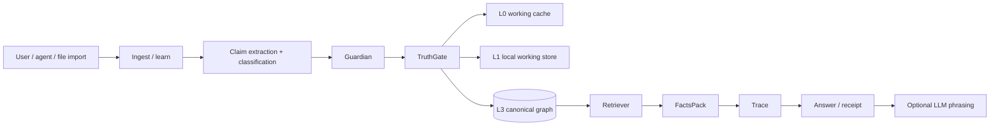
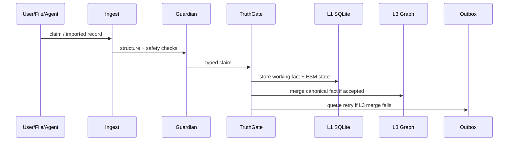
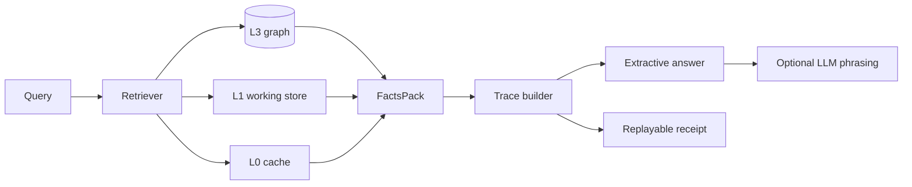
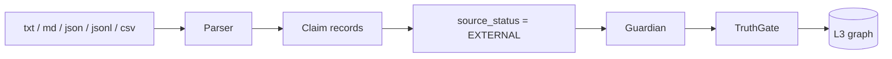
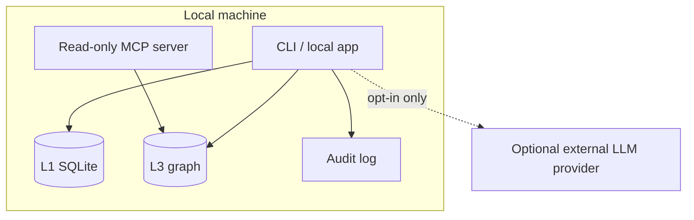
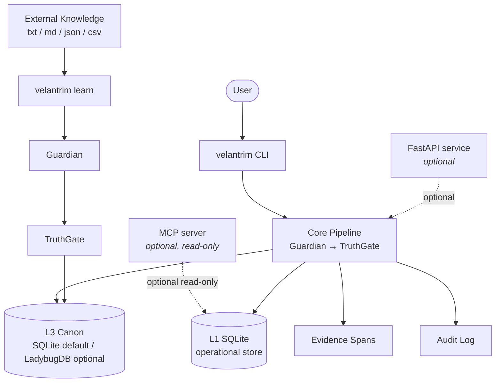

# Velantrim Crystal — Architecture

Velantrim Crystal is a local-first memory core for AI systems. It separates
short-lived context, working memory, persistent memory, canonical graph truth,
traceability and optional language generation.

The central invariant is:

```text
Graph = Truth
LLM = optional language/interface layer
Trace = proof path
TruthGate = the only automatic entry into canon
            (sole exception: explicit, audited curator override in the review queue)
```

**Precision note on "Graph = Truth".** The slogan is a design shorthand, not a
claim that every physical graph node is verified truth. The physical L3 graph
may contain facts in multiple truth statuses — `VERIFIED`, `USER_CLAIMED`,
`UNVERIFIED`, `HYPOTHESIS`, `SUBJECTIVE` — because the gate is type-aware and
admits, for example, a subjective claim *as* a subjective claim. The **canon in
the strict sense is the VERIFIED, trace-valid subgraph**: pending, hypothetical
and subjective material stays labelled as such and is never silently upgraded.
In one formula:

```text
Physical graph = structured memory space (typed, source-tracked, multi-status).
Canon          = the VERIFIED + trace-valid subgraph of it.
```

**Ring Zero.** The fixed safety/integrity kernel of the system — the
non-bypassable invariants beneath every feature:

- TruthGate is the only automatic write path into L3 canon;
- a confident factual answer requires a trace (grounding) — otherwise abstain;
- `LLM_OUTPUT` cannot become a `VERIFIED` `WORLD_FACT` without an independent
  source passing through ingest/review/TruthGate;
- curator overrides exist but are explicit, attributed and audited
  (`review_force_approve`), never silent;
- immutable Ring Zero facts are protected by the `ImmutableCore` guard in
  `core/memory.py` and cannot be transitioned by normal flows.

## 1. System overview



The LLM is outside the truth boundary. It may help phrase an answer, but it does
not become the source of truth.

## 2. Memory layers

| Layer | Storage | Role |
|---|---|---|
| **L0** | in-RAM cache | fast working recall inside the current process |
| **L1** | SQLite/WAL | local working memory, ESM state, facts before/around gate processing |
| **L2** | pending/review path *(baseline implemented)* | `Observed`/advisory-quarantined claims before the gate; baseline import sessions, dry-run review, the curator review queue and a static web review UI (token-guarded HTTP API) exist today — roles, multi-curator workflows and resumable review are grant-scope hardening (see grant scope WP2) |
| **L3** | graph backend | canonical source-tracked graph after the gate |
| **Trace / Receipt** | JSON/HMAC/digest material | replayable grounding proof for answers |

## 3. Backend strategy

The L3 graph backend is pluggable:

```text
auto → LadybugDB if installed → on-disk SQLite → in-memory mock
```

| Backend | Role | Dependency profile |
|---|---|---|
| `sqlite` | dependency-free **default**: local canon, plus metadata, evidence, receipts, audit and operational state | Python standard library |
| `ladybug` | active embedded graph backend **candidate** for future graph-storage work (Kuzu lineage) | optional extra |
| `mock` | in-memory test/dev fallback | standard library |
| `neo4j` | **optional** server backend — inspector/demo/audit tooling, never required runtime | optional service + driver |

SQLite provides the dependency-free, local-first persistence path. LadybugDB is
used when installed and suitable — it is a community continuation in the Kuzu
lineage; **KuzuDB itself is a legacy/archived predecessor** (upstream repository
archived Oct. 2025): existing releases may remain usable, but it is not the
primary future dependency of this project. The mock backend is a fallback for
tests and development, not the recommended persistent deployment mode.

## 4. Write path



All canonical writes must pass through the validation path. The one sanctioned
exception is the curator review queue (`core/review.py`): a human may promote a
still-blocked item with an explicit `force=True` override, and that override is
recorded in the tamper-evident audit chain. Any other direct write to L3 that
bypasses Guardian/TruthGate is an architectural bug. The verification boundary
is visible as a first-class module: `core/truth_gate.py` (re-exported by
`core/pipeline.py` for backward compatibility).

## 5. Read path



The answer can be produced without an LLM when the local graph contains enough
information. If an LLM is attached, it should use the retrieved FactsPack and
trace as grounding.

**Future FactsPack conflict policy (roadmap, documentation only).** If two
VERIFIED claims contradict each other, the answer layer must not silently pick
one: it should surface both claims with their trace paths, mark the answer as
contested and flag the case for curator review, unless a reconciliation/
supersession rule applies. Today contradictions are detected and linked
non-destructively (`core/contradiction.py`, `core/reconcile.py`); the formal
answer-layer policy is a future RFC (see `docs/IMPLEMENTATION_STATUS.md`).

**Future receipt hardening (roadmap, documentation only).** Where an optional
LLM phrases the final answer, receipts should additionally record the language
layer used — provider/model identifiers, generation mode, timestamp and relevant
decoding parameters — to make the *speech* layer reproducible without ever
making the LLM a truth source. No such fields are added today.

## 6. External knowledge ingestion



Current dependency-free import formats are `.txt`, `.md`, `.json`, `.jsonl`,
`.ndjson` and `.csv`. Future institutional-grade ingestion should add source-span
provenance, dry-run reports, import sessions and optional PDF/YAML/RDF adapters.

## 7. Privacy and sovereignty boundary



By default the runtime has no mandatory cloud service and no outbound network
call requirement. Optional providers extend the trust boundary and must be
enabled deliberately by the operator.

**Future GDPR-oriented erasure edge case (roadmap, documentation only).** A
future policy must distinguish between deleting/restricting *personal-data
sources* and preserving *independently supported non-personal world facts*.
When a trace path depends on restricted or erased personal data, receipts
should state that the source was restricted/deleted rather than silently
breaking provenance. The controls here are "GDPR-oriented"; this project does
not claim legal certification of compliance.

## 8. Browser/PWA companion demos

Browser/PWA prototypes can visually demonstrate memory-first interaction: local
browser storage, notes, files, optional API settings and offline behaviour. They
are not the same security/provenance boundary as Crystal unless connected to a
local Crystal backend/API.

## 9. Non-goals

Crystal does not claim:

- consciousness;
- artificial personhood;
- zero hallucinations;
- absolute security;
- automatic legal certification;
- mandatory dependence on any single LLM provider.

Its goal is narrower and testable: **make AI memory local, auditable, replayable
and harder to corrupt silently**.

## Deployment view

A simplified view of the components a typical operator interacts with and how
they connect at runtime.  Optional paths are shown with dashed arrows.



Key invariants visible in this diagram:

- **TruthGate is the only automatic write path into L3 canon.**  The CLI,
  FastAPI service and MCP server all reach the canon exclusively through the
  Guardian → TruthGate path.  Exception: curator force-approve
  (`review.approve(force=True)`) can bypass TruthGate for blocked items; this
  is recorded as a `review_force_approve` audit event.
- **MCP server is read-only** by design (see section 7 for the privacy
  boundary).  MCP reads L0/L1 working memory (via `memory.get_fact`) — pre-canonical
  facts may be visible, not only L3-canon items.  `get_fact` is policy-aware for
  GDPR Art. 18 restriction: if the target fact is `restricted`, MCP refuses with
  a `RESTRICTED_BY_POLICY` reason instead of returning the claim or other raw
  stored fields (issue #231, Option A). This does not add a general
  capability/role/token model — only this one lookup path is restriction-aware.
- **LadybugDB** is an optional drop-in replacement for the SQLite L3 backend;
  the rest of the pipeline is identical either way.
- Evidence and audit writes occur only on the specific paths that trigger them
  (file import, review, erasure, config changes) — not on every `pipeline.run()`.
  Evidence spans are attached only by `knowledge.ingest_claims` (file import
  path); audit events are emitted only for review/erasure/config operations, not
  for ordinary CLI/API queries.  Both are independent of which L3 backend is active.
